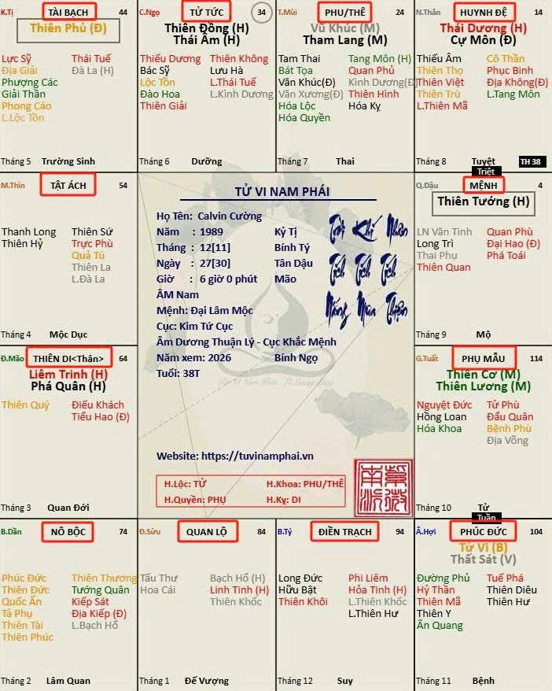

[Mục lục](../README.md)

# TỬ VI NAM PHÁI - BÀI SỐ 1: TỔNG QUAN VỀ MÔN TỬ VI ĐẨU SỐ

LỜI NÓI ĐẦU:
Hiện nay đã có rất nhiều sách và tài liệu viết về Tử Vi Đẩu Số, cũng như những kiến thức quý báu đã được truyền dạy và phổ biến bởi Thầy tôi là Tử Vi Nam Phái - Lê Quang Lăng cùng các bậc tiền bối đi trước.
Tuy nhiên, phần lớn các tài liệu này được trình bày theo văn phong học thuật cổ, sử dụng nhiều thuật ngữ chuyên môn, khiến người mới học gặp không ít khó khăn trong quá trình tiếp cận và nghiên cứu.
Bản thân mình sẽ cố gắng hệ thống hóa những kiến thức đã học được, kết hợp với những trải nghiệm nghiên cứu và ứng dụng thực tế của bản thân để trình bày lại dưới ngôn ngữ đơn giản, dễ hiểu và gần gũi nhất.
Mục tiêu không phải để biến người đọc thành một người luận số chuyên nghiệp chỉ sau vài bài viết, mà là giúp mọi người hiểu được những nguyên lý nền tảng của Tử Vi Đẩu Số, từ đó có thể tự nghiên cứu, tự kiểm chứng và tự rút ra những kết luận phù hợp cho riêng mình.
Tôi luôn cho rằng giá trị lớn nhất của việc học Tử Vi không phải là biết trước tương lai, mà là hiểu rõ bản thân, hiểu quy luật vận động của cuộc sống để có những lựa chọn sáng suốt hơn trên con đường phát triển của mỗi người.
KHÁI QUÁT VỀ MÔN TỬ VI ĐẨU SỐ:
Mỗi con người khi sinh ra đều có một thời điểm duy nhất gồm giờ, ngày, tháng và năm sinh.
Dựa trên thời điểm sinh theo Âm lịch, người xưa xây dựng một đồ hình gồm 12 cung gọi là "Lá số Tử Vi". Thông qua hệ thống các sao được an vào 12 cung này, người ta nghiên cứu và luận đoán các vấn đề liên quan đến cuộc đời con người.
Mười hai cung đó bao gồm:
• Cung Mệnh
• Cung Huynh Đệ
• Cung Phu Thê
• Cung Tử Tức
• Cung Tài Bạch
• Cung Tật Ách
• Cung Thiên Di
• Cung Nô Bộc
• Cung Quan Lộc
• Cung Điền Trạch
• Cung Phúc Đức
• Cung Phụ Mẫu
Mỗi cung đại diện cho một lĩnh vực khác nhau trong cuộc sống.
1. CUNG MỆNH
Cung Mệnh là trung tâm của toàn bộ lá số.
Đây là cung phản ánh:
• Dung mạo, ngoại hình.
• Tính cách, nhân phẩm.
• Tư duy và nhận thức.
• Tài năng, sở trường, sở đoản.
• Quan điểm sống.
• Sở thích và thói quen.
Nói một cách đơn giản, cung Mệnh chính là "con người thật" của bạn.
Những cảm xúc như vui, buồn, yêu, ghét, giận dữ hay hạnh phúc đều xuất phát từ cung này.
Các sao tọa thủ tại cung Mệnh sẽ tác động rất mạnh đến tính cách. Ví dụ:
• Nhiều cát tinh thường tạo nên tính cách ôn hòa, nhân hậu.
• Nhiều sát tinh thường tạo nên cá tính mạnh, nóng nảy hoặc quyết liệt.
2. CUNG PHỤ MẪU
Cung Phụ Mẫu phản ánh:
• Quan hệ giữa bản thân và cha mẹ.
• Hoàn cảnh gia đình thời thơ ấu.
• Sự cát hung của cha mẹ.
• Quan hệ giữa cha và mẹ.
• Mức độ chăm sóc và giáo dục mà bản thân nhận được.
Môi trường giáo dục và nền tảng gia đình có ảnh hưởng rất lớn đến sự hình thành nhân cách của mỗi người. Vì vậy cung Phụ Mẫu cũng là một cung rất quan trọng trong việc đánh giá xuất phát điểm của một cá nhân.
3. CUNG HUYNH ĐỆ
Cung Huynh Đệ phản ánh:
• Anh chị em ruột.
• Anh chị em cùng cha khác mẹ hoặc cùng mẹ khác cha.
• Mối quan hệ giữa các thành viên trong gia đình.
• Quan hệ với hàng xóm láng giềng (kết hợp với cung Điền Trạch).
Một gia đình có anh chị em đoàn kết sẽ tạo thành nguồn trợ lực rất lớn cho cuộc đời mỗi người.
Ngược lại, nếu anh chị em bất hòa hoặc thường xuyên gây rắc rối thì bản thân cũng khó tránh khỏi việc bị ảnh hưởng.
4. CUNG PHU THÊ
Cung Phu Thê phản ánh:
• Hôn nhân.
• Người phối ngẫu.
• Quan hệ vợ chồng.
• Chất lượng đời sống vật chất và tinh thần trong hôn nhân.
Đây là cung cho biết:
• Người phối ngẫu có ngoại hình ra sao.
• Tính cách như thế nào.
• Là quý nhân hay là gánh nặng trong cuộc đời mình.
Một điểm thú vị là:
Cung Nô Bộc thường biểu hiện các mối quan hệ tình cảm trong giai đoạn yêu đương.
Cung Phu Thê lại phản ánh mối quan hệ sau khi bước vào hôn nhân hoặc cam kết lâu dài.
Vì vậy mới có hiện tượng:
"Lúc yêu rất ngọt ngào nhưng cưới về lại phát sinh nhiều mâu thuẫn."
5. CUNG TỬ TỨC
Cung Tử Tức phản ánh:
• Con cái.
• Số lượng con.
• Mối quan hệ giữa cha mẹ và con cái.
• Con cái hiếu thuận hay bất hiếu.
Đồng thời đây cũng là cung biểu thị phần nào trạng thái cuộc sống ở tuổi già.
Khi kết hợp với cung An Thân, người nghiên cứu có thể đánh giá mức độ an nhàn hay vất vả trong giai đoạn hậu vận.
6. CUNG TÀI BẠCH
Cung Tài Bạch phản ánh:
• Khả năng kiếm tiền.
• Khả năng quản lý tài chính.
• Quan điểm về tiền bạc.
• Năng lực tích lũy tài sản.
Đây là cung cho biết:
• Tiền đến từ đâu.
• Kiếm tiền bằng nghề nghiệp nào.
• Có giữ được tiền hay không.
• Có khả năng đầu tư hay không.
Tài sản ở đây bao gồm:
• Tiền mặt.
• Vốn đầu tư.
• Các tài sản có thể di chuyển được.
Nhà cửa và đất đai lại thuộc phạm vi của cung Điền Trạch.
7. CUNG TẬT ÁCH
Cung Tật Ách phản ánh:
• Sức khỏe.
• Bệnh tật.
• Tai nạn.
• Tai họa.
• Các vấn đề tinh thần và tâm lý.
Đây cũng là nơi thể hiện phần sâu kín nhất trong nội tâm con người.
Những thói quen tiềm thức, các khuynh hướng tâm linh hoặc nghiệp quả tích lũy đều có thể được nghiên cứu thông qua cung này.
Cung Tật Ách thể hiện các yếu tố dễ gây tai họa cho bản thân (kể cả có cát tinh như Thiên Đồng, Ân Quang, Thiên Quý thì nó vẫn biểu thị rằng tai họa sẽ đến khi ta giúp người, tức là làm ơn mắc oán).
Cung Tật Ách còn được sử dụng để nghiên cứu các biến cố lớn liên quan đến sức khỏe và tuổi thọ. 
Cung Tật Ách còn biểu thị nguyên nhân tử vong, ngày chết đám tang như thế nào. Ngày chết con cháu có tranh giành tài sản hay không...
8. CUNG THIÊN DI
Cung Thiên Di phản ánh:
• Xã hội bên ngoài.
• Các mối quan hệ ngoài gia đình.
• Môi trường khi bước ra đời.
• Tai họa hay may mắn khi ta đi làm ở bên ngoài.
Thông qua cung Thiên Di có thể nghiên cứu:
• Khả năng xuất ngoại.
• Khả năng nổi tiếng.
• Quan hệ xã hội.
• Quý nhân hoặc tiểu nhân ngoài xã hội.
Đồng thời cung này còn phản ánh cách người khác nhìn nhận và đối xử với bạn
9. CUNG NÔ BỘC
Cung Nô Bộc phản ánh:
• Bạn bè.
• Đồng nghiệp.
• Cộng sự.
• Nhân viên cấp dưới.
Đây là cung thể hiện chất lượng các mối quan hệ xã hội gần gũi.
Ngoài ra, cung Nô Bộc còn phản ánh các mối quan hệ tình cảm trong giai đoạn yêu đương.
Thông thường:
• Nô Bộc tốt, Phu Thê xấu: yêu đẹp nhưng hôn nhân nhiều thử thách.
• Nô Bộc xấu, Phu Thê tốt: yêu đương trắc trở nhưng cuối cùng lại có hôn nhân ổn định.
(Tình Duyên cần được xét thêm vị trí của sao Đào Hoa và sao Hồng Loan, cung Mệnh và cung Phúc Đức…)
10. CUNG QUAN LỘC
Cung Quan Lộc phản ánh:
• Nghề nghiệp.
• Công danh.
• Địa vị xã hội.
• Năng lực làm việc.
• Phong cách xử lý công việc.
Đây là cung cho biết:
• Thích hợp làm quan chức.
• Thích hợp kinh doanh.
• Thích hợp nghề chuyên môn.
• Thích hợp quản lý hay kỹ thuật.
Một người có cung Quan Lộc rất tốt chưa chắc đã thành đạt, cần xét kỹ nhiều cung khác. Ví dụ, bạn rất giỏi nhưng cung Nô Bộc kém, bạn không có quý nhân nâng đỡ, nhân viên hay cấp dưới không ủng hộ bạn, dễ gặp phản phúc…cũng không thể phát triển lớn được.
11. CUNG ĐIỀN TRẠCH
Cung Điền Trạch phản ánh:
• Nhà cửa.
• Đất đai.
• Bất động sản.
• Môi trường sinh sống.
Đây là cung biểu thị:
• Điều kiện nhà ở từ nhỏ.
• Khả năng sở hữu bất động sản sau này.
• Chất lượng phong thủy nơi cư trú.
Ngoài ra cung Điền Trạch còn phản ánh:
• Quan hệ giữa các thành viên trong gia đình.
• Mối quan hệ với hàng xóm láng giềng.
• Mức độ ổn định của môi trường sống.
12. CUNG PHÚC ĐỨC
Cung Phúc Đức phản ánh:
• Âm đức tổ tiên cũng như bản thân, tiền kiếp gây ác nghiệp hay thiện nghiệp.
• Nền tảng của ông bà, dòng họ.
• Trạng thái mồ mả.
• Khả năng hưởng phúc, mức độ hạnh phúc trong cuộc sống.
Có những người rất giàu nhưng không hạnh phúc vì cuộc sống có quá nhiều biến cố là do nguyên nhân lớn ở cung Phúc Đức.
Ngược lại, có những người vật chất bình thường nhưng luôn cảm thấy an nhiên và mãn nguyện.
Đó chính là phạm vi mà cung Phúc Đức phản ánh.
Phúc Đức cũng liên quan đến:
• Nhân sinh quan.
• Đời sống tinh thần.
• Sự lạc quan.
• Khả năng vượt qua nghịch cảnh, tai nạn.
TỔNG KẾT BÀI SỐ 1:
Mười hai cung trong lá số Tử Vi phản ánh gần như toàn bộ các mặt của cuộc sống con người, từ tính cách, gia đình, tiền bạc, công việc, hôn nhân, con cái cho đến sức khỏe và tuổi già.
Tuy nhiên, cần hiểu rằng không một cung nào tồn tại độc lập.
Tất cả đều liên hệ với nhau thông qua Tam Hợp, Xung Chiếu, Nhị Hợp và hệ thống sao trong lá số.
Vì vậy, học Tử Vi không phải là nhìn một cung rồi kết luận cát hung, mà phải hiểu được sự tương tác tổng thể của toàn bộ lá số.
Trong bài tiếp theo, chúng ta sẽ tìm hiểu về cấu trúc của một lá số Tử Vi và nguyên lý an các Chính Tinh.

[Mục lục](../README.md)
