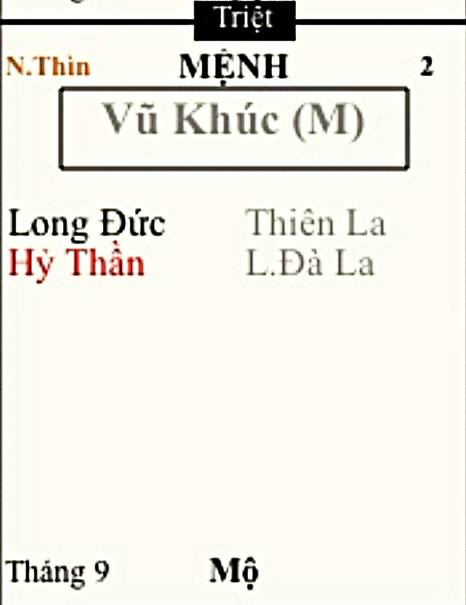

[Mục lục](../README.md)

# TỬ VI NAM PHÁI - BÀI SỐ 10: LUẬN GIẢI CUNG MỆNH THÔNG QUA CHÍNH TINH (PHẦN 6)

SAO VŨ KHÚC
Ở bài số 9, chúng ta đã tìm hiểu sơ lược về tính cách và ưu nhược điểm của người có mệnh Thái Âm. Từ đó, nếu bản thân bạn, con em hoặc người thân của bạn có mệnh Thái Âm sáng sủa thì khi lựa chọn nghề nghiệp gần như dễ dàng thành công với nhiều lĩnh vực như tài chính, ngân hàng, giáo dục, dịch vụ, ngoại ngữ, ngoại giao, nghệ thuật, kinh doanh hoặc các công việc cần sự tinh tế, khả năng quan sát và chăm sóc con người.
Ngược lại, nếu Thái Âm bị phá cách thì cần tiết chế việc hưởng thụ quá mức, tránh đầu tư theo cảm xúc, hạn chế tham gia kinh doanh sẽ rủi ro vỡ nợ cao. Chỉ cần chọn công việc ổn định, chăm chỉ tích lũy, lấy sự tận tâm và uy tín làm nền tảng thì vẫn có thể đạt được cuộc sống ổn định.
Thái Âm kết hợp với những bộ sao nào thì càng thêm giàu có, gặp những bộ sao nào thì bị phá cách và cách hóa giải ra sao... mình sẽ trình bày đầy đủ trong phần CHƯ TINH LUẬN sau này.
Hôm nay, chúng ta sẽ tiếp tục nghiên cứu chính tinh thứ sáu, đó là sao Vũ Khúc.
________________________________________
1. ĐẶC ĐIỂM NGOẠI HÌNH
Người có Vũ Khúc tọa thủ cung Mệnh thông thường sẽ có những đặc điểm sau:
• Dáng người nhỏ, không cao.
• Đầu hơi to hơn tỷ lệ cơ thể.
• Nhiều nốt ruồi trên cơ thể.
• Ánh mắt nghiêm nghị nhưng hiền hòa.
• Giọng nói vang, rõ ràng và dứt khoát.
Nam mệnh thường có sức khỏe tốt, thích vận động, nhiều người đam mê tập gym, võ thuật hoặc các môn thể thao đòi hỏi sức bền. Tiền kiếp có thời làm tướng quân trấn ải biên cương nên tập tính thích vận động vẫn còn truyền lại ở kiếp này.
Nữ mệnh Vũ Khúc vẫn có thể rất xinh đẹp nhưng thần thái thường mạnh mẽ hơn những nữ mệnh thuộc Thái Âm hay Thiên Đồng, duy dáng người nhỏ nhưng bộ ngực thường vẫn đầy đặn. Họ tạo cho người khác cảm giác là người phụ nữ độc lập, có chính kiến và có thể tự lo được cuộc sống của mình.
Nếu quan sát kỹ, bạn sẽ thấy nhiều người Vũ Khúc có dáng đi khá khoan thai, không hấp tấp. Họ không thích thể hiện cảm xúc quá nhiều ra bên ngoài, càng trưởng thành càng tạo cảm giác trầm ổn.
________________________________________
2. ĐẶC ĐIỂM TÍNH CÁCH
Nếu Thái Dương giống một người lãnh đạo truyền cảm hứng, Thái Âm giống một người biết lắng nghe và chăm sóc người khác thì Vũ Khúc lại giống một vị tướng hoặc một doanh nhân.
Đây là mẫu người coi trọng kết quả hơn là lời nói. Người có Vũ Khúc nhập Mệnh thường:
• Thẳng thắn, quyết đoán.
• Có trách nhiệm.
• Trọng chữ tín.
• Kiên trì, không dễ bỏ cuộc. Một khi đã quyết định làm việc gì, họ sẽ làm đến cùng.
Khó khăn càng lớn thì ý chí của họ càng mạnh. Họ cực kỳ chịu khó, nhất là trong kinh doanh họ sẵn sàng đi từng nơi để chào hàng, kiếm mối mang làm ăn, sẵn sàng kiên nhẫn tư vấn để tích lũy từng khách hàng một. Họ không phải kiểu người thích nói nhiều về kế hoạch. Ngược lại, đa phần đều âm thầm làm việc.
Có câu rất đúng để hình dung về người Vũ Khúc: "Làm được mới nói, làm chưa xong thì tuyệt đối không khoe." Đó cũng là lý do nhiều người quen của bạn bỗng một ngày thông báo:
• Mới mua thêm căn nhà.
• Mở thêm công ty.
• Đầu tư thêm vài lô đất.
• Hoặc đã có một khoản tài sản rất lớn mà trước đó gần như không ai biết.
Đó chính là phong cách của Vũ Khúc. Họ giàu nhưng ít khi thích khoe giàu. Khó khăn cũng ít khi than vãn. Có tiền không nói, hết tiền cũng không kể. Giàu không ai biết, khó khăn cũng không ai hay. Vô cùng kín đáo!
________________________________________
3. VŨ KHÚC VÀ TIỀN BẠC
Nếu Thái Âm là sao chủ khả năng thu hút tài lộc thì Vũ Khúc là sao biết tạo ra tài sản.
Người có Vũ Khúc nhập Mệnh thường rất nhạy với giá trị của đồng tiền. Họ nhìn đâu cũng thấy cơ hội kinh doanh. Đi du lịch cũng để ý xem địa phương này bán gì, giá bao nhiêu, thị trường có tiềm năng không. Đi siêu thị cũng có thể nhớ được giá từng mặt hàng. Thậm chí nhiều người có thói quen so sánh giá ở nhiều nơi trước khi quyết định mua. Không phải vì họ nghèo. Mà vì họ luôn muốn đồng tiền bỏ ra phải đáng giá.
Có người từng nói vui: "Tiền kiếm rất cực, tiêu một đồng cũng phải biết nó đi đâu." Đó gần như là triết lý sống của rất nhiều người mang mệnh Vũ Khúc.
Họ rất thích đầu tư. Nhưng đầu tư không phải để đánh bạc. Họ thích những khoản đầu tư có cơ sở, có số liệu và có khả năng kiểm soát rủi ro.
Đặc biệt, Vũ Khúc rất có duyên làm việc với người nước ngoài hoặc thị trường quốc tế. Họ thích tự học, tự nghiên cứu, tự mở rộng thị trường hơn là chỉ quanh quẩn trong vùng an toàn của mình.
Trong chi tiêu, họ là người keo kiệt hà tiện. Trừ khi có các phụ tinh mang tính chi tiêu phóng khoáng thì họ sẽ phóng khoáng ở những mục nào đó hoặc đam mê cá nhân của họ, chứ bản chất tiết kiệm vẫn không đổi.
Hoặc nếu bỏ ra 10 triệu để mua một chiếc máy phục vụ công việc giúp kiếm thêm 100 triệu thì họ sẵn sàng. Nhưng bỏ ra vài triệu chỉ để "cho bằng bạn bằng bè" thì họ thấy rất vô nghĩa. Đó là sự khác nhau giữa tiêu tiền để đầu tư và tiêu tiền để thể hiện. Vũ Khúc gần như luôn chọn phương án chi tiêu khôn ngoan nhất.
Trong lĩnh vực đầu tư, Vũ Khúc thích đầu tư vào tài sản lớn như đất đai, nhà cửa. Hiếm khi bỏ tiền ra mua đồ xa xỉ như xe ô tô, giày dép quần áo đồ hiệu, trừ khi dùng nó để đi ký hợp đồng lớn, còn không thì còn lâu nhé!
________________________________________
4. VŨ KHÚC VÀ SỰ NGHIỆP
Một trong những ưu điểm lớn nhất của người mệnh Vũ Khúc chính là khả năng chịu áp lực. Trong khi nhiều người dễ nản lòng khi công việc gặp khó khăn, thì Vũ Khúc lại coi khó khăn là chuyện bình thường. Họ không sợ làm việc. Thậm chí, nhiều người còn cảm thấy... khó chịu nếu quá rảnh.
Có câu vui nhưng khá đúng: "Không có việc thì tự bày việc ra làm.” Chính vì vậy, người Vũ Khúc rất ít khi chịu cảnh thất nghiệp kéo dài. 
Nếu mất việc, họ sẽ nhanh chóng tìm việc mới. Nếu chưa tìm được, họ sẽ nghĩ đến chuyện buôn bán, đầu tư hoặc làm thêm một nghề khác để tạo thu nhập. 
Khả năng xoay xở của họ rất đáng nể. Đặc biệt, họ có tố chất lãnh đạo trong lĩnh vực kinh doanh và quản trị tài chính. Họ không phải kiểu lãnh đạo nói hay nhất. Nhưng thường là người đưa ra quyết định rất nhanh, rất rõ ràng và dám chịu trách nhiệm. Nhân viên làm việc với người Vũ Khúc đôi khi sẽ thấy khá áp lực vì tiêu chuẩn họ đặt ra rất cao.
Bản thân họ làm được thì cũng muốn người khác làm được. Điều này khiến họ dễ bị nhận xét là khó tính hoặc nghiêm khắc. Thực tế, họ chỉ muốn mọi việc đạt hiệu quả cao nhất.
________________________________________
5. VŨ KHÚC VÀ CÁC MỐI QUAN HỆ
Nếu nhìn bề ngoài, nhiều người sẽ nghĩ Vũ Khúc là mẫu người lạnh lùng, khó gần và ít tình cảm. Thực ra, đó chỉ là lớp vỏ bảo vệ của họ. Người mệnh Vũ Khúc không giỏi nói những lời ngọt ngào, cũng không thích thể hiện cảm xúc quá nhiều. Nếu thật sự quý ai, họ sẽ giúp bằng hành động hơn là bằng lời nói.
Ví dụ, khi cha mẹ đau ốm, người Vũ Khúc có thể âm thầm thanh toán toàn bộ viện phí mà không kể với ai. Khi bạn bè gặp khó khăn, họ có thể cho vay tiền hoặc tìm cách giúp đỡ, nhưng sau đó cũng không bao giờ nhắc lại. Chính vì ít biểu lộ cảm xúc nên đôi khi họ bị người khác hiểu lầm là khô khan hoặc vô tâm.
Một đặc điểm rất rõ của Vũ Khúc là khá kén chọn trong các mối quan hệ. Họ không thích xã giao quá nhiều, không thích nơi đông người, cũng không thích những cuộc nói chuyện vô bổ.
Có câu rất giống với người mệnh Vũ Khúc: "Ít bạn nhưng chơi rất bền."
Một khi đã xem ai là người thân thì họ sẽ rất trung thành và sẵn sàng giúp đỡ đến cùng. Ngược lại, nếu đã mất niềm tin thì rất khó để người đó bước vào cuộc sống của họ thêm một lần nữa.
________________________________________
6. ĐIỂM YẾU CỦA VŨ KHÚC
Không có chính tinh nào hoàn hảo và Vũ Khúc cũng vậy.
- Đôi khi khá ki bo, keo kiệt:
Vũ Khúc trong nhiều trường hợp sẽ có phần ki bo, keo kiệt, tính toán chi ly tiểu tiết khi chi tiêu. Nhiều người giàu nứt đố đổ vách nhưng vẫn ăn mặc giản dị, xài cái điện thoại 7,8 năm chưa đổi, xài đôi dép vài năm chưa mua mới. Nếu Vũ Khúc mà rơi vào trạng thái này thì thật sự sẽ tạo sự mệt mỏi cho những người xung quanh. Nếu hài hòa được sẽ tốt hơn cho những mối quan hệ lâu dài.
- Khó thay đổi quan điểm:
Một khi đã quyết định điều gì thì rất khó có ai thay đổi được suy nghĩ của họ. Nếu cảm thấy mình đúng, họ sẽ kiên trì bảo vệ quan điểm đến cùng.
Điều này giúp họ thành công trong công việc, nhưng trong hôn nhân hay gia đình lại dễ xảy ra mâu thuẫn nếu cả hai đều không chịu nhường nhau.
- Thiếu sự mềm mỏng
Trong quản lý công việc, sự quyết đoán là ưu điểm. Nhưng trong cuộc sống, đôi khi cần nhiều hơn sự cảm thông.
Người Vũ Khúc thường đánh giá người khác dựa trên kết quả công việc. Ai làm tốt thì họ rất quý. Ai làm không tốt thì rất khó lấy được sự tôn trọng của họ. Đôi khi họ quên rằng mỗi người đều có hoàn cảnh khác nhau. Nếu học được cách đặt mình vào vị trí của người khác, họ sẽ được yêu quý hơn rất nhiều.
- Thiên hướng cô độc
Vũ Khúc mang tính cô độc không phải vì họ không có người thân, mà vì họ có xu hướng tự mình giải quyết mọi việc, hay lủi thủi làm một mình việc gì đó. Buồn cũng không kể, ngồi nghe nhạc một mình, sống nội tâm. Khó khăn cũng không nói, có tiền không khoe, hết tiền cũng chẳng than vãn. Lâu dần tạo thành cảm giác luôn phải một mình gánh vác mọi thứ.
Có câu rất đúng với người mệnh Vũ Khúc: "Chuyện gì tự làm được thì không muốn phiền người khác." Đó vừa là ưu điểm, nhưng cũng là điều khiến cuộc sống của họ đôi khi trở nên khá cô đơn.
________________________________________
7. VŨ KHÚC VÀ NGHỀ NGHIỆP
Vũ Khúc là sao chủ về tài chính, thương mại và quản lý tài sản. Bởi vậy, khi mệnh sáng sủa, đây là một trong những chính tinh có khả năng làm giàu mạnh nhất trong Tử Vi.
Các lĩnh vực phù hợp gồm:
• Kinh doanh.
• Tài chính.
• Ngân hàng.
• Kế toán.
• Kiểm toán.
• Đầu tư.
• Chứng khoán.
• Bất động sản.
• Xuất nhập khẩu.
• Thương mại quốc tế.
• Logistics.
• Quản lý doanh nghiệp.
• Quản lý dự án.
• Quản lý sản xuất.
Ngoài ra, vì ngũ hành thuộc Kim, nên Vũ Khúc bị phá cách không kinh doanh được vẫn rất phù hợp với làm nghề:
• Cơ khí.
• Luyện kim.
• Chế tạo máy.
• Kim hoàn.
• Trang sức.
• Thiết bị công nghiệp.
Nếu theo con đường quân đội, công an, võ thuật, thể thao hoặc các ngành mang tính kỷ luật cao thì cũng rất dễ thành công.
________________________________________
TỔNG KẾT
Tóm lại, Vũ Khúc là ngôi sao của tài sản, ý chí và sự bền bỉ.
Người mệnh Vũ Khúc thường sống thực tế, quyết đoán, trọng chữ tín, giỏi quản lý tiền bạc, có năng lực kinh doanh và khả năng tích lũy tài sản rất tốt.
Họ không thích nói nhiều mà thích chứng minh bằng kết quả. Khi đã đặt mục tiêu, họ sẽ kiên trì theo đuổi đến cùng, không dễ bỏ cuộc trước khó khăn.
Bên cạnh đó, nhược điểm của Vũ Khúc là đôi khi quá tiết kiệm, quá cứng rắn, ít bộc lộ cảm xúc, khó thay đổi quan điểm và đôi khi vì quá thẳng thắn mà vô tình làm tổn thương người khác. Tính cách độc lập cũng khiến họ thường mang cảm giác cô đơn, thích tự mình gánh vác mọi việc.
Nếu biết cân bằng những điều trên thì người mệnh Vũ Khúc không chỉ dễ đạt được thành công về tài chính mà còn xây dựng được các mối quan hệ bền vững và một cuộc sống viên mãn.
________________________________________
Lưu ý: Những đặc điểm trên chỉ phản ánh ý nghĩa cơ bản của sao Vũ Khúc khi đơn thủ cung Mệnh. Khi luận đoán thực tế cần kết hợp thêm các bộ cách khác nhau của chính tinh, các phụ tinh đi kèm, Tuần - Triệt, Tứ Hóa và toàn bộ bố cục lá số. 
Đặc biệt, Vũ Khúc rất nhạy với các bộ sao về tài lộc, cô độc tinh và sát tinh. Khi được cát tinh hội hợp, khả năng kinh doanh và tích lũy tài sản sẽ phát huy rất mạnh; ngược lại, nếu bị phá cách thì sự quyết đoán dễ biến thành cố chấp, khả năng quản lý tài chính có thể trở thành tham lợi hoặc buôn gian bán lận. 
Các bộ cách cụ thể của sao Vũ Khúc sẽ được mình trình bày chi tiết trong phần CHƯ TINH LUẬN sau này.
Nếu các bạn đọc thấy hay và hữu ích, hãy bình luận và chia sẻ bài viết để lan tỏa kiến thức đến nhiều người hơn. Đây cũng có thể xem như một hình thức bố thí kiến thức – một trong những cách hành thiện và tích đức theo lời dạy của Đức Phật.
