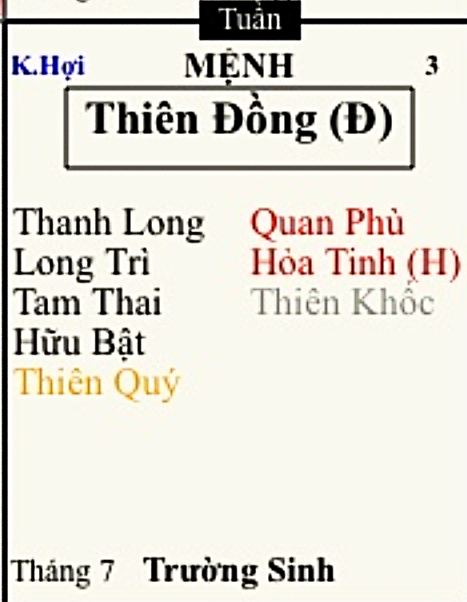

[Mục lục](../README.md)

# TỬ VI NAM PHÁI - BÀI SỐ 11: LUẬN GIẢI CUNG MỆNH THÔNG QUA CHÍNH TINH (PHẦN 7)

SAO THIÊN ĐỒNG
Ở bài số 10, chúng ta đã cùng tìm hiểu về tính cách, ưu điểm và nhược điểm của người có mệnh Vũ Khúc.
Qua đó có thể thấy, nếu bản thân bạn hoặc người thân có Vũ Khúc đắc cách thì rất phù hợp với các lĩnh vực như kinh doanh, thương mại, tài chính, ngân hàng, kế toán, kiểm toán, đầu tư, bất động sản hoặc những công việc liên quan đến quản lý tài sản và dòng tiền. Đây là mẫu người có ý chí rất mạnh, giỏi tích lũy của cải, biết biến tiền thành tài sản và càng gặp khó khăn lại càng có động lực vươn lên.
Ngược lại, nếu Vũ Khúc bị sát tinh phá cách, con đường kinh doanh thường gặp nhiều biến động, dễ đầu tư sai lầm hoặc xảy ra tranh chấp về tiền bạc. Khi đó, thay vì mạo hiểm làm chủ, đương số nên ưu tiên những công việc ổn định, có tính kỷ luật cao như quân đội, công an, thể dục thể thao, kỹ thuật, cơ khí hoặc các ngành nghề đòi hỏi sự kiên trì và trách nhiệm. Chỉ cần chăm chỉ lao động, giữ chữ tín và biết tích lũy thì vẫn có thể xây dựng được cuộc sống sung túc.
Tuy nhiên, nhược điểm lớn nhất của người mệnh Vũ Khúc không phải là tiền bạc mà là sự cô độc. Họ sống nguyên tắc, ít nói, khó mở lòng và thường có xu hướng tự mình gánh vác mọi việc. Chính vì vậy, nếu biết rộng rãi hơn trong tiền bạc, bớt bảo thủ, học cách lắng nghe và chia sẻ với người khác thì cuộc sống sẽ viên mãn hơn rất nhiều.
Vũ Khúc kết hợp với những bộ sao nào thì trở thành đại phú, gặp những bộ sao nào dễ phá tài, ảnh hưởng ra sao đến hôn nhân, sự nghiệp và cách hóa giải như thế nào... mình sẽ trình bày đầy đủ trong phần CHƯ TINH LUẬN sau này.
Hôm nay, chúng ta sẽ tiếp tục nghiên cứu chính tinh thứ bảy, đó là sao Thiên Đồng.
Trong hệ thống Tử Vi, nếu Vũ Khúc tượng trưng cho sự quyết đoán và khả năng tạo dựng tài sản thì Thiên Đồng lại là biểu tượng của phúc khí, lòng nhân hậu, sự bao dung và niềm vui trong cuộc sống.
Thiên Đồng là một trong những Phúc tinh quan trọng của Tử Vi. 
Thiên Đồng là chính tinh rất đặc biệt. Nếu gặp nhiều cát tinh nâng đỡ thì cuộc đời thường khá an nhàn, gặp nhiều quý nhân, ít phải lo cơm áo gạo tiền. Nhưng nếu bị sát tinh phá cách thì dễ rơi vào ăn chơi phá tán, phá gia chi tử.
Vậy người có Thiên Đồng tọa thủ cung Mệnh thực sự có những đặc điểm gì. Chúng ta sẽ cùng tìm hiểu ngay trong bài viết hôm nay.
________________________________________
1. ĐẶC ĐIỂM NGOẠI HÌNH
Người có Thiên Đồng tọa thủ cung Mệnh thường mang vẻ ngoài tạo cảm giác rất dễ gần và có phúc hậu. Thông thường sẽ có những đặc điểm sau:
• Khuôn mặt tròn, hai má đầy đặn, da trắng hoặc sáng màu nếu Thiên Đồng ở miếu, vượng.
• Thân hình cân đối, có xu hướng hơi mũm mĩm hoặc dễ tăng cân khi bước vào tuổi trung niên.
• Ánh mắt hiền hòa, dịu dàng và có phần trẻ thơ.
• Nụ cười tươi, tạo cảm giác thân thiện ngay từ lần gặp đầu tiên.
Người có Thiên Đồng thủ Mệnh thường có khuôn mặt trẻ hơn tuổi thật. Có nhiều người đã ngoài bốn mươi hoặc năm mươi tuổi nhưng nhìn vẫn rất trẻ trung, tính cách cũng hồn nhiên như thanh niên.
Đây cũng là một trong những chính tinh có khí chất hiền lành nhất. Dù nam hay nữ, nhìn bên ngoài đều tạo cảm giác ôn hòa, dễ tiếp xúc và không có vẻ gì là người thích hơn thua với người khác.
Nếu Thiên Đồng ở Miếu, Vượng, dung mạo thường đầy đặn, da trắng, thần sắc tươi tắn, càng lớn tuổi càng có phúc tướng. Ngược lại, nếu lạc hãm hoặc gặp nhiều sát tinh thì thân hình thường nhỏ hơn, da sạm màu hơn, thần sắc thiếu sức sống và nét phúc hậu cũng giảm đi đáng kể.
Nữ mệnh Thiên Đồng đa phần có dung mạo xinh xắn, khuôn mặt bầu bĩnh, nụ cười duyên và rất dễ tạo thiện cảm. Họ không nhất thiết là người đẹp nổi bật, nhưng lại mang nét đáng yêu, gần gũi khiến người khác muốn che chở.
Một đặc điểm khá thú vị là nhiều người Thiên Đồng rất thích ăn ngon và cũng khá "có lộc ăn". Chỉ cần không chú ý chế độ sinh hoạt, cân nặng sẽ tăng lên khá nhanh theo tuổi tác. Vì vậy, nếu muốn giữ gìn vóc dáng và sức khỏe, người mệnh Thiên Đồng nên duy trì thói quen tập luyện thể thao và kiểm soát chế độ ăn uống từ sớm.
2. ĐẶC ĐIỂM TÍNH CÁCH
Thiên Đồng là một trong những chính tinh mang tính Phúc mạnh nhất trong Tử Vi. Nếu Tử Vi đại diện cho quyền uy, Thái Dương đại diện cho danh vọng, Vũ Khúc đại diện cho tài sản thì Thiên Đồng lại đại diện cho niềm vui, lòng nhân hậu và sự an nhiên. Người có Thiên Đồng nhập Mệnh thường có những đặc điểm nổi bật sau:
• Ôn hòa, hiền lành.
• Lạc quan, yêu đời.
• Dễ gần, dễ hòa đồng.
• Giàu lòng trắc ẩn, thích giúp đỡ người khác, thích làm phúc, làm từ thiện.
• Có khiếu hài hước.
• Không thích tranh chấp.
• Dễ thích nghi với hoàn cảnh.
Họ rất cả nể, sợ làm mất lòng người khác. Ai nhờ giúp điều gì, nếu trong khả năng thì họ rất khó từ chối. Chính vì vậy, người Thiên Đồng thường có nhân duyên tốt. Đi đến đâu cũng dễ kết bạn, được nhiều người yêu quý và sẵn sàng giúp đỡ khi gặp khó khăn. Nhưng tốt bụng quá nên cuộc đời hay gặp cảnh làm ơn mắc oán, làm phước phải tội, giúp người ta nhưng ngược lại bị người ta nói xấu, lợi dụng, thậm chí bị hãm hại…tùy thuộc vào vận hạn.
Một đặc điểm rất thú vị của Thiên Đồng là không nhớ lâu thù dai. Có những chuyện hôm qua còn giận, hôm nay đã quên mất. Theo kiểu: "Người ta còn đang giận, người mệnh Thiên Đồng đã quên vì sao hai đứa cãi nhau." ^^ . Chính tính cách này giúp họ ít tạo oán với người khác và cũng khiến cuộc sống nhẹ nhàng hơn rất nhiều.
________________________________________
Điểm nổi bật khác của Thiên Đồng là khả năng đồng cảm rất cao.
Họ dễ xúc động trước những câu chuyện buồn, những mảnh đời bất hạnh, những con vật bị bỏ rơi hay đơn giản chỉ là nhìn thấy người khác gặp khó khăn. Có người nhìn thấy một chú chó đi lạc cũng đứng lại tìm cách cho ăn. Có người xem một bộ phim cảm động là khóc từ đầu đến cuối. (Ứng nhiều với nữ mệnh). Đó đều là những biểu hiện rất thường gặp ở người mệnh Thiên Đồng.
Họ có khả năng đặt mình vào vị trí của người khác để suy nghĩ. Vì vậy, họ rất phù hợp với các công việc cần sự chăm sóc, lắng nghe và chữa lành.
________________________________________
Thiên Đồng còn là chính tinh có trực giác rất mạnh. Nhiều người có linh cảm rất chính xác. Đôi khi họ không giải thích được vì sao mình lại có cảm giác như vậy, nhưng sau này sự việc lại diễn ra đúng như những gì họ đã cảm nhận. Chính vì vậy, người Thiên Đồng thường yêu thích:
• Tâm lý học.
• Tâm linh.
• Huyền học.
• Thiền định.
• Phật học.
• Những lĩnh vực nghiên cứu về đời sống tinh thần.
Nếu gặp thêm các sao tăng cường trực giác thì khả năng cảm nhận của họ càng nổi bật hơn.
________________________________________
Tuy nhiên, Thiên Đồng cũng có một điểm rất đặc trưng là tính trẻ con. Dù bao nhiêu tuổi đi nữa, trong họ vẫn luôn tồn tại một tâm hồn khá ngây thơ. Họ thích vui đùa, thích kể chuyện cười, thích tạo không khí thoải mái cho mọi người.
Có những người đã ngoài năm mươi tuổi nhưng nói chuyện vẫn rất hóm hỉnh, vui vẻ và giữ được sự hồn nhiên hiếm thấy. Đó cũng là lý do người mệnh Thiên Đồng thường trẻ lâu hơn tuổi thật.
Các đặc tính trên sẽ ít hơn khi Thiên Đồng gặp sát tinh, ôm vòng Thái Tuế hoặc gặp Triệt Lộ, cụ thể sau này mình sẽ phân tích kỹ các trường hợp.
________________________________________
Một đặc điểm nữa là người có mệnh Thiên Đồng nếu không bị phá cách thì họ sẽ không quá tham vọng. Phương châm của người có mệnh Thiên Đồng: "Kiếm đủ tiền để sống vui còn quan trọng hơn kiếm thật nhiều tiền mà ngày nào cũng căng thẳng."
Họ không thích đặt mình vào môi trường cạnh tranh quá khốc liệt.
Nếu có thể lựa chọn giữa một công việc lương cao nhưng áp lực và một công việc thu nhập vừa phải nhưng cuộc sống cân bằng, rất nhiều người Thiên Đồng sẽ chọn phương án thứ hai. Đó không phải là thiếu ý chí, mà là quan điểm sống khác nhau. Đối với họ, hạnh phúc không chỉ nằm ở tiền bạc mà còn nằm ở sự bình yên trong tâm hồn.
Chính vì vậy, Thiên Đồng thường sống rất lạc quan. Khi gặp nghịch cảnh, họ vẫn biết tự động viên bản thân và tìm niềm vui trong những điều giản dị. Đây cũng là lý do Thiên Đồng được xem là một trong những ngôi sao mang nhiều phúc khí nhất trong Tử Vi.
3. THIÊN ĐỒNG VÀ TRÍ TUỆ
Thiên Đồng là một chính tinh rất thông minh, nhưng kiểu thông minh của họ khác với Tử Vi, Thiên Cơ hay Thái Âm. Nếu Thiên Cơ giỏi phân tích, Thái Âm giỏi quan sát, Vũ Khúc giỏi thực hành, thì Thiên Đồng lại giỏi cảm nhận.
Họ học hỏi thông qua trải nghiệm, cảm xúc và trực giác nhiều hơn là những công thức cứng nhắc.
Người có Thiên Đồng nhập Mệnh thường:
• Có trực giác rất nhạy bén.
• Giàu trí tưởng tượng, tính sáng tạo.
• Có năng khiếu văn chương, nghệ thuật, đàn hát…
• Học nhanh nhưng cũng rất nhanh chán.
• Học rộng nhưng đôi khi chưa đủ sâu.
Thiên Đồng rất hứng thú với nhiều lĩnh vực khác nhau. Hôm nay có thể say mê học ngoại ngữ, vài tháng sau lại chuyển sang nhiếp ảnh, âm nhạc, hội họa hoặc nghiên cứu huyền học.
Chính vì hứng thú quá nhiều thứ nên họ thường rơi vào tình trạng:
"Biết rất nhiều nhưng chưa thật sự tinh thông một lĩnh vực nào."
Đây cũng là nhược điểm khá phổ biến của người mệnh Thiên Đồng. Nói chung chính là tính cả thèm chóng chán ^^! Nếu khắc phục được ắt có nhiều thành tựu lớn trong cuộc sống.
________________________________________
Một điểm đặc biệt của Thiên Đồng chính là sự linh cảm. Nhiều người có Thiên Đồng thường có giác quan thứ sáu khá tốt. Có những lúc họ không thể giải thích bằng lý trí, chỉ đơn giản là có cảm giác:
• Người này đáng tin.
• Việc này không nên làm.
• Chuyến đi này nên hoãn lại.
Sau đó sự việc diễn ra đúng như linh cảm ban đầu.
Dĩ nhiên, khả năng này còn phụ thuộc vào toàn bộ lá số và các phụ tinh đi kèm, nhưng nhìn chung Thiên Đồng là một trong những chính tinh có trực giác nổi bật nhất.
________________________________________
Tuy nhiên, trí tuệ của Thiên Đồng cũng có một hạn chế đó là do quá giàu cảm xúc nên nhiều khi họ đưa ra quyết định theo cảm tính nhiều hơn lý trí. Họ dễ mềm lòng, dễ bị những câu chuyện cảm động tác động và đôi khi đặt niềm tin không đúng chỗ. Chính vì vậy, người mệnh Thiên Đồng cần học cách cân bằng giữa trực giác và lý trí.
Khi biết kết hợp sự nhạy bén của trực giác với tư duy phân tích và tính kỷ luật, Thiên Đồng hoàn toàn có thể phát huy rất tốt năng lực sáng tạo và đạt được thành công trong những lĩnh vực đòi hỏi sự tinh tế, cảm xúc và khả năng thấu hiểu con người. 
4. ƯU NHƯỢC ĐIỂM CỦA THIÊN ĐỒNG
Thiên Đồng là một sao có thể nói rằng chính những ưu điểm dễ biến thành nhược điểm, phụ thuộc vào rất nhiều phụ tinh đi kèm. Mình sẽ phân tích ngay sau đây để các bạn cùng nắm rõ:
- Thứ nhất, cổ nhân thường gọi Thiên Đồng là "có cái phúc lười." Nghe qua tưởng là chê, nhưng thực ra không hẳn như vậy. Người Thiên Đồng không phải không biết cố gắng, mà họ luôn tự hỏi: "Có cách nào làm nhẹ nhàng hơn không?"
Nếu có thể hoàn thành công việc trong hai giờ, họ sẽ không muốn ngồi lì cả ngày chỉ để tỏ ra bận rộn. Nếu có thể dùng máy móc hỗ trợ thì họ cũng không thích làm thủ công. Điều này khiến họ đôi khi bị đánh giá là lười, nhưng ở góc độ khác lại là người biết tìm cách tối ưu công việc.
Tuy nhiên, nếu sự thoải mái này đi quá giới hạn thì lại trở thành sự trì hoãn, thiếu quyết tâm và dễ bỏ lỡ cơ hội. 
->>> Vì vậy, tính cách này là ưu hay là nhược điểm còn tùy vào chính sự bản thân đương số áp dụng vào cuộc sống.
Trong kinh doanh, nhìn chung, Thiên Đồng phù hợp hơn với những công việc mang tính sáng tạo hoặc các nghề mang tính dịch vụ, phục vụ cộng đồng.
________________________________________
- Thứ hai, mặc dù không quá tham vọng về tiền bạc, nhưng Thiên Đồng lại là một Phúc tinh. Nhiều người có Thiên Đồng sáng sủa thường có điều kiện vật chất khá thuận lợi. Có người sinh ra trong gia đình khá giả, có người luôn gặp quý nhân giúp đỡ đúng lúc. Có người tuy không kiếm được quá nhiều tiền nhưng lại rất ít khi rơi vào cảnh túng thiếu. Dường như cuộc sống luôn có một cách nào đó để họ vượt qua khó khăn lẫn tai nạn, nạn ách. Đó cũng là ý nghĩa của chữ "Phúc" mà Thiên Đồng mang lại.
Tuy nhiên, nếu Thiên Đồng gặp nhiều sát tinh hoặc bị phá cách thì mặt trái cũng sẽ xuất hiện. Khi đó, đương số dễ:
• Ham hưởng thụ.
• Thiếu động lực phấn đấu.
• Chi tiêu theo cảm xúc.
• Làm việc tùy hứng.
• Thiếu tính kỷ luật.
• Dễ bỏ cuộc giữa chừng.
Vì vậy, bài học lớn nhất của người mệnh Thiên Đồng là phải biết cân bằng giữa hưởng thụ và nỗ lực. Cuộc sống cần có niềm vui, nhưng cũng cần có trách nhiệm. Khi biết biến sự lạc quan thành động lực hành động, Thiên Đồng không chỉ có phúc mà còn có thể tạo dựng được cuộc sống sung túc và bền vững bằng chính năng lực của mình.
TỔNG KẾT VỀ SAO THIÊN ĐỒNG
Ưu điểm nổi bật:
• Hiền lành, dễ gần. Tốt bụng, hay giúp đỡ người khác.
• Có trực giác tốt.
• Yêu nghệ thuật.
• Ít thù hằn, không nhớ lâu thù dai, giận hờn nhanh chóng quên đi, không để trong bụng.
• Biết tận hưởng cuộc sống.
Nhược điểm lớn:
• Thiếu quyết tâm dài hạn, dễ cả thèm chóng chán.
• Dễ lười biếng, dễ rơi vào ăn chơi hưởng thụ quá đà.
• Dễ tin người, khó từ chối khi người khác nhờ vả. Quá tốt bụng thì dễ bị lợi dụng, dễ rơi vào cảnh làm ơn mắc oán…
• Hay trì hoãn, ít chịu áp lực cao. Thích kiểu vừa làm vừa thảnh thơi hưởng thụ hơn là quá căng thẳng đầu óc hoặc vất vả tay chân.
Lưu ý: Những đặc điểm trên chỉ phản ánh ý nghĩa cơ bản của sao Thiên Đồng khi tọa thủ cung Mệnh. Khi luận đoán thực tế, cần kết hợp thêm các bộ cách khác nhau của chính tinh, các phụ tinh đi kèm, Tuần - Triệt, Tứ Hóa và toàn bộ bố cục lá số. 
Có điều đặc biệt khá thú vị ở sao Thiên Đồng chính là vị trí của sao này mang nhiều ý nghĩa tâm linh rất lớn, sau này mình sẽ có bài phân tích chuyên sâu về đề tài này.

[Mục lục](../README.md)
