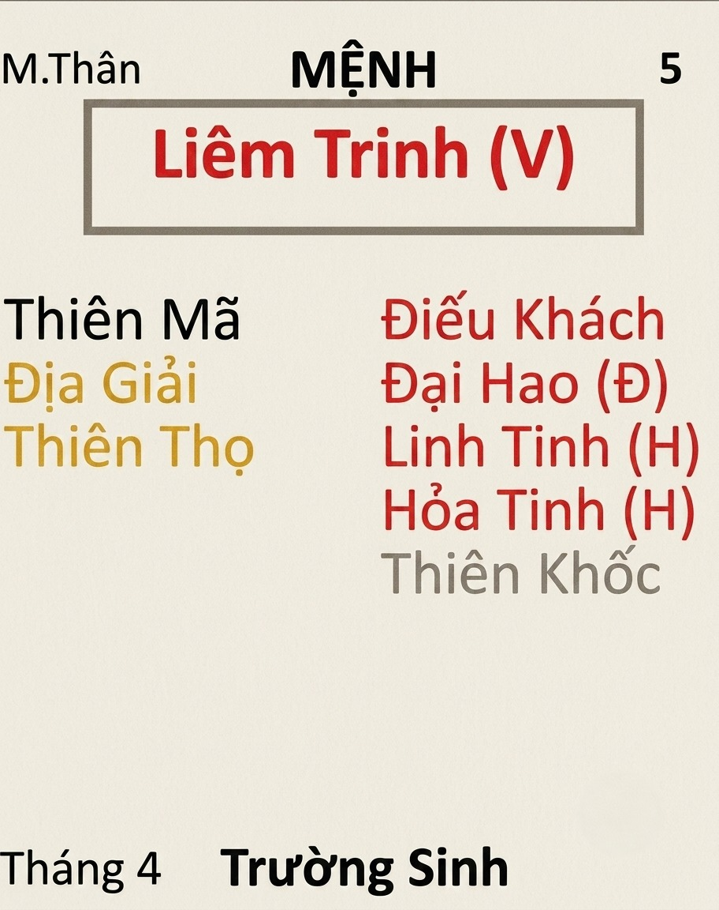

[Mục lục](../README.md)

# TỬ VI NAM PHÁI - BÀI SỐ 12: LUẬN GIẢI CUNG MỆNH THÔNG QUA CHÍNH TINH (PHẦN 8)

SAO LIÊM TRINH
Ở bài số 11, chúng ta đã cùng tìm hiểu về tính cách, ưu điểm và nhược điểm của người có mệnh Thiên Đồng.
Qua đó có thể thấy, nếu bản thân bạn hoặc người thân có mệnh Thiên Đồng sáng sủa thì nhìn chung là người có phúc khí sẵn. Cho dù làm ngành nghề nào cũng ít khi thiếu cơm ăn áo mặc, nhưng nếu được lựa chọn thì nên ưu tiên những công việc phục vụ cộng đồng, giáo dục, nghệ thuật, từ thiện, y tế hoặc các lĩnh vực mang lại giá trị cho con người.
Ngược lại, nếu Thiên Đồng bị phá cách thì cần hạn chế lối sống quá hưởng thụ, lười biếng hoặc buông xuôi trước khó khăn. Phước đức cũng giống như tiền trong tài khoản, tiêu mãi mà không tích lũy thì sẽ có ngày cạn kiệt. Khi phước mỏng đi, tai họa rất dễ kéo đến mà không còn đủ sức chống đỡ. Điều thực sự bảo vệ con người trước sóng gió cuộc đời không phải tiền bạc hay quyền lực, mà chính là phúc khí.
Hôm nay, chúng ta sẽ tiếp tục nghiên cứu chính tinh thứ tám, đó là sao Liêm Trinh.
Đây là một trong những chính tinh đặc biệt và cũng gây nhiều tranh luận nhất trong khoa Tử Vi. Rất khó nói Liêm Trinh là tốt hay xấu, bởi tính chất của nó thay đổi rất mạnh khi đi cùng các chính tinh và phụ tinh khác.
Ví dụ, Liêm Trinh đi cùng Tham Lang sẽ hình thành một bộ cách hoàn toàn khác với Liêm Trinh đi cùng Thiên Tướng. Cùng là Liêm Trinh nhưng tính cách, sự nghiệp, tình cảm và cách phát triển cuộc đời có thể khác nhau một trời một vực.
Vì vậy, trong bài viết này chúng ta chỉ tìm hiểu ý nghĩa cơ bản của sao Liêm Trinh khi tọa thủ cung Mệnh. Những bộ cách cụ thể sẽ được mình phân tích chi tiết trong phần CHƯ TINH LUẬN sau này.
________________________________________
1. ĐẶC ĐIỂM NGOẠI HÌNH
Người có Liêm Trinh tọa thủ cung Mệnh thường có những đặc điểm sau:
• Dáng người cân đối hoặc cao vừa phải.
• Khung xương khá lớn, thân hình khỏe mạnh.
• Khuôn mặt hơi dài hoặc vuông.
• Một số người có gò má cao.
• Lông mày rậm.
• Đôi mắt sáng, có thần, nhiều người hơi lộ mắt.
• Giọng nói vang và có lực.
Nam mệnh thường toát lên vẻ mạnh mẽ, cá tính, có phần ngang tàng. Nữ mệnh lại có khí chất rất riêng. Không nhất thiết là người đẹp nhất nhưng thường rất thu hút, có thần thái, phong cách và cá tính rõ rệt (ví dụ một số bạn nữ để tóc ngắn). Nhiều người trẻ tuổi đã được khá nhiều người khác giới để ý.
Khác với vẻ hiền hòa của Thái Âm hay Thiên Đồng, người mang Liêm Trinh thường tạo cho người khác cảm giác khó gần hơn một chút. Chỉ khi tiếp xúc lâu mới thấy họ là người rất nhiệt tình và sống hết lòng với những người mình quý mến.
________________________________________
2. ĐẶC ĐIỂM TÍNH CÁCH
Nếu Thái Dương tượng trưng cho ánh nắng rực rỡ, Thái Âm tượng trưng cho ánh trăng dịu dàng, thì Liêm Trinh giống như ngọn lửa. Đó là ngọn lửa của tuổi trẻ, của nhiệt huyết, của khát vọng cống hiến và cũng là ngọn lửa của sự bốc đồng nếu không biết kiểm soát.
Người có Liêm Trinh nhập Mệnh thường có những đặc điểm nổi bật:
• Thẳng thắn, dễ thời nói thẳng suy nghĩ bản thân (trừ khi mệnh có triệt lộ sẽ giảm bớt).
• Rất nhiệt huyết, nhiệt tình và năng động.
• Khi lành thì lành lắm, khi dữ lên thì dữ như hổ, tính đấu tranh và tính ăn thua lớn.
• Không thích bị người khác chèn ép, áp đặt. Để tự nhiên thì không sao, nếu bị áp đặt, đè nén thì sẽ phản kháng kịch liệt.
• Chi tiêu phóng khoáng, nam hay nữ đều như vậy. 
• Là một trong những chính tinh cũng yêu thích chuyện tâm linh, thích đi chùa chiền lễ bái (hoặc nhà thờ nếu theo đạo khác), thích tham gia các hoạt động tâm linh như thờ cúng, bói toán, tử vi, phong thủy…
________________________________________
3. LIÊM TRINH VÀ SỰ NGHIỆP
Liêm Trinh là một trong những chính tinh có tham vọng phát triển rất mạnh. Họ không thích cuộc sống quá bình lặng hay lặp đi lặp lại mỗi ngày. Trừ khi bị phá cách mới ham chơi lười làm thôi.
Khác với Thiên Đồng thích an nhàn, Vũ Khúc thích tích lũy tài sản hay Thái Dương thích danh tiếng, Liêm Trinh thích được thử thách bản thân, thích chinh phục mục tiêu và thích cảm giác chiến thắng.
Họ là mẫu người có thể làm việc rất quên mình khi tìm thấy lý tưởng hoặc mục tiêu đủ lớn. Một khi đã quyết tâm, họ sẵn sàng thức khuya, làm thêm giờ, chấp nhận áp lực để hoàn thành công việc. Đôi khi người ngoài nhìn vào còn tưởng họ "nghiện công việc".
Liêm Trinh cũng là người có tinh thần kỷ luật khá cao. Nhiều người thường nhầm rằng đây là sao ham chơi vì có tính đào hoa. Thực tế, họ là người "chơi ra chơi, làm ra làm". Khi làm việc, họ rất nghiêm túc, có nguyên tắc và không thích sự cẩu thả.
Nếu được giao quản lý một tập thể, họ thường đặt ra quy định rõ ràng, thưởng phạt phân minh và yêu cầu mọi người tuân thủ. Chính vì vậy, cấp dưới đôi khi cảm thấy người Liêm Trinh hơi nghiêm khắc.
Một câu rất đúng với người có mệnh Liêm Trinh là: "Việc gì cũng phải rõ ràng, đúng thì nói đúng, sai thì phải sửa." Họ không thích kiểu làm việc qua loa hay "dĩ hòa vi quý" cho xong chuyện.
Đặc biệt, Liêm Trinh rất có tố chất lãnh đạo, có tài đốc binh, đốc thúc nhân viên hoặc cấp dưới làm việc. Họ có khả năng tổ chức công việc, điều phối tập thể và truyền năng lượng cho người khác.
Chính vì vậy, người có Liêm Trinh sáng sủa rất phù hợp với những lĩnh vực như:
• Quản lý doanh nghiệp.
• Chính trị.
• Hành chính nhà nước.
• Quân đội, công an.
• Thanh tra, kiểm tra.
• Kiểm sát.
• Tòa án.
• Luật sư.
• Điều tra.
• Quản trị nhân sự.
• Công tác đoàn thể.
• Tổ chức sự kiện.
• Ngoại giao.
• Truyền thông.
• Các công việc thường xuyên tiếp xúc với quần chúng.
Ngoài ra, do bản thân mang tính đào hoa nên Liêm Trinh cũng khá có duyên với các nghề phải giao tiếp nhiều như:
• Nhà hàng.
• Khách sạn.
• Du lịch.
• Hàng không.
• Thời trang.
• Mỹ phẩm.
• Làm đẹp.
• Giải trí.
Điểm cần lưu ý là người Liêm Trinh rất thích cạnh tranh. Nếu được đặt trong một môi trường năng động, có mục tiêu rõ ràng, họ thường phát triển rất nhanh. Ngược lại, nếu phải làm những công việc quá đơn điệu, ngày nào cũng giống ngày nào, không có cơ hội thể hiện năng lực thì họ rất dễ chán, mất động lực và tìm môi trường khác.
Đây cũng là một trong những chính tinh có tinh thần tuổi trẻ mạnh nhất. Họ thích đổi mới, thích thử sức và luôn muốn chứng minh năng lực của mình. Tuy nhiên, vì tính hiếu thắng khá cao nên đôi khi họ cũng tự tạo áp lực cho bản thân. Có những việc đáng lẽ chỉ cần làm tốt là đủ, nhưng người Liêm Trinh lại muốn phải là người làm tốt nhất.
Nếu không học được cách cân bằng giữa lý tưởng và thực tế, họ rất dễ rơi vào trạng thái làm việc quá sức hoặc thất vọng khi kết quả chưa được như mong muốn.
________________________________________
4. LIÊM TRINH VÀ TIỀN BẠC
Trong Tử Vi, nếu Vũ Khúc là ngôi sao đại diện cho năng lực tạo ra tài sản, Thái Âm đại diện cho khả năng tích lũy của cải thì Liêm Trinh lại đại diện cho dục vọng và khát vọng chinh phục vật chất. Đây cũng chính là lý do vì sao Liêm Trinh là một chính tinh rất khó luận đoán.
Khi đi với cát tinh và được nhiều sao tốt nâng đỡ, dục vọng đó sẽ trở thành động lực phấn đấu, giúp đương số không ngừng học hỏi, làm việc và vươn lên. Nhưng khi gặp nhiều sát tinh, ám tinh hoặc các bộ sao phá cách, dục vọng ấy lại rất dễ biến thành lòng tham, khiến con người sẵn sàng đánh đổi đạo đức để đạt được mục đích. Bởi vậy mới có câu: "Lửa dùng đúng thì sưởi ấm, dùng sai thì thiêu rụi tất cả." Đó cũng chính là hình ảnh của sao Liêm Trinh.
Người có Liêm Trinh sáng sủa thường rất biết kiếm tiền. Họ có đầu óc tính toán, nhạy bén với cơ hội, không ngại cạnh tranh. Khác với Vũ Khúc thích tích lũy từng đồng một cách chắc chắn, Liêm Trinh sẵn sàng chấp nhận thử thách lớn hơn nếu nhìn thấy cơ hội thành công.
Họ cũng thích cuộc sống có chất lượng. Làm việc vất vả thì cũng muốn được ăn ngon, mặc đẹp, đi du lịch, tận hưởng thành quả lao động của mình. Vì vậy người Liêm Trinh chi tiêu rất phóng khoáng.
Quan điểm của nhiều người mệnh Liêm Trinh cũng giống Thiên Đồng: "Kiếm tiền là để sống tốt hơn chứ không phải chỉ để nhìn con số trong tài khoản." Tuy nhiên, điểm cần lưu ý là ham muốn càng lớn thì cám dỗ cũng càng nhiều.
Nếu bản thân không có nguyên tắc sống rõ ràng hoặc gặp nhiều sát tinh phá cách, người Liêm Trinh rất dễ bị cuốn vào những con đường kiếm tiền nhanh. Ví dụ như:
• Đầu tư liều lĩnh.
• Đánh bạc, cá độ.
• Tham nhũng, nhận hối lộ. Lợi dụng chức quyền để trục lợi.
• Buôn bán bằng những thủ đoạn thiếu minh bạch, buôn gian bán lận, lùa gà…
Ban đầu có thể chỉ nghĩ: "Làm một lần chắc không sao." Nhưng rất nhiều sai lầm lớn trong cuộc đời đều bắt đầu từ suy nghĩ đó.
Ngược lại, nếu biết giữ đạo đức nghề nghiệp và kiểm soát lòng tham, người có Liêm Trinh lại rất dễ thành công trong những ngành nghề đòi hỏi sự quyết đoán, bản lĩnh và khả năng xử lý các mối quan hệ.
Một điểm khá thú vị của Liêm Trinh là họ hiểu rất rõ giá trị của các mối quan hệ xã hội. Họ biết rằng đôi khi muốn hợp tác lâu dài thì phải biết cho đi trước. Một bữa cơm, một món quà hay một lời hỏi thăm đúng lúc có thể giúp xây dựng niềm tin với đối tác. Đó là nghệ thuật ứng xử bình thường trong cuộc sống.
Tuy nhiên, ranh giới giữa xây dựng quan hệ và mua chuộc lợi ích rất mong manh. Nếu không giữ được nguyên tắc, rất dễ bước qua giới hạn mà chính bản thân cũng không nhận ra. Vì vậy, bài học lớn nhất của người mệnh Liêm Trinh không phải là học cách kiếm tiền, mà là học cách chiến thắng chính lòng tham của mình.
Khi vượt qua được cám dỗ vật chất, năng lượng mạnh mẽ của Liêm Trinh sẽ trở thành động lực giúp họ tạo dựng sự nghiệp lớn, vừa có tiền tài vừa giữ được danh dự và sự kính trọng của mọi người.
________________________________________
5. LIÊM TRINH VÀ CÁC MỐI QUAN HỆ ĐÀO HOA
Nhắc đến Liêm Trinh thì không thể không nhắc đến tính đào hoa của sao này. Tuy nhiên, đào hoa của Liêm Trinh không hoàn toàn giống Tham Lang, sau này các bạn sẽ được học đến sao Tham Lang để có thể phân biệt rõ hơn.
Nếu Tham Lang là đào hoa thiên về hưởng thụ, vui chơi và sức hấp dẫn tự nhiên thì đào hoa của Liêm Trinh thường gắn liền với công việc, môi trường xã hội và những mối quan hệ trong quá trình làm việc.
Người có mệnh Liêm Trinh thường làm những công việc phải tiếp xúc với rất nhiều người, nên cơ hội quen biết người khác giới cũng nhiều hơn người bình thường. Chính vì vậy, nhiều người mang mệnh Liêm Trinh thường có sức hút khá lớn, đặc biệt khi còn trẻ.
Nam mệnh thường có phong thái mạnh mẽ, quyết đoán. Nữ mệnh lại mang khí chất rất riêng, vừa cá tính vừa cuốn hút. Không nhất thiết phải là người đẹp nhất nhưng lại rất dễ tạo ấn tượng với người đối diện.
Trong giao tiếp, Liêm Trinh khá rộng rãi, nhiệt tình và thích kết nối với mọi người. Họ chấp nhận cho đi để tạo mối quan hệ, cho đi ở đây không chỉ là tiền bạc mà còn là sự giúp đỡ, sự nhiệt tình, những mối quan hệ hay những giá trị mình có thể mang lại cho người khác. Vì vậy, người có Liêm Trinh thường xây dựng được mạng lưới quan hệ khá rộng.
Đối với bạn bè, họ rất nghĩa khí. Bạn gặp khó khăn, họ có thể sẵn sàng bỏ công bỏ sức giúp đỡ mà không tính toán quá nhiều. Nhưng ngược lại, nếu đã bị phản bội hoặc lợi dụng thì họ cũng rất khó quên. Khác với Thiên Đồng dễ bỏ qua, Liêm Trinh tuy không phải người thù dai nhưng rất khó lấy lại niềm tin khi đã mất.
Trong tình cảm, Liêm Trinh yêu rất mãnh liệt. Khi yêu, họ sẵn sàng hy sinh, hết lòng vì người mình yêu. Nhưng cũng vì cảm xúc quá mạnh nên khi yêu dễ ghen, dễ chiếm hữu và đôi khi muốn kiểm soát đối phương nhiều hơn mức cần thiết.
Đặc biệt, người có Liêm Trinh sáng sủa rất coi trọng sự chung thủy. Họ có thể tha thứ nhiều chuyện, nhưng sự phản bội thì rất khó chấp nhận. Có câu nói khá đúng với người Liêm Trinh: "Yêu thì hết lòng, nhưng đã hết niềm tin thì cũng rất dứt khoát." Nếu bị phá cách thì chính họ lại không chung thủy, dễ sa ngã vào mối quan hệ ngoài luồng. 
Người Liêm Trinh rất thích những môi trường sôi động. Họ thích gặp gỡ bạn bè, tham gia các hoạt động tập thể, hội họp, du lịch hay những nơi đông người. Nếu phải sống quá khép kín hoặc ngày nào cũng chỉ quanh quẩn một chỗ, họ sẽ cảm thấy rất bí bách. Tuy nhiên, chính vì quan hệ xã hội rộng nên nếu gặp nhiều sát tinh hoặc ám tinh phá cách thì đây cũng là chính tinh rất dễ vướng vào thị phi, tình cảm phức tạp hoặc những rắc rối do các mối quan hệ mang lại.
Vì vậy, người có mệnh Liêm Trinh càng thành công thì càng cần biết giữ giới hạn trong giao tiếp, cư xử minh bạch và tránh để cảm xúc nhất thời chi phối các quyết định quan trọng.
________________________________________
TỔNG KẾT VỀ SAO LIÊM TRINH
Tóm lại, Liêm Trinh là chính tinh của tuổi trẻ, nhiệt huyết, kỷ luật, cạnh tranh và khát vọng cống hiến. Người có Liêm Trinh tọa thủ cung Mệnh thường năng động, giàu ý chí, có tố chất lãnh đạo, có tài đốc binh, quản lý giỏi nhân viên hoặc cấp dưới, không ngại khó khăn và luôn muốn khẳng định giá trị của bản thân.
Họ phù hợp với những môi trường có tính cạnh tranh, cần nhiều năng lượng, khả năng tổ chức và giao tiếp như quản lý, chính trị, pháp luật, quân đội, công an, truyền thông, kinh doanh, ngoại giao hoặc các công việc thường xuyên tiếp xúc với nhiều người.
Bên cạnh đó, Liêm Trinh cũng là một chính tinh mang tính đào hoa khá mạnh. Khi được cát tinh hỗ trợ, sức hút này sẽ giúp mở rộng quan hệ xã hội và tạo nhiều cơ hội phát triển. Nhưng nếu gặp sát tinh phá cách thì cũng rất dễ phát sinh thị phi, cám dỗ về tình cảm hoặc tiền bạc.
Điểm mạnh nhất của Liêm Trinh là lòng nhiệt huyết và tinh thần cống hiến. Điểm yếu lớn nhất lại là sự nóng nảy, hiếu thắng và khó kiểm soát cảm xúc.
Nếu biết tu dưỡng đạo đức, giữ được sự liêm chính đúng như tên gọi của chính tinh này, biết dùng sự quyết liệt để bảo vệ lẽ phải thay vì bảo vệ cái tôi, biết tiết chế dục vọng và rèn luyện sự bình tĩnh thì Liêm Trinh sẽ trở thành một trong những chính tinh có khả năng tạo dựng sự nghiệp lớn, được nhiều người kính trọng và để lại nhiều giá trị cho xã hội.

[Mục lục](../README.md)
