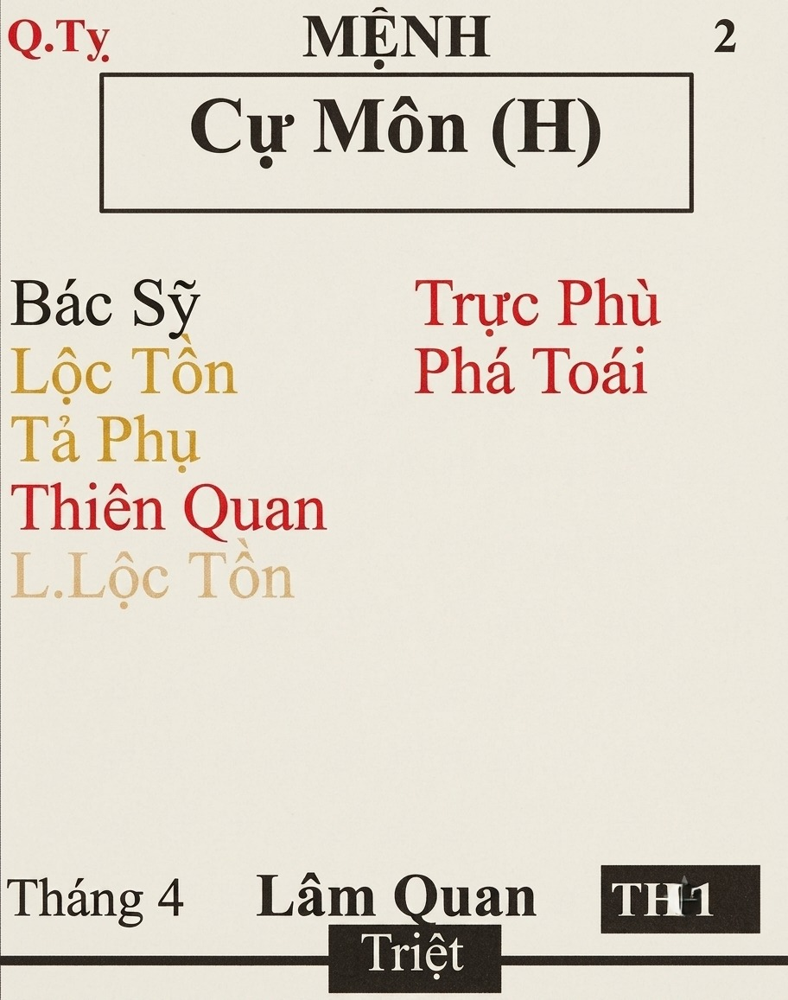

[Mục lục](../README.md)

# TỬ VI NAM PHÁI - BÀI SỐ 13: LUẬN GIẢI CUNG MỆNH THÔNG QUA CHÍNH TINH (PHẦN 9)

SAO CỰ MÔN
Ở bài số 12, chúng ta đã cùng tìm hiểu về tính cách, ưu điểm và nhược điểm của người có mệnh Liêm Trinh.
Qua đó có thể thấy, nếu bản thân bạn hoặc người thân có mệnh Liêm Trinh thì nhìn chung nên tận dụng sự nhiệt huyết để cống hiến hết mình cho cộng đồng, phát huy khả năng quản lý và khả năng ngoại giao. Trường hợp Liêm Trinh bị phá cách thì cần khống chế tâm nóng nảy, khống chế lòng tham và dục tính để không phải vướng vào lao lý hoặc những rắc rối khiến bản thân phải hối hận cả đời.
Hôm nay, chúng ta sẽ tiếp tục nghiên cứu chính tinh thứ chín, đó là sao Cự Môn.
Đây là một trong những chính tinh thường bị nhiều người đánh giá không cao trong khoa Tử Vi vì mang nhiều tính chất thị phi. Tuy nhiên, thực tế không hẳn như vậy. Muốn kết luận tốt hay xấu còn phải xét rất nhiều yếu tố đi kèm như vị trí miếu, vượng hay hãm địa, các chính tinh đồng cung, hệ thống phụ tinh hội hợp và đặc biệt có Tuần Triệt án ngữ hay không.
Hơn nữa, Cự Môn lại sở hữu rất nhiều ưu điểm mà những chính tinh khác không có. Ngay sau đây, chúng ta sẽ cùng nhau nghiên cứu ngay và luôn!
________________________________________
1. ĐẶC ĐIỂM NGOẠI HÌNH
Người có Cự Môn tọa thủ cung Mệnh thường có những đặc điểm sau:
• Nếu miếu, vượng hoặc đắc địa thì thân hình cao lớn, béo tốt, trông đôn hậu và khỏe mạnh. 
• Nếu hãm địa hoặc gặp nhiều sát tinh thì thân hình nhỏ bé, gầy yếu, sức khỏe không tốt. 
• Gương mặt thường vuông hoặc đầy đặn, thần sắc khá nghiêm nghị. 
• Mắt sáng, có thần, ánh nhìn sắc bén, khả năng quan sát rất tốt. 
• Một số người có môi mỏng, khi nói chuyện mang biểu cảm rất rõ ràng. 
• Khí chất có phần khó gần hơn những chính tinh khác. 
Nhìn bề ngoài, Cự Môn thường tạo cho người khác cảm giác khá lạnh lùng. Nhưng thực tế bên trong họ lại là người có nội tâm và suy nghĩ vô cùng phức tạp.
Cự Môn giống như một tảng băng trôi hoặc một chiếc giếng không đáy. Bề ngoài có thể rất bình thường nhưng bên trong lại luôn cuồn cuộn những suy nghĩ, những tính toán và những cảm xúc mãnh liệt mà rất ít người có thể nhìn thấy.
________________________________________
2. ĐẶC ĐIỂM TÍNH CÁCH
Nếu Thái Dương đại diện cho sự quang minh chính trực, Thái Âm đại diện cho sự tinh tế, thì Cự Môn lại là ngôi sao đại diện cho lời ăn tiếng nói, khả năng khám phá, khả năng phân tích và khả năng biện luận.
Nếu Cự Môn miếu, vượng hoặc đắc địa thì thường là người:
• Thông minh, đa mưu túc trí. 
• Tính tình vui vẻ, nhưng đôi khi vẫn còn có tính ăn thua, tính tranh đua lớn.
• Có khả năng khám phá, tìm tòi, nghiên cứu, tìm hiểu tường tận những vấn đề mà họ muốn biết.
• Có năng lực đánh giá môi trường, con người xung quanh rất tốt. 
• Ăn nói đanh thép, lập luận chặt chẽ. 
• Đôi khi vẫn dễ nổi nóng, cư xử thất thường. Theo kiểu như bình thường thương và cưng chiều con cái lắm, nhưng mà nóng lên là chửi nó, đánh nó lên bờ xuống ruộng.
Tính ăn thua này mang lại thành quả tốt hay xấu rất phụ thuộc vào phụ tinh đi kèm, nếu đi kèm nhiều cát tinh và các sao nghiên về đường học hành thì tính ăn thua sẽ trở thành sự phấn đấu hết mình cho sự nghiệp, từ đó công danh hiển hách, rất có uy quyền và danh tiếng. 
Ngược lại, nếu Cự Môn hãm địa, gặp nhiều hung tinh, không có Tuần Triệt án ngữ thì dễ xuất hiện các tính chất như:
• Hay nói chuyện lấn áp người khác, nói chồng lên khi người khác đang nói.
• Ăn gian nói dối, ăn nói lươn lẹo. Ăn nói hồ đồ, biết chửi thề nói tục.
• Tính tình chua ngoa, xảo quyệt, tham lam. Hay cà khịa, chọc tức người khác, “nhân chi sơ, tính bổn khịa” là Cự Môn đi cùng các sao xấu.
• Có nhiều mưu hèn kế bẩn để hại người khác.
• Tính đa nghi, bản thân thì có nhiều mưu hèn kế bẩn nhưng lại hay tưởng người khác giống mình nên lại sinh đa nghi như Tào Tháo.
• Dễ sinh tai tiếng, thị phi hoặc kiện cáo. Cuộc đời người Cự Môn hãm địa và có hung tinh thì hay chửi người khác, hay nói xấu người khác, hay đặt điều đâm thọt, ghen tức đố kỵ, ghen ăn tức ở, tìm cách hãm hại người khác, và cũng bị người khác đối xử lại tương tự. Hay thích đâm đơn kiện người khác, đôi khi cũng bị kiện ngược lại.
________________________________________
Tính đa nghi của Cự Môn phải nói là cao nhất khoa Tử Vi. Cụ thể:
• Họ không quá tin tưởng người khác.
• Việc gì cũng muốn hỏi cho rõ.
• Thông tin nào cũng muốn kiểm chứng.
• Làm việc gì cũng muốn tìm hiểu đến tận cùng nguyên nhân.
Có thể nói, Cự Môn chỉ thật sự yên tâm khi chính mình đã hiểu rõ bản chất của vấn đề. Chính vì vậy, họ thường suy nghĩ rất nhiều, làm việc gì cũng cân nhắc kỹ lưỡng. Nhưng đôi khi vì suy nghĩ quá nhiều nên lại dễ rơi vào trạng thái do dự, thiếu quyết đoán.
Trong cuộc sống, Cự Môn rất ít khi tin hoàn toàn vào lời nói của người khác. Họ thích những thông tin được kiểm chứng từ thực tế hơn là nghe kể lại. Vì vậy, việc gì họ cũng muốn tận mắt nhìn thấy, tận tay kiểm tra hoặc trực tiếp trải nghiệm rồi mới đưa ra kết luận.
________________________________________
Một đặc điểm khác của Cự Môn là rất có định kiến. Một khi đã hình thành nhận định về một con người hoặc một sự việc thì rất khó thay đổi. 
Đặc biệt mấy bà mẹ chồng mệnh Cự Môn mà đã ghét đứa con dâu rồi, thì cho dù đứa con dâu đó có tốt thế nào đi nữa cũng khó lay chuyển. 
Muốn Cự Môn thay đổi quan điểm thì không thể chỉ nói vài câu là được. Bạn phải đưa ra đủ lý lẽ, đủ bằng chứng và đủ sức thuyết phục thì họ mới hên xui chịu xem xét lại. Còn nếu chỉ nói theo cảm tính thì gần như không thể thay đổi được suy nghĩ của họ. 
________________________________________
Cự Môn còn là người có khả năng quan sát và đánh giá con người rất tốt. Người tốt hay người xấu, chỉ cần tiếp xúc một thời gian là họ đã có thể cảm nhận được phần nào. Một câu chuyện chỉ cần nghe qua là nhanh chóng nắm được cốt lõi.
Họ rất giỏi nhìn ra những điểm bất thường mà người khác không để ý. Có những chi tiết rất nhỏ nhưng Cự Môn vẫn ghi nhớ rất lâu.
Chính vì khả năng quan sát quá tốt nên họ biết cách làm sao để lấy lòng người khác, họ thông qua quan sát biết người này thích uống café, người kia thích nhậu…tuy nhiên khi giao tiếp nói vài câu lại rất dễ bị người khác hiểu lầm, đời Cự Môn đôi khi nhọ ở chỗ đó!
Đôi khi quá tinh tế nên họ cũng dễ nhìn thấy khuyết điểm của người khác nhiều hơn ưu điểm. Đây vừa là năng lực, vừa là điểm yếu của Cự Môn.
________________________________________
3. CỰ MÔN VÀ CÔNG VIỆC
Điểm nổi bật nhất của Cự Môn chính là cái "khẩu". Trong khoa Tử Vi có câu nói rằng "Cự Môn không tách rời được khẩu."
Lời nói gần như là vũ khí mạnh nhất của người có Cự Môn nhập Mệnh. Họ rất giỏi diễn đạt, lập luận và phản biện. Có thể nói chuyện nhiều giờ mà vẫn còn rất nhiều ý.
Có khả năng dùng ngôn từ để phân tích, thuyết phục, phản bác hoặc tác động đến tâm lý người khác. Đây cũng là lý do Cự Môn rất phù hợp với những công việc lấy lời nói làm công cụ kiếm tiền như:
• Giáo viên. 
• Luật sư. 
• Dẫn chương trình. 
• Diễn giả. 
• Chuyên gia đào tạo. 
• Sales, marketing
• Tư vấn, ví dụ tư vấn bảo hiểm, tư vấn du học…
• Các công việc cần kỹ năng đàm phán. 
• Biên tập, báo chí, truyền thông.
• Sáng tạo nội dung, live stream.
• Làm giám đốc, quản lý cho các công ty.
Khả năng học ngoại ngữ của Cự Môn cũng rất tốt. Họ thường có năng khiếu sử dụng ngôn từ để lay động lòng người và tạo ảnh hưởng trong giao tiếp.
________________________________________
Một điểm rất đặc biệt của Cự Môn là khả năng phân tích logic, liên tưởng và suy luận rất mạnh.
Một đặc điểm khác của Cự Môn là không thích làm việc hời hợt.
Dù là học một môn học mới, nghiên cứu một vấn đề hay tìm hiểu một sự kiện nào đó, họ đều muốn hiểu sâu, hiểu kỹ và hiểu tường tận. Tâm trí của Cự Môn gần như không cho phép họ lướt qua mọi việc một cách sơ sài. Họ luôn muốn vạch trần những điều đang bị che giấu phía sau bề nổi của sự việc. 
Chính điều này khiến Cự Môn rất phù hợp với những công việc cần điều tra, nghiên cứu, phân tích hoặc phản biện. Họ rất thích nghiên cứu, thích tìm hiểu bản chất của vấn đề chứ không chỉ nhìn hiện tượng bên ngoài. Chính vì vậy, Cự Môn thường có những góc nhìn rất khác với số đông. 
Có rất nhiều cách mệnh Cự Môn đi theo công tác nghiên cứu như nghiên cứu khoa học, công nghệ, dược phẩm, hóa chất…
________________________________________
Tuy nhiên, chính vì khả năng liên tưởng quá mạnh nên Cự Môn cũng rất dễ bị lạc đề. Khi trình bày một vấn đề, họ thường cố gắng kết nối rất nhiều chi tiết với nhau. Ý này liên tưởng sang ý khác. Rồi từ ý khác lại tiếp tục liên hệ sang một vấn đề mới. Cứ như vậy, dòng suy nghĩ liên tục tỏa ra nhiều hướng. Có lúc đang nói về một chủ đề thì lại nhớ sang chuyện khác. Rồi từ chuyện khác lại quay ngược trở về.
Chính vì tư duy thường xuyên xoắn móc rồi lại lan tỏa, nên đôi khi người nghe cảm thấy Cự Môn nói hơi lan man, chưa đi thẳng vào trọng tâm.
Thực tế không phải họ không biết trọng tâm nằm ở đâu, mà vì trong đầu họ luôn xuất hiện quá nhiều mối liên hệ nên rất khó bỏ qua những điều mà bản thân cho là có liên quan.
Tóm lại, họ nắm rõ vấn đề rất tường tận và thấu đáo, nhưng đến phần trình bày lại dễ đi lòng vòng và nói quá nhiều, không vào trọng tâm, thế mới ảo ma Canada!
________________________________________
4. CỰ MÔN VÀ CÁC MỐI QUAN HỆ
Một trong những nhược điểm lớn nhất của Cự Môn chính là quan hệ giao tiếp thường không được thuận lợi.
Người có Cự Môn nhập Mệnh vốn rất thẳng tính, nghĩ gì nói đó, lại thích phân tích đúng sai nên trong giao tiếp đôi khi dễ làm tổn thương người khác mà chính bản thân cũng không nhận ra.
Có những câu nói chỉ đơn thuần là góp ý, nhưng vì cách diễn đạt quá trực diện nên người nghe lại cảm thấy mình đang bị chỉ trích.
Chính vì vậy, Cự Môn thường không hòa thuận với người khác, một đời khó tránh khỏi thị phi khẩu thiệt, tranh chấp trong tối ngoài sáng và dễ làm mất lòng người xung quanh.
________________________________________
Cự Môn là người không chịu thua trong tranh luận. Khi bất đồng quan điểm, họ luôn muốn dùng lý lẽ để bảo vệ quan điểm của mình. Nếu chưa thuyết phục được đối phương thì rất khó chịu dừng lại. Nhiều khi chỉ là một chuyện nhỏ nhưng Cự Môn vẫn muốn phân tích đến cùng để làm rõ đúng sai.
Đây vừa là ưu điểm, vừa là nhược điểm. Ưu điểm là giúp họ có tư duy phản biện rất tốt. Nhược điểm là dễ khiến những cuộc trao đổi bình thường trở thành tranh cãi không cần thiết.
________________________________________
Cự Môn cũng là người rất khó khoan dung với sai lầm của người khác. 
Họ thường nhìn rất rõ những khuyết điểm của đối phương. Thậm chí có xu hướng bám chặt vào những lỗi lầm ấy mà không dễ bỏ qua. Đôi khi chỉ một sai sót nhỏ cũng có thể bị Cự Môn phân tích rất kỹ.
Vì vậy, nhiều người cảm thấy Cự Môn hơi khắt khe, thiếu sự bao dung.
Khi quyền lợi của bản thân bị xâm phạm thì dù là chuyện lớn hay nhỏ, Cự Môn cũng rất khó bỏ qua. Có thể nổi trận lôi đình và phản ứng khá quyết liệt.
________________________________________
Trong tình cảm, Cự Môn cũng là người rất mãnh liệt. Họ yêu sâu sắc, chân thành nhưng cũng rất dễ ghen. 
Ngay cả khi đang hạnh phúc, trong lòng Cự Môn vẫn có thể xuất hiện cảm giác bất an. Họ rất khó chấp nhận việc người mình yêu còn dành sự quan tâm hoặc nhớ nhung một người khác.
Chính vì yêu quá sâu nên đôi khi lại tự tạo áp lực cho chính mình và cho đối phương.
________________________________________
Cự Môn vốn có tính thích kiểm soát.
Trong suy nghĩ của họ, mất quyền kiểm soát đồng nghĩa với việc bản thân đang gặp nguy hiểm.Vì vậy, họ luôn muốn nắm rõ tình hình, nắm rõ thông tin và chuẩn bị trước mọi phương án.
Nếu phát triển theo hướng tích cực, Cự Môn sẽ dùng khả năng này để:
• Sắp xếp công việc khoa học. 
• Quản lý nhân sự, quản lý doanh nghiệp hoặc quản lý dự án rất tốt.
• Giải quyết những tình huống hỗn loạn, mang lại trật tự cho tập thể. 
• Bảo vệ những người mình yêu thương. 
Nhưng nếu đi theo hướng tiêu cực, đặc biệt khi gặp nhiều hung sát tinh, thì họ lại dễ trở thành người:
• Muốn quản lý người khác quá mức. 
• Thích thao túng tình huống, muốn mọi việc phải diễn ra theo ý mình. 
• Khó chấp nhận khi mọi thứ vượt ngoài tầm kiểm soát. 
Đây cũng chính là bài học lớn mà người có Cự Môn cần học trong cuộc đời: biết buông đúng lúc và không phải chuyện gì cũng cần kiểm soát tuyệt đối. Và đặc biệt Cự Môn gặp sát tinh hoặc ám tinh khác thì cả đời cần học cách nói chuyện, cách trình bày, cách giữ hòa khí.
________________________________________
Như vậy, nhìn tổng thể, Cự Môn là ngôi sao của trí tuệ, khả năng nghiên cứu phân tích và sức mạnh của lời nói.
Nếu đi cùng cát tinh, biết tu dưỡng bản thân và rèn luyện khẩu đức thì đây là một trong những chính tinh có thể đạt thành tựu rất lớn trong xã hội. Các sao cát lành hội tụ nhiều như Ân Quang Thiên Quý, Thiên Quan Thiên Phúc có thể đưa Cự Môn trở thành một bậc chân tu có khả năng nghiên cứu và thuyết giảng về Phật Pháp rất sâu sắc.
Ngược lại, nếu gặp nhiều sát tinh, lại không biết tiết chế lời nói, đa nghi và cố chấp thì rất dễ tự chuốc lấy thị phi và những mâu thuẫn không đáng có. Cả đời mang thị phi gieo rắc khắp nơi, làm người khác ê đầu ê óc.
Cự Môn kết hợp với những bộ sao nào thì phát huy được tài hùng biện, khi nào trở thành cách cục đại phú quý, khi nào dễ vướng kiện tụng, thị phi và nên hóa giải ra sao... mình sẽ trình bày chi tiết trong phần CHƯ TINH LUẬN sau này.

[Mục lục](../README.md)
