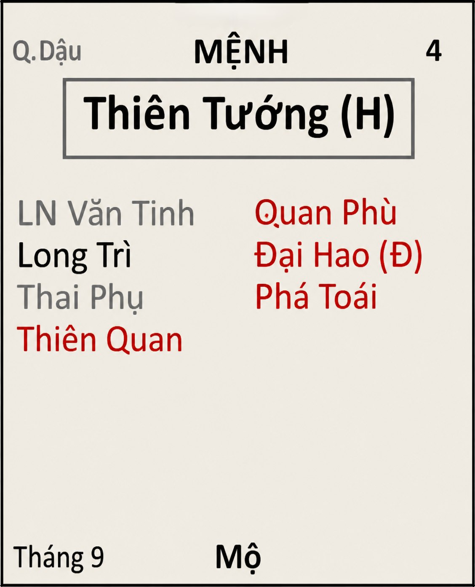

[Mục lục](../README.md)

# TỬ VI NAM PHÁI - BÀI SỐ 14: LUẬN GIẢI CUNG MỆNH THÔNG QUA CHÍNH TINH (PHẦN 10)

SAO THIÊN TƯỚNG
Ở bài số 13, chúng ta đã cùng tìm hiểu về tính cách, ưu điểm và nhược điểm của người có mệnh Cự Môn.
Qua đó có thể thấy, nếu bản thân bạn hoặc người thân có mệnh Cự Môn sáng sủa thì nên tận dụng khả năng phân tích, quan sát và tư duy logic của mình. Đây là mẫu người rất dễ thành công trong những công việc cần sử dụng lời nói, khả năng lập luận hoặc nghiên cứu chuyên sâu. Nếu biết tu dưỡng khẩu đức và phát huy đúng sở trường, họ hoàn toàn có thể tạo dựng danh tiếng và kiếm được rất nhiều tiền nhờ chính năng lực của bản thân.
Ngược lại, nếu Cự Môn bị phá cách thì điều quan trọng nhất chính là phải học cách kiểm soát lời nói, suy nghĩ thật kỹ hãy nói. Đừng phản ứng quá nhanh trước bất kỳ tình huống nào. Đừng nghĩ rằng: "Do người ta nói trước nên mình mới chửi lại." Hoặc đổ thừa do người này thế này, người kia thế kia nên mình mới ứng xử như vậy. Chúng ta nên tu cái khẩu của bản thân trước, đừng bao giờ nghĩ rằng lời nói gió bay. Tất cả những khẩu nghiệp đều bị ghi nhận và vẫn phải bị quả báo.
Người mệnh Cự Môn thì cả đời khắc cốt ghi tâm câu nói: "Họa xướng như lời." Một lời nói có thể cứu một con người, nhưng cũng có thể hủy hoại cả một mối quan hệ, thậm chí là cả một cuộc đời. Vì vậy, nếu biết suy nghĩ trước khi nói, biết nhẫn một chút, nhịn một chút thì cuộc sống sẽ ngày càng bình an và thuận lợi hơn.
Hôm nay, chúng ta sẽ tiếp tục nghiên cứu chính tinh thứ mười, đó là sao Thiên Tướng.
Trong 14 chính tinh, Thiên Tướng là một ngôi sao khá đặc biệt. Đây là ngôi sao đại diện cho sự chính trực, tận tâm và trách nhiệm.
Tuy nhiên, Thiên Tướng cũng là chính tinh rất khó luận riêng lẻ. Bởi vì đứng với sao tốt thì càng tốt, đứng với sao xấu cũng sẽ dễ bị ảnh hưởng theo sao xấu. Do đó, khi luận đoán về Thiên Tướng, chúng ta luôn phải kết hợp với các chính tinh và phụ tinh đi cùng thì mới có thể đưa ra kết luận chính xác.
Hôm nay, chúng ta sẽ tìm hiểu trước những tính chất cơ bản của sao Thiên Tướng để xây dựng nền tảng. Các bộ cách cụ thể sẽ được mình trình bày chi tiết trong phần CHƯ TINH LUẬN sau này.
________________________________________
1. ĐẶC ĐIỂM NGOẠI HÌNH
Người có Thiên Tướng tọa thủ cung Mệnh thường mang một dáng vẻ rất hiền lành, phúc hậu và dễ tạo thiện cảm với người đối diện.
Thông thường sẽ có những đặc điểm như sau:
• Gương mặt đoan chính, uy nghi nhưng hiền hòa. 
• Ánh mắt điềm tĩnh nhưng thật thà. Không phải kiểu người nhìn vào là thấy sự gian trá, gian xảo. Kể cả Thiên Tướng đi cùng sát tinh đi nữa thì cái mặt nhìn vẫn có nét hiền hậu.
• Khí chất nhìn chững chạc hơn so với tuổi. 
Nếu Thiên Tướng sáng sủa, thân hình thường khỏe mạnh, da dẻ sáng, khuôn mặt đẹp, thần thái đường hoàng và rất có phong thái của người làm quản lý.
Nam mệnh Thiên Tướng thường tạo cho người khác cảm giác là người đáng tin cậy. Họ không cần nói nhiều nhưng vẫn khiến người đối diện cảm thấy yên tâm khi giao việc.
Nữ mệnh Thiên Tướng lại mang vẻ đẹp dịu dàng, kín đáo và đoan trang. Đây là mẫu phụ nữ sống nội tâm, lễ phép, ít khoe khoang, cư xử đúng mực và rất biết giữ gìn hình ảnh của bản thân.
Nhiều người có Thiên Tướng cũng khá thích chăm chút vẻ bề ngoài. Không phải để phô trương, mà vì họ thích sự chỉnh tề, sạch sẽ và lịch sự. Đi ra ngoài quần áo luôn được chuẩn bị gọn gàng, đầu tóc chỉnh chu, tác phong nghiêm túc. Họ rất ít khi xuất hiện trong tình trạng luộm thuộm hay cẩu thả.
Nhìn chung, ngay từ ngoại hình và thần thái, người có Thiên Tướng tọa Mệnh thường toát lên cảm giác điềm đạm, đáng tin, chính trực và có khí chất của người làm việc lớn. Tuy nhiên, chỉ là bề ngoài thôi nhé, thực sự có đáng tin hay chính trực không thì vẫn còn phụ thuộc vào phụ tinh đi kèm chứ không thể khẳng định được ngay, nhưng nhìn chung đa phần mệnh Thiên Tướng có bề ngoài như miêu tả ở trên.
________________________________________
2. ĐẶC ĐIỂM TÍNH CÁCH
Người có Thiên Tướng tọa thủ cung Mệnh thường có những đặc điểm nổi bật như:
• Điềm đạm, cẩn trọng, chu đáo, ăn nói từ tốn.
• Trọng đạo khiêm cung, kính trên nhường dưới. Người Thiên Tướng biết tôn kính với người lớn hơn mình, biết nhường nhịn và yêu thương những người dưới mình. 
• Công bằng, chính trực, hiếm khi tham lam tài sản người khác. 
• Ham học hỏi, yêu thích kiến thức. Người mệnh Thiên Tướng ngày xưa thông thường thích đọc sách, ngày nay công nghệ phát triển thì số người thích đọc sách ít lại, nhưng họ cũng thích tìm hiểu kiến thức mới trên các nguồn Internet cho dù ở độ tuổi nào.
• Có khả năng sư phạm tốt, khả năng trình bày vấn đề để người khác dễ hiểu.
• Sống tình cảm, biết hy sinh bản thân cho những người xung quanh. 
• Thích giúp đỡ người khác, thích làm việc thiện. Nam mệnh khá là ga lăng nên cũng dễ được mấy bạn nữ yêu thích, mến mộ.
• Không tính toán, không so đo chi ly từng đồng từng cắc với người khác. Thầy mình vẫn hay nói “người mệnh Thiên Tướng không đo giọt nước mắm, không đếm củ dưa hành bao giờ”. 
• Nam mệnh Thiên Tướng thường rất thích gái đẹp (nhưng để trong bụng thôi, ít thể hiện ra ngoài). Do đó nam mệnh một số bạn rất dễ rơi vào trạng thái dại gái, bị gái dụ dỗ, lừa gạt. 
• Nữ mệnh thì dễ lụy tình, mang thiệt thòi về cho bản thân. Có những mệnh cách người nữ bị chồng đánh đập nhưng vẫn không chịu ly dị vì sống quá tình cảm, suy nghĩ quá nhiều cho người khác. Suy nghĩ cho tương lai con cái và đủ mọi lý do…
Nếu không bị phá cách quá nhiều, người mệnh Thiên Tướng ắt là bậc chính nhân quân tử.
________________________________________
Một điểm rất đặc biệt của Thiên Tướng là luôn suy nghĩ cho người khác trước khi nghĩ đến bản thân.
Thấy ai gặp khó khăn là động lòng. Thấy chuyện bất công thì không chịu được. Thấy người yếu thế bị bắt nạt thì sẵn sàng đứng ra bênh vực.
Việc giúp đỡ người khác của Thiên Tướng thường xuất phát từ sự chân thành chứ không phải để mong được báo đáp. "Người Thiên Tướng giúp người xong rồi... cũng quên luôn mình từng giúp." Đó chính là nét đẹp rất đáng quý của người mệnh Thiên Tướng.
________________________________________
Trong cuộc sống, Thiên Tướng cư xử rất khiêm tốn. Họ không thích khoe khoang, không thích tranh công, cũng không thích hơn thua.
Nếu thành công, họ thường cho rằng đó là công sức của cả tập thể. Nếu thất bại, họ lại sẵn sàng nhận trách nhiệm về mình.
Tuy nhiên, chính vì quá coi trọng tình nghĩa nên Thiên Tướng cũng rất dễ gặp phiền phức. Họ thường:
• Đứng ra bảo lãnh cho người khác. 
• Tin người quá mức. 
• Dễ nhận lời giúp khi người khác nhờ vả. 
Kết quả là không ít người phải gánh hậu quả thay cho người khác. Lòng tốt rất đáng quý, nhưng cũng cần đi kèm với sự tỉnh táo.
________________________________________
Đây là một trong những chính tinh có nhân duyên rất tốt, dễ được người khác tin tưởng và yêu quý. Tuy nhiên, cũng chính vì quá tốt bụng và quá nặng tình nên đôi khi lại tự mang thiệt thòi cho bản thân.
Nhìn chung, người có mệnh Thiên Tướng, nếu không bị các sao xấu phá cách về đạo đức và nhân cách, thì thường là người được cả người Dương lẫn người Âm kính trọng. Họ sống ngay thẳng, công bằng, biết trước biết sau, lấy chữ tín và sự chính trực làm gốc nên đi đến đâu cũng dễ được người Dương lẫn người Âm yêu quý và sẵn sàng giúp đỡ.
Người xưa có câu: "Đạo cao long hổ phục, đức trọng quỷ thần khâm." Câu nói này có thể xem là một trong những lời miêu tả rất phù hợp dành cho người mang mệnh Thiên Tướng. Khi đạo đức đủ cao, ngay cả những người mạnh mẽ cũng phải nể phục; khi đức hạnh đủ lớn, đến quỷ thần cũng phải kính trọng. Đó cũng chính là giá trị lớn nhất mà Thiên Tướng theo đuổi trong cuộc đời: không phải quyền lực hay tiền tài, mà là uy tín được xây dựng bằng nhân cách và sự chính trực.
________________________________________
3. THIÊN TƯỚNG TRONG CÔNG VIỆC VÀ SỰ NGHIỆP
Người mệnh Thiên Tướng nhìn chung Miếu, Vượng, Đắc và không gặp Tuần Triệt thì đều là người ít nhiều có công danh sự nghiệp. Đắc cách có thể phát triển mạnh trong môi trường nhà nước. Làm công ty tư nhân cũng dễ được làm giám đốc, trưởng phòng…
Trường hợp hãm địa, gặp Tuần Triệt hoặc bị phá cách nhiều, người Thiên Tướng vẫn giỏi làm nghề chuyên môn hoặc chuyển sang làm kinh doanh vẫn rất thành công.
Trong một số bộ cách đặc biệt, Thiên Tướng còn có duyên làm Thầy. Tất cả các ngành nghề như thầy giáo, thầy thuốc, thầy tướng số, thầy tu…đều rất giỏi.
Trong công việc, người Thiên Tướng làm việc chậm nhưng rất chắc chắn. Có tinh thần trách nhiệm cao.  Điểm nổi bật nhất của Thiên Tướng chính là sự tận tâm. Khi đã nhận một công việc, họ luôn cố gắng hoàn thành một cách tốt nhất có thể.
Có câu nói rất đúng với người Thiên Tướng: "Đã nhận thì phải làm cho tròn." Chính vì vậy, họ là những người rất được cấp trên tin tưởng và đồng nghiệp quý mến.
Thiên Tướng còn là người rất nghiêm khắc với bản thân. Họ luôn muốn mọi việc được thực hiện chỉnh chu. Làm việc gì cũng có kế hoạch. Không thích làm qua loa. Không thích sự cẩu thả.
Đây là mẫu người làm việc cực kỳ cẩn thận. Họ không thích làm cho xong mà luôn muốn làm cho đúng.
Có người chỉ cần xem qua một bản hợp đồng vài phút là ký ngay. Nhưng nếu là Thiên Tướng, họ có thể đọc từng điều khoản, từng dấu chấm, dấu phẩy, kiểm tra đi kiểm tra lại rồi mới đặt bút ký. Nhiều người vẫn nhận xét: "Đưa việc cho Thiên Tướng thì yên tâm, chỉ có điều phải kiên nhẫn chờ." Đúng là như vậy.
Thiên Tướng không phải làm chậm vì thiếu năng lực, mà vì họ luôn muốn giảm thiểu rủi ro xuống mức thấp nhất. Trong công việc, họ đặc biệt giỏi:
• Lãnh đạo, quản lý một bộ phận chuyên môn rất tốt.
• Khả năng đào tạo, training nhân viên bên dưới tốt.
• Kiểm soát chất lượng, kiểm tra hồ sơ. 
• Giỏi phò tá, có thể làm cánh tay đắc lực cho một lãnh đạo lớn.
Đây cũng là lý do rất nhiều người Thiên Tướng phù hợp với các công việc như:
• Lãnh đạo các ban, ngành chuyên môn.
• Công viên chức. 
• Công an, bộ đội, lực lượng vũ trang.
• Hành chính, thư ký. 
• Quản lý dự án. 
• Kế toán, kiểm toán. 
• Thanh tra. 
• Quản lý chất lượng (QA/QC). 
• Quản lý doanh nghiệp (giám đốc điều hành, trưởng phòng…)
• Hành chính - nhân sự.
• Luật pháp.
• Giáo dục.
• Y tế.
• Các tổ chức xã hội hoặc từ thiện.
• Một số bộ cách đặc biệt thì người Thiên Tướng có thể theo con đường tu hành.
________________________________________
Thiên Tướng không phải là mẫu người kinh doanh quá xuất sắc, trừ khi có một số bộ cách bổ trợ đi kèm.
Trong kinh doanh, đôi khi cần sự quyết đoán, dám chấp nhận rủi ro và nắm bắt cơ hội rất nhanh. Trong khi đó, Thiên Tướng thường suy nghĩ quá nhiều. Cơ hội vừa đến...Họ còn đang phân tích ưu - nhược điểm. Đến lúc quyết định xong thì người khác đã làm trước mất rồi.
Có câu rất đúng với Thiên Tướng: "Cẩn thận quá đôi khi cũng đánh mất cơ hội."
Nếu kinh doanh, họ thường là những thương gia rất lương thiện. Họ không thích lừa dối, không thích mánh khóe, không thích kiếm tiền bằng mọi giá.
Làm lãnh đạo công ty thì họ rất thương nhân viên, thương cấp dưới của mình. Họ hay tăng lương, nâng đỡ nhân viên, do đó làm tăng chi phí cho doanh nghiệp.
________________________________________
4. THIÊN TƯỚNG VÀ NHỮNG MỐI QUAN HỆ
Trong gia đình, Thiên Tướng sinh ra được cha mẹ chăm sóc yêu thương nhiều hơn anh chị em trong nhà. 
Thiên Tướng là người con, người cháu hiếu thảo với cha mẹ, ông bà của mình. 
Anh chị em trong nhà thường không hòa thuận với người mệnh Thiên Tướng, tuy nhiên người Thiên Tướng vẫn cố giữ trạng thái ôn hòa nhất có thể.
Thiên Tướng ắt là người chồng/người vợ tốt, tận tâm và rất có trách nhiệm với gia đình con cái.
Người mệnh Thiên Tướng tuy yêu thương con cái, nhưng khi dạy dỗ con cái thường rất khoa học và không nuông chiều.
Đối với bạn bè, đồng nghiệp, hoặc các mối quan hệ xã hội khác. Người Thiên Tướng vẫn đối nhân xử thế rất quân tử. Trừ khi bị phá cách bởi một số phụ tinh đặc biệt.
________________________________________
5. NHƯỢC ĐIỂM CẦN KHẮC PHỤC
Không có chính tinh nào hoàn hảo và Thiên Tướng cũng vậy. 
- Điểm yếu thứ nhất chính là quá sống tình cảm và dễ tin người. Vì bản thân sống ngay thẳng nên họ cũng dễ nghĩ người khác sẽ giống mình. Do đó rất dễ bị người khác lợi dụng lòng tốt.
- Điểm yếu thứ hai của Thiên Tướng chính là quá cẩn thận. Có những việc chỉ cần suy nghĩ năm phút là có thể quyết định, nhưng Thiên Tướng có thể cân nhắc đến vài ngày. Họ luôn muốn mọi thứ phải thật chắc chắn rồi mới bắt đầu. Đó là ưu điểm, nhưng cũng chính là nguyên nhân khiến nhiều cơ hội vụt mất.
________________________________________
TỔNG KẾT BÀI SỐ 14
Nhìn chung, người có mệnh Thiên Tướng là mẫu người sống ngay thẳng, nhân hậu, trọng nghĩa khí và rất có trách nhiệm. Họ không phải kiểu người thích tranh giành vị trí đứng đầu, nhưng lại thường là người giúp tập thể vận hành ổn định nhất.
Người mệnh Thiên Tướng là người giàu về đạo đức, tiếp đến là giàu về kiến thức, rồi cuối cùng mới giàu có về mặt kinh tế.
Người mệnh Thiên Tướng chỉ cần biết cân bằng giữa Lý Trí và Tình Cảm thì cuộc đời sẽ bớt khổ tâm hơn, ít bị người khác lợi dụng tình cảm hơn. Đôi khi quá tình cảm cũng dễ làm cho những người không tốt xung quanh thêm sự ỷ lại và sự vô ơn. Tình cảm, sự hy sinh cần dành cho đúng người.
Thiên Tướng kết hợp với những bộ sao nào thì phát huy công danh lên vị trí cao nhất, tối kỵ khi gặp những bộ sao nào…mình sẽ trình bày chi tiết trong phần CHƯ TINH LUẬN sau này.
