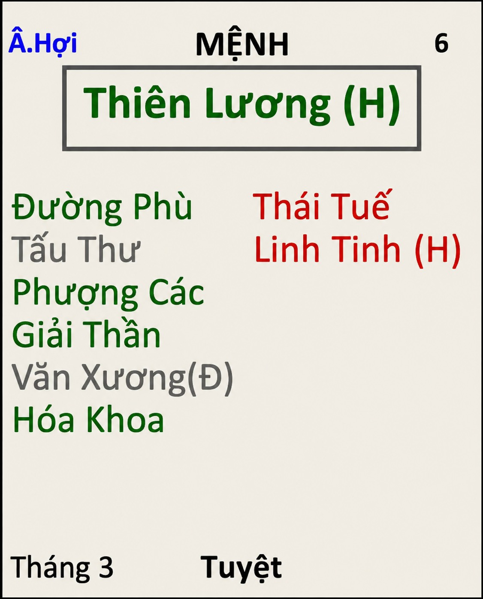

[Mục lục](../README.md)

# TỬ VI NAM PHÁI - BÀI SỐ 15: LUẬN GIẢI CUNG MỆNH THÔNG QUA CHÍNH TINH (PHẦN 11)

SAO THIÊN LƯƠNG
Ở bài số 14, chúng ta đã cùng tìm hiểu về tính cách, ưu điểm và nhược điểm của người có mệnh Thiên Tướng.
Qua đó có thể thấy, nếu bản thân bạn hoặc người thân có mệnh Thiên Tướng thì cho dù ở Miếu địa, Vượng địa hay thậm chí Hãm địa cũng đều là một chính tinh khá trọn vẹn, nói chung là ngon lành cành đào! Người có Thiên Tướng chỉ cần không bị các sát tinh phá cách quá nặng thì cuộc đời nhìn chung vẫn khá ổn định, được nhiều người yêu quý và giúp đỡ.
Tuy nhiên, Nam mệnh Thiên Tướng cũng cần lưu ý đừng quá "dại gái", quá mềm lòng trước chuyện tình cảm mà đánh mất nguyên tắc sống của mình.
Còn Nữ mệnh Thiên Tướng thì không nên quá hy sinh hoặc rơi vào sự quỵ lụy trong hôn nhân. Nếu chẳng may gặp phải người chồng không tốt thì cũng đừng cố chịu đựng chỉ vì quan điểm "cho mấy đứa con có đủ cha đủ mẹ". Có những mái nhà đủ cha đủ mẹ nhưng mỗi ngày đều đầy tiếng cãi vã, bạo lực gia đình và chỉ có năng lượng tiêu cực. Môi trường như vậy đôi khi còn gây tổn thương cho con cái nhiều hơn và cũng là vô tình hại con mình một cách gián tiếp mà không hề hay biết.
Bởi vậy, người mệnh Thiên Tướng hãy luôn nhớ câu thơ:
"Gặp gỡ trên đời một chữ duyên,
Trân trọng bên nhau lúc hiện tiền.
Người đến ân cần cho hết dạ,
Người về thôi vướng bận niềm riêng."
Hôm nay, chúng ta sẽ tiếp tục nghiên cứu chính tinh thứ mười một, đó là sao Thiên Lương.
Nếu Thiên Tướng đại diện cho sự chính trực và trách nhiệm, thì Thiên Lương lại là ngôi sao của phúc đức, lòng từ bi, sự che chở. Đây cũng là một trong những chính tinh mang màu sắc rất đặc biệt trong Tử Vi.
________________________________________
1. ĐẶC ĐIỂM NGOẠI HÌNH
Người có Thiên Lương tọa thủ cung Mệnh thường có những đặc điểm sau:
• Dáng người thanh thoát. 
• Da trắng hoặc sáng màu. 
• Khuôn mặt thanh tú. 
• Nhiều người có lưng hơi gù khi lớn tuổi.
• Khí chất điềm đạm, nho nhã và có vẻ già dặn hơn tuổi thật. 
Nếu Thiên Lương nhập Miếu hoặc Vượng địa thì ngoại hình đầy đặn hơn, khuôn mặt sáng sủa, thần thái ổn trọng, khiến người khác vừa gặp đã có cảm giác đáng tin cậy.
Ngược lại, nếu gặp nhiều sát tinh hoặc rơi vào Hãm địa thì ngoại hình vẫn dễ nhìn nhưng thần sắc thường thiếu sinh khí, cơ thể dễ mang dáng vẻ suy tư.
Một điểm khá thú vị là người Thiên Lương thường tạo cho người khác cảm giác "đứng đắn". Có những người mới ngoài hai mươi tuổi nhưng phong thái nói chuyện lại giống như người đã trải qua rất nhiều va chạm trong cuộc sống. Đó chính là nét đặc trưng của Thiên Lương.
Đôi khi không hẳn nhìn họ già trước tuổi, mà bởi khí chất của họ vốn mang phong cách của một người từng trải, điềm tĩnh và chững chạc.
________________________________________
2. ĐẶC ĐIỂM TÍNH CÁCH
Thiên Lương mang tâm địa lương thiện, thanh cao, sống có nguyên tắc và rất coi trọng đạo đức. Họ lý trí, giỏi biện luận, có cốt cách của người quân tử, của bậc hiền triết hoặc của người tu hành. 
Trong cách đối nhân xử thế, Thiên Lương luôn lấy sự chân thành, khiêm cung và lễ nghĩa làm nền tảng.
Người có Thiên Lương nhập Mệnh thường rất nhân từ, hay nghĩ cho người khác, thích giúp đỡ người gặp khó khăn và luôn xem việc làm điều thiện là niềm vui của bản thân. Họ đối xử ôn hòa với mọi người, biết phục thiện và sẵn sàng dang tay giúp đỡ những người bất hạnh.
Người có mệnh Thiên Lương thông thường còn rất thích khuyên nhủ người khác. Thấy người khác khổ, ắt sẽ khuyên nên làm thế này, nên làm thế kia. Đi với một số bộ cách đặc biệt, người Thiên Lương còn thích dạy người khác cách sống sao cho đúng. Ví dụ, cho dù có gặp tỷ phú thì vẫn dạy người ta cách xài tiền.
Người mệnh Thiên Lương nếu không bị sát tinh phá cách thì thông thường sẽ rất giản dị. Họ giản dị từ trang phục cho đến cách chi tiêu, họ ăn uống cũng rất đơn giản, không cầu kỳ. Thậm chí, khi nghèo khổ, người mệnh Thiên Lương sẵn sàng nhịn đói để nuôi con của mình ăn học nên người.
Chúng ta thường thấy hình bóng của một người thầy với bộ trang phục quần tây, áo sơ mi cũ kỹ, đi một chiếc xe cũ, trông rất giản dị…Ấy chính là biểu trưng cho người mệnh Thiên Lương. Nhưng đôi khi giản dị quá lại có phần lượm thượm. 
->Đây là mình đang miêu tả để các bạn hiểu về bản chất của sao Thiên Lương thôi, chứ không phải ai mệnh Thiên Lương cũng như vậy nhé. Thiên Lương có phụ tinh Đào Hoa, Hồng Loan đi cùng thì vẫn rất sang đẹp chứ không hoàn toàn giản dị nữa.
Người có mệnh Thiên Lương nếu không có sát tinh, ắt là người sống rất có nề nếp và khoa học, phong cách đôi khi có phần giống người già. Ví dụ, họ dậy sớm lúc 6 giờ sáng, tối về cũng luôn cố gắng ngủ sớm trước 10 giờ. Bình thường thì hiếm khi ăn đồ ăn vặt có hại cho sức khỏe…
Người có mệnh Thiên Lương đôi khi lại hay chỉ trích, phê bình và đánh giá người khác. Những người càng sống có nguyên tắc, thì lại càng thấy những người xung quanh không có nguyên tắc, có lẽ đây cũng là bệnh của người già. Ví dụ, bạn mà mặc áo hở ngực hay trên người có hình xăm, đứng trước người có mệnh Thiên Lương thì họ sẽ đánh giá bạn là người không tốt.
Người có mệnh Thiên Lương còn thích được người khác tôn vinh, thích được mọi người xung quanh tôn sùng, tôn kính. Đi cùng sát tinh, ám tinh…dễ rơi vào tình trạng hám danh.
Đa phần người có mệnh Thiên Lương sẽ ưa thích các vật phẩm và văn hóa cổ như: đồ cổ, trang phục cổ, đồng hồ cổ, nhà tranh mái ngói, khung cảnh làng quê, phim cổ trang. Có học võ thì họ cũng thích võ cổ truyền hơn võ hiện đại.
Người mệnh Thiên Lương bẩm sinh thì không thông minh sẵn, nhưng nhờ sự cần cù, chịu khó, thích lọ mọ nghiên cứu, thích học tập kiến thức mới…mà dần dần có kiến thức sâu rộng hơn người khác.
Nhìn chung, vị trí của Thiên Lương ở các cung và phụ tinh cũng ảnh hưởng rất lớn đến tính cách của người Thiên Lương, cụ thể mình sẽ trình bày chi tiết trong phần CHƯ TINH LUẬN sau này.
________________________________________
3. THIÊN LƯƠNG VÀ CÔNG VIỆC, SỰ NGHIỆP
Thiên Lương nhìn chung khá quang minh lỗi lạc, xử lý công việc quyết đoán, luôn đứng trên lập trường công bằng và rất ít khi thiên vị. Chính vì vậy, trong công việc họ thường được nhiều người kính trọng và tin tưởng.
Tính cách của Thiên Lương trong công việc vừa có sự khiêm tốn, lễ phép, vừa có phần sĩ diện và nguyên tắc. Họ không quá coi trọng tiền bạc, ít tính toán được mất về vật chất, nhưng lại rất coi trọng danh dự, nhân phẩm và chữ tín.
Thiên Lương có tính tình ôn hòa, biết cư xử, khéo sắp xếp công việc và không thích bon chen, tranh giành. Họ ít khi chủ động xông pha mạo hiểm, cũng không thích làm người tiên phong. 
Thiên Lương yêu thích sự yên tĩnh, cuộc sống yên bình, ổn định nên thường lựa chọn làm công ăn lương và khá có duyên với tôn giáo, triết học hoặc con đường tu tập.
Trong một xã hội đầy biến động, người Thiên Lương hiếm khi là người đứng lên làm cách mạng. Họ có khuynh hướng chờ đợi thời cơ thích hợp hơn là chủ động lao vào cạnh tranh. Trên phương diện phục vụ cộng đồng, Thiên Lương cũng không nhiệt huyết mãnh liệt như Thiên Tướng; về quyền uy cũng không mạnh mẽ như Thái Dương. 
Nhìn chung, người Thiên Lương phù hợp các ngành nghề như:
- Giáo dục, nghiên cứu học thuật, pháp luật, tư pháp, thanh tra, kiểm tra, cố vấn, tư vấn, quản lý nhà nước hoặc các tổ chức xã hội.
- Chính trị, hoạt động xã hội, công tác thiện nguyện, tổ chức phi chính phủ hoặc các công việc mang tính nhân đạo.
Con đường thành công của Thiên Lương thường đến từ chức vụ, từ học vấn, danh vị hoặc sự tín nhiệm mà người khác dành cho mình hơn là nhờ những thủ đoạn cạnh tranh hay tranh đoạt. Họ không phải kiểu người giỏi mưu mẹo, càng không đủ thủ đoạn để đối đầu với những âm mưu hay sự chống phá xung quanh.
Ngoài ra, người có Thiên Lương nhập Mệnh, đi kèm các bộ cách đặc biệt thì còn có thiên hướng nghiên cứu về y học, đặc biệt là Đông y, thuốc Nam, thuật số, tôn giáo hoặc các lĩnh vực liên quan đến chữa bệnh và cứu người. Đây là những lĩnh vực mà Thiên Lương thường có tiềm năng bẩm sinh, chỉ cần đủ duyên là có thể theo nghề được.
Thiên Lương còn rất có duyên với tập thể số đông, có duyên làm thầy giáo nếu đầy đủ cách bộ cách phù hợp. Người mệnh Thiên Lương mà làm thầy thì có rất nhiều học trò theo.
________________________________________
4. NHƯỢC ĐIỂM CỦA THIÊN LƯƠNG
Tuy mang nhiều phẩm chất đáng quý, nhưng cũng giống như bất kỳ chính tinh nào khác, Thiên Lương vẫn có những nhược điểm cần phải nhận ra để hoàn thiện bản thân.
Trước hết, Thiên Lương là người không quá thực dụng, ít bon chen và cũng không thích tranh giành. Chính vì vậy, họ thường bỏ lỡ nhiều cơ hội tốt trong cuộc sống. Họ có khuynh hướng chờ thời cơ hơn là chủ động tạo ra thời cơ, thích ổn định hơn là mạo hiểm. Đôi khi vì quá thận trọng nên đánh mất những cơ hội vốn chỉ xuất hiện một lần. Trừ khi có sát tinh đi kèm thì mới giải được nhược điểm này.
Một nhược điểm khác là không giỏi tính toán tiền bạc. Thiên Lương coi trọng đạo nghĩa hơn vật chất, không quá để tâm đến chuyện được mất, nên đôi khi dễ chịu thiệt về kinh tế hoặc bỏ qua những lợi ích đáng lẽ thuộc về mình. Người mệnh Thiên Lương mà cho người khác vay tiền thì rất khó mà đòi lại được khi thấy con nợ quá khổ ^^!
Tuy sống nhân hậu và hay giúp đỡ người khác, nhưng cũng chính vì vậy mà Thiên Lương rất dễ rơi vào cảnh làm ơn mắc oán. Họ thường quá nhiệt tình, can thiệp quá sâu vào chuyện của người khác, cuối cùng lại bị hiểu lầm hoặc mang tiếng xấu.
Người có Thiên Lương nhập Mệnh cũng khá sĩ diện, thích giữ hình ảnh của mình trước người khác. Đôi khi họ cậy mình từng trải, thích góp ý, thích bắt bẻ hoặc soi xét người khác với mong muốn giúp họ tốt hơn, nhưng cách thể hiện lại khiến đối phương cảm thấy bị phê phán.
Một đặc điểm khá rõ của Thiên Lương là lòng tốt rất lớn, nhưng cũng chính vì lòng tốt quá lớn nên khi bị phản bội hoặc thất vọng, cảm xúc tiêu cực sẽ bùng phát mạnh hơn người bình thường.
Thiên Lương rất lương thiện và luôn truyền năng lượng nhân ái đến cho người khác. Nhưng cũng giống như mọi thứ trên đời, đây là con dao hai lưỡi. Khi tình cảm quá sâu, kỳ vọng quá lớn hoặc dành quá nhiều tâm huyết cho một người hay một việc nào đó, nếu kết quả nhận lại là sự phản bội hoặc vô ơn, toàn bộ lòng tốt ấy rất dễ chuyển hóa thành cơn giận dữ dữ dội.
Bởi vậy, nhiều người chỉ nhìn thấy vẻ hiền lành của Thiên Lương mà quên mất rằng người càng hiền thì khi nổi nóng lại càng đáng sợ.
Thiên Lương cũng thuộc dạng nóng tính và khá cục. Nếu Liêm Trinh nóng theo kiểu bộc phát, mạnh mẽ và quyết liệt, thì Thiên Lương lại nóng theo kiểu dồn nén rất lâu. Bình thường họ rất ôn hòa, nhưng khi sự chịu đựng vượt quá giới hạn, hoặc khi những người họ hết lòng giúp đỡ lại quay lưng phản bội, cơn giận sẽ bùng phát rất dữ dội.
Điểm đáng tiếc là sau khi nóng giận và gây ra hậu quả, Thiên Lương lại là người hối hận rất nhanh. Họ thường tự trách bản thân, cảm thấy day dứt vì những gì mình đã nói hoặc đã làm.
Có những lúc Thiên Lương cố chấp bảo vệ một quan điểm đã không còn phù hợp với thực tế, chỉ vì không muốn thừa nhận mình sai. Thậm chí, họ có thể tự làm khó bản thân chỉ để giữ lấy cái tôi và lý tưởng của mình.
Là người sống lý tưởng, Thiên Lương cũng dễ lý tưởng hóa cuộc sống và con người. Họ mong muốn mọi việc đều diễn ra theo những giá trị đạo đức tốt đẹp. Vì vậy, khi phải đối diện với thực tế đầy toan tính và vụ lợi, họ thường thất vọng nhiều hơn người khác.
Ngoài ra, Thiên Lương còn có xu hướng tự quan trọng hóa bản thân. Vì ham học hỏi, hiểu biết nhiều và có chính kiến nên đôi khi họ vô tình nghĩ mình là người hiểu rõ mọi vấn đề. Họ thích đưa ra lời khuyên, thích chia sẻ quan điểm, và đôi khi lại tỏ ra như một chuyên gia trong nhiều lĩnh vực.
Đặc biệt, vì luôn muốn khác biệt nên có lúc Thiên Lương cố tình đi ngược với số đông, không hẳn vì điều đó đúng hơn, mà chỉ để khẳng định cá tính riêng của mình. Chính điều này khiến không ít người đánh giá họ là lập dị hoặc khó hòa hợp.
Thiên Lương cũng là một trong những mẫu người ít chịu thỏa hiệp. Khi đã tin rằng mình đúng, họ rất khó thay đổi lập trường. Đây vừa là ưu điểm về nguyên tắc sống, nhưng cũng là nhược điểm khiến họ đôi khi đánh mất những cơ hội hợp tác hoặc làm tổn thương các mối quan hệ xung quanh.
Tuy nhiên, xét cho cùng, tất cả những nhược điểm trên đều xuất phát từ một điểm chung: Thiên Lương quá coi trọng đạo nghĩa và lý tưởng sống. Chỉ cần biết dung hòa giữa lý tưởng và thực tế, giữa lòng tốt và sự tỉnh táo, giữa nguyên tắc và sự linh hoạt, thì những điểm yếu ấy sẽ dần trở thành sức mạnh giúp Thiên Lương trưởng thành và đạt được nhiều thành tựu trong cuộc sống.
________________________________________
TỔNG KẾT BÀI SỐ 15
Qua những phân tích trên có thể thấy, Thiên Lương là một trong những chính tinh mang nhiều sự giản dị và đạo đức trong khoa Tử Vi. Đây là mẫu người sống ngay thẳng, trọng nghĩa khinh tài, có lòng từ bi, luôn mong muốn đem kiến thức và khả năng của mình để giúp ích cho người khác. Họ không thích tranh giành, không giỏi thủ đoạn, nhưng lại rất dễ nhận được sự kính trọng nhờ nhân phẩm và uy tín của bản thân.
Người có Thiên Lương thủ Mệnh thường không phải kiểu phát tài quá sớm hay thành công bằng những con đường đầy mạo hiểm. Con đường của họ là lấy đức làm gốc, lấy uy tín làm nền, lấy sự cống hiến để đổi lấy thành tựu. Chính vì vậy, cuộc đời của Thiên Lương thường càng về hậu vận càng ổn định, càng lớn tuổi càng được nhiều người tín nhiệm và kính trọng.
Tuy nhiên, sao Thiên Lương ở những cung đặc biệt, đi kèm một ám tinh, sát tinh lại rất dễ biến chất thành con người dâm dục, thậm chí bị phá cách quá nặng nề còn dễ dẫn đến những hành vi lệch lạc như ngoại tình, đồng tính…Mình sẽ trình bày đầy đủ các bộ cách trong phần CHƯ TINH LUẬN sau này.

[Mục lục](../README.md)
