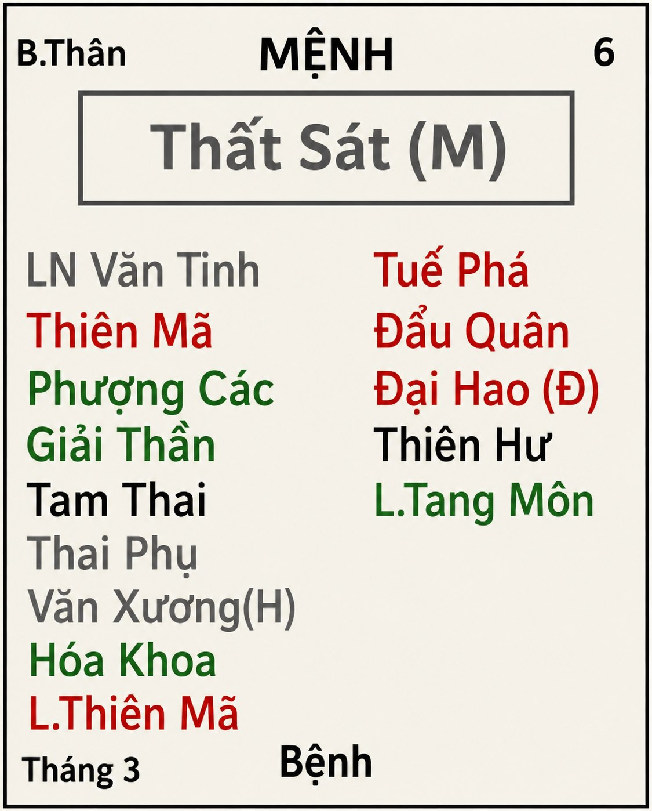

[Mục lục](../README.md)

# TỬ VI NAM PHÁI - BÀI SỐ 16: LUẬN GIẢI CUNG MỆNH THÔNG QUA CHÍNH TINH (PHẦN 12)

SAO THẤT SÁT
Ở bài số 15, chúng ta đã cùng tìm hiểu về tính cách, ưu điểm và nhược điểm của người có Mệnh Thiên Lương.
Qua đó có thể thấy, nếu bản thân hoặc người thân có Mệnh Thiên Lương mà không bị phá cách thì đa phần đều có tuổi thọ cao do họ biết giữ gìn sức khỏe, sống có đạo đức và duy trì lối sống điều độ. Tuy nhiên, Thiên Lương cũng cần lưu ý một nhược điểm là rất dễ nuông chiều con cái, khiến con sau này thiếu sự kính trọng hoặc trở nên hỗn hào với cha mẹ.
Đối với trường hợp Thiên Lương bị phá cách, mình sẽ phân tích chi tiết hơn trong phần Chư Tinh Luận sau này.
Hôm nay, chúng ta sẽ cùng nghiên cứu chính tinh thứ mười hai trong hệ thống 14 Chính Tinh, đó là sao Thất Sát.
________________________________________
1. Ý nghĩa tổng quát của sao Thất Sát
Thất Sát là một trong những hung sát tinh quan trọng nhất của Tử Vi Đẩu Số. Dù lá số đẹp hay xấu, chỉ cần Thất Sát tọa Mệnh hoặc cung an Thân thì cuộc đời thường khó tránh khỏi những biến cố lớn, những lần đối mặt với hiểm nguy hoặc những giai đoạn đầy chướng ngại.
Người mang Mệnh Thất Sát thường hiếm khi được hưởng sự viên mãn trọn vẹn trên mọi phương diện. Họ có thể:
• Phú quý nhưng hôn nhân trắc trở. 
• Gia đình hạnh phúc nhưng đường con cái không như ý. 
• Có con nhưng con ít hoặc con hay đau yếu. 
• Có thể sớm chịu cảnh chia ly với cha mẹ hoặc anh chị em. 
• Nếu lục thân đầy đủ, sức khỏe tốt thì công danh, tài lộc lại khó đạt đến đỉnh cao. 
Bởi vậy, khi luận Mệnh Thất Sát tuyệt đối không thể chỉ nhìn riêng cung Mệnh mà phải xem toàn bộ mười hai cung để xác định phương diện nào của cuộc đời sẽ là phần "khuyết". 
________________________________________
2. Đặc trưng cuộc đời của người Mệnh Thất Sát
Cuộc đời nhiều sóng gió, thành công đến sau thử thách. Người có Thất Sát thủ Mệnh gần như đều phải trải qua một quá trình tôi luyện.
Nếu tuổi trẻ quá thành công, quá thuận lợi thì hậu vận thường dễ suy bại. Người xưa gọi đó là: "Thiếu niên đắc chí, hậu vận đa truân."
Ngược lại, nếu thời trẻ phải bôn ba, vất vả, nhiều lần thất bại rồi đến trung niên mới phát triển thì chính những kinh nghiệm ấy sẽ trở thành nền tảng vững chắc giúp họ giữ được thành công lâu dài.
Thất Sát được cổ nhân ví như thanh kiếm (thanh gươm), bất kỳ thanh kiếm nào cũng phải trải qua nhiều lần tôi luyện mới trở nên sắc bén, Thất Sát càng trải qua nhiều khó khăn thì càng trưởng thành và bản lĩnh.
________________________________________
3. Ngoại hình của người Mệnh Thất Sát
Người có Thất Sát tọa Mệnh thường có những đặc điểm sau:
• Khuôn mặt vuông dài hoặc góc cạnh. 
• Đôi mắt to và hơi lồi 1 chút, ánh mắt sắc và có uy. 
• Trên mặt thường có sẹo, nốt rỗ hoặc dấu vết đặc biệt. 
• Thân thể dễ có thương tích hoặc sẹo. 
Nếu Thất Sát nhập miếu thì thân hình đầy đặn hơn; nếu lạc hãm thì người thường gầy và khắc khổ hơn. Đây là đặc điểm tổng quan thôi, vì còn sự tác động của phụ tinh và hệ thống Tuần Triệt làm thay đổi ngoại hình nữa.
________________________________________
4. Tính cách đặc trưng của Thất Sát
Sao Thất Sát là một sao trong bộ ba tam hợp: Thất Sát, Phá Quân và Tham Lang. Biểu tượng cho sự tham, sân, và si của con người. Trong đó, Thất Sát tượng trưng cho tính sân. Đây là tượng trưng thôi chứ không có nghĩa người có mệnh Thất Sát chắc chắn có tính sân hận hung tàn, còn tùy vào Miếu Vượng Đắc Hãm, hệ thống phụ tinh và tuần triệt gia giảm.
Điểm nổi bật nhất của Thất Sát là sự pha trộn giữa lý trí, quyết đoán và nóng nảy. Giữa tình cảm và lý trí, người mệnh Thất Sát sẽ ưu tiên chọn lý trí hơn. Ví dụ ai mà phụ tình họ, họ sẽ quyết tâm ly dị chứ khó mà năn nỉ để cho thêm cơ hội, trừ khi còn vướng nghiệp duyên quá lớn (Tang Môn phùng Ân Quang Thiên Quý...sau này học tới mình sẽ nói rõ).
Đây là mẫu người nhìn chung sẽ có những đặc trưng sau:
• Tính cách mạnh mẽ, độc lập, kiên cường, không thích dựa dẫm. 
• Họ nhanh nhẹn tháo vát, đi nhanh, làm gì cũng nhanh, không có rề rà, trừ khi sức khỏe không cho phép thôi.
• Họ không thích bị người khác quản lý. 
• Ý chí cực mạnh, đã quyết làm thì làm đến cùng. Họ rất ghét sự thất bại.
• Có nhiều nguyên tắc nghiêm khắc, khắc khe và khó tính.
• Cho dù đàn ông hay đàn bà đều có tính ghen tuông rất lớn.
• Tính chiếm hữu cao, cái gì của mình là của mình, không thích ai động vào.
• Họ không thích bị người khác can thiệp vào công việc của mình và cũng ít khi chịu phục tùng bất kỳ ai.
• Ngay từ khi còn đi học, nhiều người Mệnh Thất Sát đã có xu hướng phản kháng những quy tắc mà họ cho là vô lý.
• Người mệnh Thất Sát dễ thời ghét cay ghét đắng người khác. Ai đã làm cho họ ghét thì họ ghét luôn tổ tông 3 đời của người đó.
Khi Thất Sát lạc hãm mà không có nhiều bộ sao cát lành hoặc hệ thống Tuần Triệt chế hóa, mà còn lại tăng nhiều hung sát tinh thì:
• Tính hung hăng, ngang tàn, tàn độc, dễ trở thành “sad nhân”. Một khi đã xác định đối thủ thì sẽ đuổi cùng giết tận, theo kiểu: "Nhổ cỏ phải nhổ tận gốc."
• Luôn muốn chiến thắng, không muốn thua cuộc, rất độc tài và chuyên quyền. Trong gia đình thì rất gia trưởng với người dưới, hỗn hào với người trên.
• Họ sân hận, thù dai, thiếu sự cảm thông, đồng cảm, và khó tha thứ cho người khác. Có xu hướng trả đũa rất quyết liệt khi ai động đến họ. 
Tuy nhiên, điểm đáng quý là Thất Sát không phải kiểu người gian xảo (trừ khi đi cùng ám tinh).
• Họ yêu ghét rất rõ ràng.
• Đã ghét thì nói ghét.
• Đã quý thì hết lòng.
________________________________________
Nội tâm của Thất Sát thường cô độc:
Thất Sát thường tạo cho người khác cảm giác lạnh lùng. Thực chất họ chỉ là những người sống độc lập và ít biểu lộ cảm xúc. Bên ngoài cứng rắn nhưng bên trong lại rất trọng tình nghĩa.
Một khi đã xem ai là người thân thì họ sẽ bảo vệ đến cùng.
Lòng trung thành của Thất Sát rất lớn. Họ ghét phản bội và cũng rất khó tha thứ cho những ai từng làm tổn thương mình.
Đó cũng là lý do Thất Sát nổi tiếng là người nhớ rất lâu cả ân lẫn oán, ơn đền oán trả rất rõ ràng.
Đây cũng là chính tinh được xem là không nên kết oán nhất.
________________________________________
5. Thất Sát và công việc, sự nghiệp
Nếu Thất Sát miếu, vượng hoặc đắc địa thì đây là một trong những chính tinh có tố chất lãnh đạo mạnh nhất. Họ thường có các đặc tính:
• Dũng cảm. 
• Gan lì. 
• Quyết đoán. 
• Có mưu lược. 
• Có tầm nhìn xa. 
• Có năng lực chỉ huy. 
• Có khả năng thống lĩnh tập thể. 
Thất Sát thích làm việc lớn. Họ không thích những công việc quá nhỏ nhặt hoặc lặp đi lặp lại.
Họ cũng không ngại chịu trách nhiệm, càng áp lực càng dễ phát huy năng lực. Chính vì vậy, nhiều người Mệnh Thất Sát dễ thành công trong quân đội, công an, kỹ thuật, quản lý, doanh nghiệp hoặc những lĩnh vực cần bản lĩnh và khả năng ra quyết định.
Thất Sát khi đắc cách thì thời chiến có thể làm anh hùng vang danh một phương. Thời bình có thể gây dựng sự nghiệp lớn và nổi tiếng ở một vùng. Người mệnh Thất Sát khi kinh doanh, buôn bán cũng rất giỏi. Họ rất nhanh nhẹn và chịu khó.
________________________________________
Động lực lớn nhất của Thất Sát là:
• Thành công. 
• Danh tiếng. 
• Địa vị. 
• Tiền tài. 
• Quyền lực. 
Họ luôn muốn chứng minh năng lực bản thân. Họ cũng thích người khác phải công nhận thực lực của mình. Trong sâu thẳm, Thất Sát luôn mong muốn được người khác nể phục hơn là yêu quý.
________________________________________
Khác với vẻ ngoài nóng nảy, bên trong Thất Sát lại là người suy nghĩ rất kỹ. Trước khi hành động, họ thường:
• Thu thập thông tin. 
• Phân tích ưu điểm. 
• Tìm khuyết điểm. 
• Dự đoán rủi ro. 
• Chuẩn bị phương án dự phòng. 
Họ có khả năng nhìn thấy những điểm yếu mà người khác bỏ qua.
Nếu đối thủ để lộ sơ hở, Thất Sát sẽ nhanh chóng phát hiện và tận dụng.
Họ thích lập kế hoạch dài hạn, chia mục tiêu lớn thành nhiều bước nhỏ và kiên trì thực hiện từng bước một.
Họ làm việc rất nghiêm túc, yêu cầu cao về chất lượng và ít khi giao những phần quan trọng cho người khác vì khó hoàn toàn tin tưởng.
Chính sự cẩn trọng này khiến nhiều người nghĩ Thất Sát quá cầu toàn hoặc quá khó tính.
________________________________________
6. Quan niệm về tiền bạc
Thất Sát rất biết giữ tiền. Họ không thích tiêu xài phung phí.
Trong kinh doanh, họ thành công nhờ sự chuẩn bị kỹ lưỡng chứ không phải nhờ may mắn.
Trước khi đầu tư, họ sẽ nghiên cứu rất kỹ. Chỉ khi cảm thấy đủ chắc chắn họ mới bắt đầu hành động. Bởi vậy, tài sản của Thất Sát thường được tích lũy từ từ và vững chắc, đặc biệt sau tuổi trung niên.
________________________________________
7. Thất Sát và các mối quan hệ
Trong gia đình, người Thất Sát nhìn chung rất có trách nhiệm. Họ sẵn sàng chăm lo cho mọi người xung quanh miếng ăn áo mặc.
Nhiều người mệnh Thất Sát cũng dễ xảy ra bất hòa với anh chị em hoặc với cha của mình.
Trong đời, người Thất Sát dễ bị bạn bè, đồng nghiệp, người ngoài xã hội hãm hại sau lưng.
Họ cũng thường thử lòng người thân để kiểm tra mức độ trung thành. Nếu được yêu thương chân thành, Thất Sát sẽ đáp lại bằng sự bảo vệ và hy sinh rất lớn. Nhưng nếu bị phản bội, họ rất khó quên và rất khó tha thứ.
________________________________________
8. Nữ mệnh Thất Sát
Nữ mệnh Thất Sát thường:
• Hoạt bát. 
• Mạnh mẽ. 
• Quyết đoán. 
• Có khí chất. 
• Giỏi công việc. 
• Thích giúp đỡ người khác. 
Họ không phải là mẫu phụ nữ chỉ thích nội trợ. Sau khi kết hôn, thường có xu hướng nắm quyền chủ động trong gia đình.
Nếu gặp người chồng quá nhu nhược thì rất dễ rơi vào tình trạng "vợ quyết định mọi việc".
________________________________________
TỔNG KẾT BÀI SỐ 16
Bên cạnh những nhược điểm, Thất Sát cũng sở hữu những phẩm chất rất đáng khâm phục.
Đây là một trong những chính tinh anh hùng và quật cường nhất trong Tử Vi. Họ không bao giờ lùi bước trước khó khăn, họ không sợ đối thủ mạnh, không sợ áp lực, không sợ thử thách. Phong ba bão táp đối với Thất Sát chỉ là cơ hội để chứng minh bản lĩnh.
Ngoài ra, Thất Sát còn nổi tiếng bởi tinh thần lao động chăm chỉ. Họ làm việc nhanh nhẹn, hiệu quả, có trách nhiệm. Đã bắt tay vào việc thì sẵn sàng quên mình để hoàn thành. Thất Sát không thích hứa suông, đã nhận việc thì sẽ cố gắng hoàn thành đến cùng. Chính vì vậy, Thất Sát luôn là mẫu người dễ gây dựng sự nghiệp bằng chính thực lực của bản thân.
Sao Thất Sát hoặc bộ cách Sát Phá Tham nói chung (gồm Thất Sát, Phá Quân, Tham Lang) lại là bộ cách đặc biệt có thể cai quản được sát tinh, rất phù hợp khi cung Mệnh hội chiếu cùng sát tinh để có thể làm nên những việc lớn mà người khác ít ai làm được. Tuy nhiên, còn xét nhiều yếu tố như vị trí của sao Thất Sát tại 12 cung, chính tinh và phụ tinh đi kèm, sự đắc hãm của phụ tinh và hệ thống tuần triệt mới có thể kết luận được tốt ở chỗ nào và xấu ở chỗ nào. Cụ thể mình sẽ phân tích kỹ sau này, các bạn cứ đón đọc nhé!

[Mục lục](../README.md)
