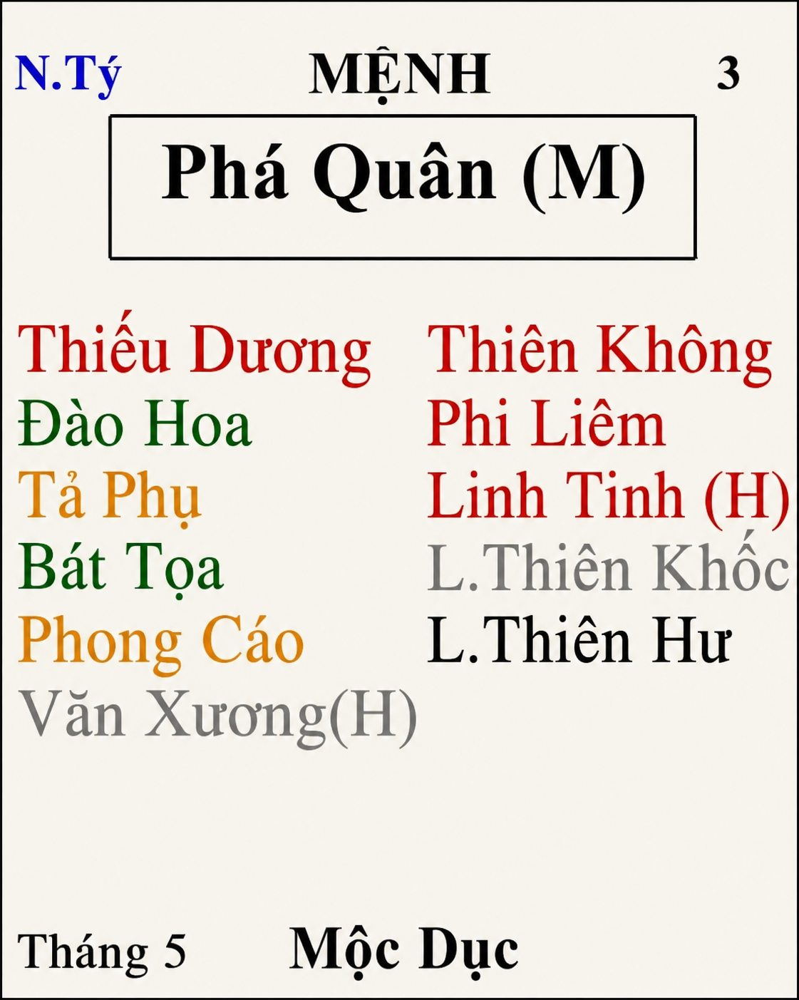

[Mục lục](../README.md)

# TỬ VI NAM PHÁI - BÀI SỐ 17: LUẬN GIẢI CUNG MỆNH THÔNG QUA CHÍNH TINH (PHẦN 13)

SAO PHÁ QUÂN
Ở bài số 16, chúng ta đã cùng tìm hiểu về tính cách, ưu điểm và nhược điểm của người có Mệnh Thất Sát.
Qua đó có thể thấy, nếu bản thân hoặc người thân có Mệnh Thất Sát biết tận dụng đặc tính mạnh mẽ, uy quyền, nhanh nhẹn, quyết đoán của mình, đồng thời mệnh cách không bị phá cách thì đa phần đều có thành tựu cao trong lĩnh vực kinh tế. Nếu làm việc trong cơ quan nhà nước cũng dễ nắm giữ chức vụ cao, còn theo con đường binh nghiệp như công an, quân đội... cũng thường đạt được nhiều thành tựu.
Đối với trường hợp Thất Sát bị phá cách thì vẫn nên học cách kiềm chế sự nóng nảy và tính sân si của bản thân để tránh gây họa lớn cho mình cũng như tạo nghiệp chướng sâu nặng. Khi quả báo đến thì hậu quả thường rất khó lường. Cụ thể những bộ cách nào bị phá cách và cách hóa giải ra sao, mình sẽ phân tích chi tiết hơn trong phần Chư Tinh Luận sau này.
Hôm nay, chúng ta sẽ cùng nghiên cứu chính tinh thứ mười ba trong hệ thống 14 Chính Tinh, đó là sao Phá Quân.
________________________________________
1. Tổng quan về sao Phá Quân
Phá Quân là một chính tinh rất đặc biệt. Đây cũng là một bộ sao không thể chỉ nhìn vào bản thân chính tinh mà khẳng định là tốt hay xấu.
Tính chất của sao Phá Quân thay đổi rất nhiều, phụ thuộc vào vị trí Miếu - Vượng - Đắc - Hãm, các chính tinh và phụ tinh đi cùng, đồng thời còn chịu ảnh hưởng rất lớn của hệ thống Tuần, Triệt.
Ví dụ, người có Mệnh Phá Quân thông thường ăn mặc khá đơn giản, thoải mái, không thích màu mè. Tuy nhiên, nếu đi cùng các phụ tinh như Đào Hoa, Hồng Loan, Hoa Cái… thì họ vẫn biết chăm chút ngoại hình, biết làm đẹp và không hề khô khan.
Chính vì vậy, trong bài viết này chúng ta chỉ nghiên cứu những đặc tính cơ bản và nổi bật nhất của sao Phá Quân để có cái nhìn tổng quan về người có Mệnh Phá Quân, tuyệt đối không dùng những đặc điểm này để khẳng định hoàn toàn một con người, bởi khi luận đoán lá số luôn phải xét toàn cục.
________________________________________
2. Đặc điểm ngoại hình
Người có Phá Quân tọa Mệnh, khuôn mặt, lưng và tay chân đầy đặn, có phần thô thiển, không được thanh tao, nếu nhập Miếu địa và có nhiều phụ tinh tốt bổ trợ thì đỡ hơn.
Nếu Phá Quân nhập Miếu thì thân hình thường dễ mập. Nếu lạc hãm thì người lại gầy hơn nhưng cũng dễ phát tướng ở tuổi trung niên trở đi. Lạc hãm dễ bị phá tướng hoặc trên mặt có rỗ lốm đốm.
Người mệnh Phá Quân thích ăn mặc đơn giản thoải mái, cho dù tính chất công việc bắt họ phải mặc áo sơ mi, quần tây, dây nịch, cà vạt...họ vẫn khó chịu trong bụng. Về đến nhà chắc chắn quần đùi, dép lê. Khi đi chơi hay mặc quần áo rộng phùng phình, mang dép, quần áo màu sắc đơn giản không nổi trội. Họ thích sự thoải mái trong ăn mặc, thích những vật phẩm kích thước lớn. Ví dụ họ thích ăn tô hơn ăn chén, xe thì thích xe bán tải, xe 7 chỗ hầm hố.
Ngoài ra, người có Mệnh Phá Quân thường có giọng nói hùng hồn, động tác nhanh nhẹn, ít chú trọng lễ nghĩa hình thức, thích ăn vặt và phong thái đôi khi thiếu sự điềm đạm.
Một số bạn mệnh Phá Quân dễ bị nói cà lăm, hay quên trước quên sau, nghe tai này lọt qua tai kia, khi sinh thường không đủ tháng hoặc khó sinh. Tuổi trẻ có phần khó nuôi, bệnh nhiều, hay dễ nổi mụn nhọt, rôm sẩy.
Phá Quân là người hành động rất nhanh, nhưng cũng chính vì vậy mà thường bất cẩn. Họ hay gặp những tai nạn nhỏ trong sinh hoạt hằng ngày như trượt chân, té ngã, va chạm hoặc tự làm mình bị trầy xước.
________________________________________
3. Tính cách tổng quát
Sao Phá Quân là một sao trong bộ ba tam hợp: Thất Sát, Phá Quân và Tham Lang. Biểu tượng cho sự tham, sân, và si của con người. Trong đó, Phá Quân tượng trưng cho tính si. Si ở đây là sự si mê, nhận thức sai lầm. Đây là tượng trưng thôi chứ không có nghĩa là người có mệnh Phá Quân là như vậy, đôi khi chỉ là quyết định nhanh, dễ sai lầm, dễ hồ đồ thôi, và còn tùy vào Miếu Vượng Đắc Hãm, hệ thống phụ tinh và tuần triệt tác động gia giảm vào nữa.
Có sách viết: "Phá Quân thủ Mệnh là con người bạo hung gian trá, tính gian hoạt, không hợp với ai, làm việc gì chỉ chực ăn người, không ưa điều thiện, thích hùa vào việc ác, coi lục thân như người dưng, cốt nhục vô tình vô nghĩa." Theo quan điểm của mình thì nhận định này không đúng. Điều đó còn phụ thuộc rất nhiều vào việc Phá Quân đang ở Miếu, Vượng hay Hãm địa; có đi cùng Sát tinh hay không; có được Tuần, Triệt chế ngự hay không; đồng thời còn phải xét Nam mệnh hay Nữ mệnh. Nếu chỉ nhìn thấy Phá Quân mà kết luận một người hung ác thì là luận đoán quá phiến diện. 
Đây cũng là lý do mình không lấy nội dung từ bất kỳ sách nào mà phải mất hàng giờ đồng hồ ngồi soạn lại.
Bản chất của Phá Quân là người suy nghĩ khá đơn giản, không thích cầu kỳ, phức tạp. Họ thích nói chuyện đi thẳng vào vấn đề, không thích nói kiểu ẩn dụ, bóng gió, hay nói vòng vo hoa lá cành. Họ không thích nghe những từ ngữ mang nhiều nghĩa bóng. Có khi họ nghe không hiểu những ý tứ sâu xa trong đó. Có phụ tinh bổ trợ sự thông minh tinh tế thì họ nghe hiểu, mà cũng không thích nghe.
Họ thường hành động theo cảm tính, thích dùng sức hơn dùng trí. 
Phá Quân thường ít suy nghĩ chín chắn trước khi hành động, dễ làm trước rồi mới tính sau. Họ có phần thiếu sự ranh mãnh, đôi khi bỏ cái tốt để chọn cái xấu, bản tính khá thô trực, hiếu thắng và khi bị tổn thương thì khả năng trả đũa cũng rất quyết liệt.
Ngoại lệ đáng chú ý là trường hợp Phá Quân tại Tý hoặc Ngọ ở trạng thái Miếu địa, được sao Thiên Cơ nhị hợp, khi đó vừa có sức mạnh hành động vừa có tư duy mưu lược. (cái này mình sẽ phân tích kỹ mọi trường hợp sau này).
Tính tình khác của Phá Quân là khá phóng khoáng, nói chuyện dễ nghe và có phần ngọt ngào.
________________________________________
Sở thích của Phá Quân thay đổi rất nhanh. Họ luôn muốn tìm kiếm cái mới, cái lạ trong công việc cũng như trong cuộc sống thay vì chấp nhận những lề thói cũ hoặc sự lặp đi lặp lại mỗi ngày.
Đây là mẫu người rất nhanh chán. Không ngồi yên một chỗ được lâu. Thích khám phá, thích trải nghiệm và có năng lực khai sáng rất tốt.
________________________________________
Phá Quân rất ghét bị người khác áp đặt hoặc ra lệnh. Nếu buộc phải làm theo mệnh lệnh của người khác, họ thường tỏ ra khó chịu, cáu bẳn hoặc phản ứng bằng thái độ bất hợp tác.
Ngay cả khi phải đối mặt với một thế lực mạnh hơn mình, Phá Quân có thể cúi đầu vì hoàn cảnh nhưng trong lòng chưa bao giờ thực sự khuất phục.
Phá Quân là mẫu người dám đi ngược với số đông, dám thử những điều mới và không ngại phá bỏ những quy tắc cũ kỹ nếu cảm thấy không còn phù hợp.
Trong công việc cũng như cuộc sống, họ thường là người tiên phong, thích khai sáng, thích cải cách và không muốn mãi đi theo lối mòn.
________________________________________
ƯU ĐIỂM NỔI BẬT CỦA PHÁ QUÂN
Phá Quân cũng là người yêu ghét rất rõ ràng. Họ thích ai thì đối xử hết lòng, không thích ai cũng rất khó giả vờ thân thiết.
Trong giao tiếp, Phá Quân khá chân thành và thẳng thắn. Họ không thích những lời giả dối, càng không thích những âm mưu hay kế hoạch quá vòng vo. Đối với họ, mọi chuyện nên đi thẳng vào vấn đề.
Mặc dù đôi khi cũng nói dối nếu cảm thấy lời nói dối đó mang lại lợi ích cho nhiều người, nhưng bản thân Phá Quân lại không giỏi che giấu cảm xúc. Vì vậy, người khác thường dễ dàng nhận ra.
Đôi lúc họ cư xử thiếu tế nhị hoặc nói chuyện chưa khéo léo, nhưng điều đó đôi khi xuất phát từ sự bộc trực mà thôi.
________________________________________
NHỮNG ĐIỂM YẾU TRONG TÍNH CÁCH
Điểm yếu lớn nhất của Phá Quân chính là thiếu kiên nhẫn.
Nếu thành công không đến đủ nhanh, họ sẽ rất dễ mất hứng và chuyển sang theo đuổi một mục tiêu khác. Đây cũng là nguyên nhân khiến Phá Quân thường không hoàn thành được những gì mình đã bắt đầu.
Họ rất khó tập trung toàn tâm toàn ý cho một công việc trong thời gian dài, đồng thời cũng tiêu tốn quá nhiều năng lượng vào nhiều mục tiêu khác nhau.
Bên cạnh đó, Phá Quân còn khá nóng tính. Dù là nam hay nữ thì trong người đều có sẵn "hỏa khí". Chỉ cần gặp người hoặc việc khiến mình không vừa ý là phản ứng ngay, nghĩ gì nói nấy.
Đối với nữ mệnh, tính cách này vẫn biểu hiện mạnh. Họ thường rất cứng rắn, mạnh mẽ, thậm chí có phần ngang bướng và khó bị người khác áp chế.
Phá Quân cũng dễ cảm thấy bị xúc phạm bởi những lời chê bai hoặc đôi khi chỉ là những tổn thương do chính bản thân tưởng tượng ra.
Tuy rất nhanh nổi nóng nhưng họ cũng rất nhanh quên. Hiếm khi giữ tâm trạng buồn bã hoặc phiền muộn quá lâu.
Một điểm tiêu cực khác là Phá Quân thường đặt bản thân lên vị trí ưu tiên hàng đầu.
Nếu không biết rèn luyện bản thân, họ rất dễ trở nên ích kỷ, độc đoán, vị kỷ và chỉ quan tâm đến cảm xúc của chính mình.
Khi cá tính phát triển theo hướng tiêu cực, không có các sao cát hóa hoặc tuần triệt án ngữ, Phá Quân có thể trở thành người nóng nảy, thiếu tinh tế, thậm chí bị người khác đánh giá là láo xược vì quá thẳng thắn và quá coi trọng cái tôi.
Ngoài những khuyết điểm đã trình bày ở các phần trên, Phá Quân còn có nhược điểm rất lớn đó là quá si mê nên dễ hành sự hồ đồ.
Đây là điểm yếu khiến rất nhiều Phá Quân phải trả giá trong cuộc sống. Đã thích điều gì thì rất khó nghe lời khuyên của người khác.
Người thân, bạn bè càng ngăn cản thì đôi khi họ càng quyết tâm làm theo ý mình. Chỉ đến khi trực tiếp gánh chịu hậu quả thì mới thực sự nhận ra vấn đề.
Không chỉ trong tình cảm mà ngay cả trong công việc, đầu tư hay làm ăn cũng vậy. Có những quyết định nhìn lại mới thấy mình đã quá dại dột, đúng với câu: "Khôn ba năm, dại một giờ."
________________________________________
4. Phá Quân và công việc, sự nghiệp
Theo cổ thư, Phá Quân là người "suốt đời nhiều phong ba, ly hương tổ nghiệp", tức là muốn dựng nghiệp lớn thì thường phải đi xa nhà xa quê làm ăn, có làm gần nhà cũng cần phải đi lại nhiều mới có ăn. Tay làm hàm nhai, tay quai miệng trễ là đặc trưng chung của mệnh này. Tất nhiên là còn tùy trường hợp cụ thể, cung Thiên di có tuần triệt thì chưa chắc đi xa đã làm nên được cơm cháo.
Người mệnh Phá Quân thường có khuynh hướng tự mình tạo dựng con đường riêng thay vì kế thừa những gì sẵn có.
Khi đối diện thử thách, Phá Quân thường bộc lộ rất rõ năng lực lãnh đạo, sự sáng tạo và khả năng ứng biến nhanh.
Đây cũng là mẫu người "gặp núi mở đường, gặp sông bắc cầu", càng khó khăn thì càng có cơ hội phát huy năng lực.
Đó cũng là lý do vì sao Phá Quân thường mang ý nghĩa "trước phá - sau dựng", không ngừng bỏ cái cũ để tạo nên cái mới.
Tuy nhiên, điểm yếu của Phá Quân là giỏi khai sáng nhưng lại không giỏi giữ thành quả.
Phá Quân không thích sự ổn định quá lâu. Ngay cả khi sự nghiệp đã đi vào quỹ đạo, họ vẫn luôn mong muốn thay đổi cục diện, tìm kiếm một hướng phát triển mới hoặc thử sức ở một lĩnh vực khác. Điều này đôi khi khiến chính họ tự phá vỡ những gì mình đã dày công xây dựng.
________________________________________
Một đặc điểm rất nổi bật của Phá Quân là luôn dám thử những điều mới, thậm chí đi ngược với xu thế chung. Tuy nhiên, do suy nghĩ còn đơn giản và thường hành động theo cảm tính nên nhiều khi họ thiếu tính khoa học trong cách làm việc, dẫn đến thất bại hoặc phá sản.
Điều đáng quý là Phá Quân không hề sợ thất bại. Họ có thể thất bại nhiều lần nhưng vẫn sẵn sàng đứng dậy làm lại, tiếp tục tìm kiếm một con đường khác. Chính tinh thần không ngại thất bại ấy là một trong những sức mạnh lớn nhất của Phá Quân.
Một người có Mệnh Phá Quân hoàn toàn có thể trải qua những giai đoạn đối lập trong cuộc đời:
• Thuở nhỏ học hành bình thường, thậm chí không chịu học, nhưng càng lớn tuổi chí hướng càng mạnh mẽ, cuối cùng lại đạt trình độ học vấn rất cao.
• Hôm nay còn là một nhân viên phải bôn ba khắp nơi, ngày mai đã trở thành người quản lý cấp cao hoặc chủ doanh nghiệp.
• Có lúc sự nghiệp hưng thịnh, tiền vào như nước, nhưng cũng có lúc gần như trắng tay, phải bắt đầu lại từ đầu.
Chính vì vậy, cuộc đời của Phá Quân thường rất nhiều sóng gió nhưng cũng đầy những cơ hội đổi đời.
________________________________________
Một trong những ưu điểm nổi bật nhất của Phá Quân là sức sáng tạo.
Họ chán ghét những gì đã cũ kỹ, nhàm chán hoặc lặp đi lặp lại. Chính vì vậy, bản thân luôn muốn tìm ra những phương pháp mới, cách làm mới, thích đi trên những con đường chưa ai từng đi. Với họ, điều đó vừa tạo cảm giác khác biệt, vừa mang lại sự hứng khởi và kích thích.
Chính tinh này luôn mang tinh thần đổi mới, cải cách và không ngừng tìm kiếm những hướng đi khác với số đông. Đây cũng chính là điểm khiến Phá Quân rất dễ trở thành người tiên phong trong nhiều lĩnh vực.
________________________________________
5. Phá Quân và tiền bạc
Phá Quân là người khá có duyên với tiền bạc.
Trong cuộc đời, họ thường có nhiều cơ hội kiếm được tiền, đặc biệt là khi dám đổi mới hoặc đi theo những lĩnh vực mới mẻ.
Tuy nhiên, khả năng quản lý tài chính lại không phải thế mạnh. Họ thường tiêu xài khá thoải mái, sống phóng khoáng, đôi khi xa xỉ và dễ rơi vào tình trạng vung tay quá trán.
Bên cạnh đó, Phá Quân còn có tinh thần mạo hiểm rất lớn. Họ thích đầu tư, thích thử nghiệm, thích những lĩnh vực có tính đột phá và đôi khi mang tâm lý đầu cơ khá mạnh. Nếu mệnh cách tốt, sự liều lĩnh này có thể mang lại thành công lớn.
Ngược lại, nếu đi cùng nhiều sát tinh hoặc gặp vận xấu thì con người Phá Quân cũng rất dễ lâm vào cờ bạc, ăn chơi phá tán, phá gia chi tử. Người giàu sang thì chơi ở casino, thằng nghèo thì đánh bài, đá gà ở trong xóm. Một số trường hợp thì chơi cá độ online, kiểu gì cũng dễ dính.
________________________________________
6. Tình cảm và hôn nhân
Trong chuyện tình cảm, Phá Quân là người rất cực đoan. Khi yêu thì say mê hết lòng, có thể yêu đến quên cả bản thân. Nhưng khi tình cảm nguội lạnh thì cũng có thể trở nên dửng dung bất cần. Vì vậy, tình cảm của Phá Quân thường có nhiều biến động.
Có những cặp đôi tưởng như không thể sống thiếu nhau, nhưng chỉ sau một thời gian ngắn lại chia tay. Cũng có những trường hợp đã chia tay rồi lại quay về, đúng với hình tượng "gương vỡ lại lành".
Đối với Phá Quân, cảm xúc thường thay đổi rất nhanh. Sáng còn nồng nhiệt, chiều đã lạnh nhạt.
Chính vì vậy, nếu không biết kiềm chế cảm xúc thì rất dễ tạo nên những tổn thương cho người mình yêu.
________________________________________
7. Quan hệ xã hội
Phá Quân yêu ghét rất rõ ràng. Họ đối xử với người khác khá chân thành và thẳng thắn.
Những lời giả dối, lừa đảo hay những kế hoạch quá mưu mô đều khiến Phá Quân rất khó chịu.
Họ thích đi thẳng vào vấn đề hơn là vòng vo. Tuy nhiên, cũng vì quá thẳng nên đôi khi làm mất lòng người khác mà bản thân không hề nhận ra.
Nếu mệnh cách tốt, Phá Quân có tinh thần nghĩa hiệp, chính trực, dám đứng ra bênh vực điều đúng và căm ghét sự bất công.
Ngược lại, nếu rơi vào hãm địa hoặc gặp nhiều sát tinh thì tính khí dễ trở nên cực đoan, thích tranh đấu, quan hệ xã hội kém hòa hợp, thậm chí dễ kết oán với người khác.
Một nhược điểm khá đặc biệt của Phá Quân là không biết "gạn đục khơi trong". Họ thường thích kết giao với những người biết nịnh nọt hoặc chiều theo ý mình. Nhiều khi biết rõ đó là bạn xấu nhưng vẫn thích qua lại.
Thậm chí sau khi bị lợi dụng hoặc bị chơi xấu, họ vẫn tiếp tục giữ mối quan hệ xã giao như cũ. Đây là điểm yếu rất đáng lưu ý trong cuộc đời của người có Mệnh Phá Quân.
________________________________________
8. Phá Quân hãm địa bị phá cách
Khi Phá Quân rơi vào hãm địa kèm thêm một số sát tinh, ám tinh thì những đặc tính tích cực sẽ bị biến đổi theo chiều hướng tiêu cực.
Tính tình trở nên dữ dội, cực đoan, cương cường quá mức và rất khó hòa hợp với người khác. Họ vẫn yêu ghét phân minh nhưng lại cố chấp, ý thức chủ quan rất mạnh, là điển hình của chủ nghĩa cá nhân.
Đa phần thuộc kiểu người tự tư tự lợi, lòng dạ hẹp hòi, đa nghi, gian trá và xảo quyệt.
Sự hiếu kỳ vẫn rất lớn nhưng mọi việc thường chỉ dựa vào hứng thú nhất thời, thiếu kiên nhẫn, thiếu bền chí và rất dễ bỏ dở giữa chừng.
Lời nói và hành động mang tính tùy hứng, cử chỉ đôi khi khoa trương, ngông cuồng, thích làm tổn thương người khác mà không cân nhắc hậu quả.
Trong trường hợp đi cùng nhiều sát tinh, tính phá hoại càng mạnh.
Người này có thể coi cái xấu là tốt, lấy ân báo oán, đối nhân xử thế thường mang tâm lý thù địch.
Quan hệ với người thân cũng dễ xảy ra xung đột, lục thân bất hòa, bạn bè dễ trở mặt và một đời thường kết nhiều oán hơn kết nhiều duyên.
Nếu thêm nhiều sát tinh thì còn có thể trở nên độc ác, ích kỷ, tư lợi, thích cờ bạc, ham mê tửu sắc, không tôn trọng thuần phong mỹ tục, sẵn sàng dùng thủ đoạn để đạt mục đích.
Đây cũng là trường hợp dễ hành sự cực đoan, thích dùng bạo lực để giải quyết vấn đề và sẵn sàng làm điều sai trái nếu không được giáo dục hoặc rèn luyện đúng hướng.
________________________________________
9. Tổng kết về sao Phá Quân
Phá Quân là ngôi sao của sự cải cách, khai phá và đổi mới.
Đây là mẫu người không thích đi theo lối mòn, luôn muốn phá bỏ cái cũ để xây dựng cái mới. Họ là những người tiên phong, giàu năng lượng, thích hành động, dũng cảm, sáng tạo và không ngại thất bại.
Tinh thần ấy giúp Phá Quân rất dễ thành công trong những môi trường cần sự đột phá, đổi mới và dám chịu trách nhiệm. Đi tắc đón đầu trong ngành nghề mới, ví dụ tự nhiên có cái trend mới nổi như mấy con Labubu, Baby Three…mặc dù nhiều người thấy mấy con đó xấu lạ nhưng lại mang đến thành công rực rỡ.
Đây là mẫu người rất dễ tạo nên những bước ngoặt lớn trong cuộc đời. Có thể từ thất bại vươn lên thành công rực rỡ, cũng có thể từ đỉnh cao rơi xuống vực sâu chỉ trong một thời gian ngắn.
Đặc điểm nổi bật nhất của Phá Quân chính là "trước phá - sau dựng", "khứ cựu lai tân". Tuy nhiên, cũng chính vì quá nóng vội, thiếu kiên nhẫn, hành động theo cảm tính và thường đặt bản thân lên trước nên cuộc đời của Phá Quân hiếm khi bằng phẳng.
Muốn hiểu đúng một người có Mệnh Phá Quân, tuyệt đối không thể chỉ nhìn vào bản thân chính tinh này mà phải xét đầy đủ Miếu - Vượng - Đắc - Hãm, các chính tinh, phụ tinh hội hợp, Tuần - Triệt, Tứ Hóa cũng như toàn bộ bố cục của lá số.
Có lẽ vì vậy mà Phá Quân luôn được xem là ngôi sao mang tính biến động mạnh nhất trong hệ thống 14 Chính Tinh. Cuộc đời của họ ít khi bình lặng, nhưng chính những biến động ấy lại là môi trường để Phá Quân trưởng thành, tích lũy kinh nghiệm và từng bước hoàn thiện chính mình.

[Mục lục](../README.md)
