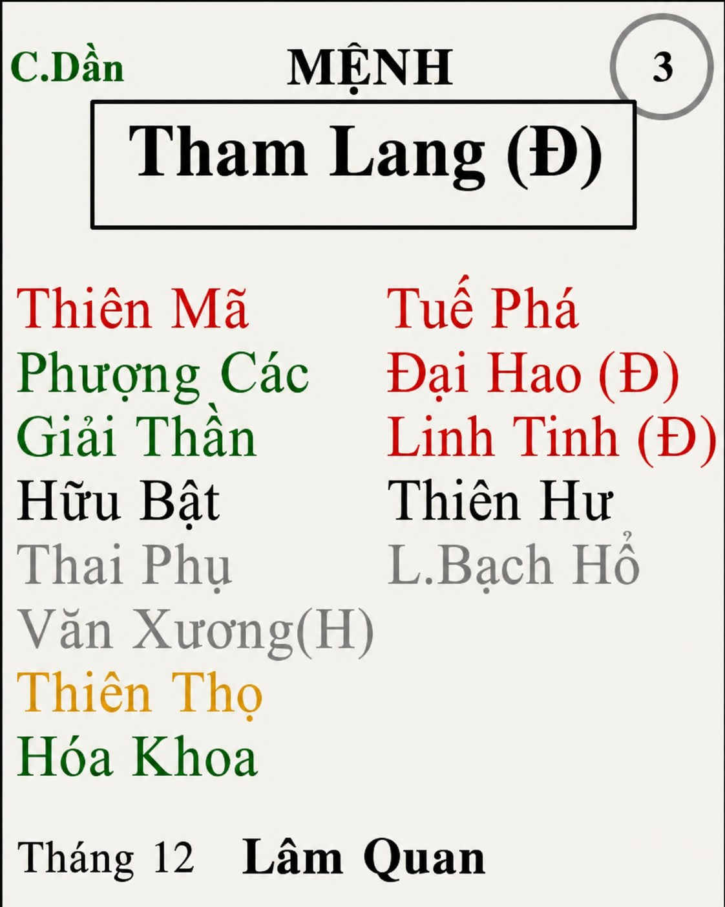

[Mục lục](../README.md)

# TỬ VI NAM PHÁI - BÀI SỐ 18: LUẬN GIẢI CUNG MỆNH THÔNG QUA CHÍNH TINH (PHẦN 14)

SAO THAM LANG
Ở bài số 17, chúng ta đã cùng tìm hiểu về tính cách, ưu điểm và nhược điểm của người có Mệnh Phá Quân.
Qua đó có thể thấy, nếu bản thân hoặc người thân có Mệnh Phá Quân biết phát huy tư duy đổi mới, tinh thần tiên phong và khả năng nắm bắt thời cơ, đồng thời lá số có nhiều cát tinh trợ lực thì rất dễ thành công trong những lĩnh vực mang tính đột phá, các ngành nghề mới hoặc môi trường cạnh tranh cao. 
Ngược lại, nếu Phá Quân bị phá cách thì sự liều lĩnh, nóng vội và ham mạo hiểm rất dễ dẫn đến thất bại, thậm chí khuynh gia bại sản. Cho dù Phá Quân bộ cách nào đi nữa thì vẫn cần lưu ý khi thành công hay thất bại cũng không nên sa đà vào ăn chơi cờ bạc, chơi với bạn bè cần lựa chọn thật kỹ. Những bộ cách cụ thể cũng như phương pháp hóa giải, mình sẽ phân tích chi tiết hơn trong phần Chư Tinh Luận sau này.
Hôm nay, chúng ta sẽ cùng nghiên cứu chính tinh thứ mười bốn và cũng là chính tinh cuối cùng trong hệ thống 14 Chính Tinh, đó là sao Tham Lang.
Đây là một trong những ngôi sao có tính chất phức tạp và biến hóa phong phú nhất trong Tử Vi Đẩu Số. Người có Mệnh Tham Lang có thể trở thành một doanh nhân tài ba, một nghệ sĩ nổi tiếng, một vị tướng giỏi, một người nghiên cứu tâm linh, người tu hành theo đạo pháp nào đó, hoặc người thầy bói lừng danh, thậm chí cũng có thể trở thành người sống buông thả, chìm đắm trong tửu sắc và dục vọng.
Tại sao lại có sự khác biệt lớn như vậy?
Bởi vì bản chất của Tham Lang không thiên về thiện hay ác. Ngôi sao này chỉ đại diện cho ham muốn của con người. Ham muốn ấy nếu được định hướng đúng sẽ trở thành động lực phát triển rất mạnh. Nhưng nếu không được kiểm soát, nó cũng chính là nguyên nhân đưa con người đến sai lầm và sa ngã.
Chính vì vậy, cổ nhân mới nhận định rằng: "Tham Lang chủ phúc họa, thiện ác lẫn lộn."
Người có Tham Lang gặp nhiều cát tinh thì lòng ham muốn trở thành động lực để học hỏi, phấn đấu và vươn lên. Ngược lại, nếu gặp nhiều sát tinh hoặc bản thân thiếu sự tu dưỡng thì rất dễ chạy theo hưởng thụ, vật chất, danh lợi và tình dục, cuối cùng tự chuốc lấy phiền não.
Đó cũng là lý do khi luận đoán sao Tham Lang, chúng ta tuyệt đối không nên chỉ nhìn vào một vài đặc điểm đơn lẻ rồi kết luận tốt hay xấu. Cần phải xét đến vị trí miếu, vượng hay hãm địa, các sao hội hợp cũng như toàn bộ bố cục của lá số thì mới có thể đánh giá chính xác.
Trong phạm vi bài viết này, chúng ta sẽ chỉ tập trung nghiên cứu đặc tính cơ bản của sao Tham Lang khi tọa thủ tại cung Mệnh, làm nền tảng cho việc tìm hiểu các bộ cách chuyên sâu ở những bài sau.
________________________________________
1. Bản chất của sao Tham Lang
Sao Tham Lang là một sao trong bộ ba tam hợp: Thất Sát, Phá Quân và Tham Lang. Biểu tượng cho sự tham, sân, và si của con người. Trong đó, Tham Lang tượng trưng cho tính tham.
Chữ "Tham" trong Tham Lang có nghĩa là ham muốn, tìm kiếm, không ngừng theo đuổi những điều mình mong muốn. Chữ "Lang" vốn chỉ loài sói, biểu tượng cho bản năng sinh tồn, khả năng săn tìm cơ hội và thích nghi rất mạnh.
Bởi vậy, bản chất của Tham Lang không đơn thuần là "tham lam" theo nghĩa tiêu cực. Đây là ngôi sao luôn thôi thúc con người phải tìm kiếm, khám phá, trải nghiệm và không chấp nhận sự tầm thường.
Người có Mệnh Tham Lang rất khó hài lòng với hiện trạng. Họ luôn muốn cuộc sống phải có điều gì đó mới mẻ, thú vị và nhiều thử thách hơn. Chính vì thế, Tham Lang thường có rất nhiều sở thích.
Hôm nay họ có thể say mê kinh doanh, ngày mai lại hứng thú với nghệ thuật, âm nhạc, công nghệ, du lịch, tâm linh hay một lĩnh vực hoàn toàn mới. Một khi đã thích điều gì, họ thường lao vào nghiên cứu rất sâu trong thời gian ngắn, tốc độ tiếp thu khiến nhiều người phải kinh ngạc.
Đây cũng là nguyên nhân khiến Tham Lang trở thành một trong những chính tinh có kiến thức khá rộng và khả năng thích nghi rất tốt.
________________________________________
2. Ngoại hình và khí chất
Khi Tham Lang nhập miếu, vượng hoặc đắc địa, đương số thường có ngoại hình khá nổi bật. Thân hình cao hoặc cân đối, dáng người đầy đặn, khỏe mạnh, khuôn mặt tròn đầy, làn da sáng.
Ánh mắt có thần, thần thái tự tin và rất dễ gây thiện cảm với người đối diện.
Lông tóc khá rậm rạp, lông chỗ đó cũng thế. Khả năng sinh lý và nhu cầu sinh lý cao, điện chưa chắc đủ nhưng nước chắc chắn dư xài (cái này là lý thuyết thôi chứ mình không có dám trải nghiệm lung tung ^^).
Người mệnh Tham Lang có dáng đi đủng đỉnh nhẹ nhàng, đi như lướt trên mặt đất, như kiểu không có gì phải vội.
Nam mệnh thường mang vẻ nam tính, mạnh mẽ và phong trần.
Nữ mệnh đa số có vóc dáng quyến rũ, trưởng thành sớm, biết chăm chút ngoại hình, có sức hút tự nhiên với người khác giới. 
Thông thường, nữ sẽ thích mặc váy, nhìn chung là gợi cảm.
Nếu Tham Lang rơi vào hãm địa thì ngoại hình thường nhỏ người hơn, dễ có sẹo, nốt ruồi, vết bớt hoặc khuyết điểm trên da.
________________________________________
3. Tính cách đặc trưng của Tham Lang
Tham Lang là người có thái độ khá thẳng thắn, thích ai là thích ra mặt, ghét ai cũng tỏ thái độ rõ ràng chứ không e dè.
Người mệnh Tham Lang khi cáu lên sẽ dễ chuyển sang trạng thái hỗn hào, có tính bất cần rất lớn.
Người Tham Lang thông thường sẽ khá lười. Khi làm gì cũng muốn làm nhanh cho xong để có thời gian ngồi chill chill thong thả.
Tham Lang nhìn chung là người luôn sống theo khát vọng. Khát vọng ấy có thể là tiền bạc, danh vọng. Có thể là tri thức, có thể là nghệ thuật. Cũng có thể là tình yêu, tự do hoặc những trải nghiệm mới. Tham Lang bị phá cách thì sẽ chuyển hóa sự khát vọng thành sự tham vọng, bất chấp thủ đoạn để đạt được thứ mình muốn như lùa gà để kiếm tiền, ngoại tình để thỏa mãn…Chính khát vọng ấy khiến cuộc sống của Tham Lang lúc nào cũng sôi động và đầy màu sắc.
Người có Mệnh Tham Lang thường thông minh, nhanh nhạy. Họ có tư duy linh hoạt, phản ứng tốt trước sự thay đổi và rất nhạy bén trong việc nắm bắt thông tin. Khi bước vào một lĩnh vực mới, Tham Lang thường không chỉ học để biết mà còn muốn hiểu thật sâu bản chất vấn đề. Chính vì vậy, tốc độ tiến bộ của họ thường khiến người khác bất ngờ. 
Ngoài ra, họ còn có khả năng quan sát và nắm bắt tâm lý người khác rất tốt. Họ giao tiếp khéo léo, hoạt ngôn, biết tạo không khí vui vẻ và rất dễ kết giao với bạn bè. Đây cũng là một trong những chính tinh có năng lực xã giao nổi bật nhất trong Tử Vi.
Ở môi trường đông người, Tham Lang thường nhanh chóng hòa nhập, biết cách xây dựng quan hệ và tạo dựng mạng lưới xã hội rộng. Họ thích các hoạt động tập thể, những buổi gặp gỡ, giao lưu, hội họp hay các sự kiện náo nhiệt hơn là cuộc sống khép kín. 
Đặc biệt, nam hay nữ đa phần đều có tửu lượng tốt, tận dụng khả năng ngoại giao để kiếm tiền rất giỏi.
Bên cạnh đó, Tham Lang còn là người yêu cái đẹp. Họ có gu thẩm mỹ khá tốt, thích ăn ngon, mặc đẹp, thích không gian sang trọng, thích những món đồ có giá trị và biết tận hưởng thành quả mình làm ra. Chỗ nào ăn ngon, món nào làm thế nào mới ngon, người Tham Lang rất sành.
Khác với Thiên Đồng thiên về hưởng sự an nhàn và bình dị, miễn vui thì ăn quán cóc, quán trà đá chém gió vẫn được. Còn Tham Lang lại hướng tới những trải nghiệm chất lượng hơn, tinh tế hơn và đôi khi cũng xa hoa hơn.
Tuy nhiên, chính vì quá yêu thích cuộc sống nên Tham Lang cũng rất dễ bị cuốn vào những cám dỗ của vật chất. Người có Mệnh Tham Lang thường thích điều mới lạ, không chịu được sự nhàm chán. Họ luôn muốn thay đổi môi trường, công việc hoặc mục tiêu khi cảm thấy không còn hứng thú. Đây vừa là ưu điểm, vừa là nhược điểm.
Ưu điểm là họ rất nhanh thích nghi với hoàn cảnh mới, dám thử sức ở nhiều lĩnh vực khác nhau.
Nhược điểm là dễ "cả thèm chóng chán", hứng thú rất nhanh nhưng cũng mất hứng rất nhanh, khiến nhiều công việc chưa kịp hoàn thành đã muốn chuyển sang mục tiêu khác.
Đa phần các bạn mệnh Tham Lang đều yêu thích lĩnh vực tâm linh, thích tham gia các hoạt động tâm linh như thờ cúng, đi lễ, coi bói, phong thủy…
Ngoài ra, các bạn mệnh Tham Lang còn thường hay thích coi phim kiếm hiệp, thích nuôi thú cưng.
________________________________________
4. Đào hoa – đặc trưng của Tham Lang
Đặc trưng của Tham Lang chính là tính Đào Hoa. Tuy nhiên, chúng ta cần hiểu đúng ý nghĩa của khái niệm này. Đào Hoa trước hết là sức hấp dẫn. Đó là khả năng khiến người khác yêu mến, tin tưởng, muốn tiếp xúc và dễ nảy sinh thiện cảm.
Chính nhờ đặc tính này mà người có Mệnh Tham Lang thường giao tiếp rất tốt, dễ mở rộng các mối quan hệ và được nhiều người giúp đỡ trong cuộc sống.
Nhưng sức hút càng lớn thì cám dỗ cũng càng nhiều.
Nếu không biết giữ mình, rất dễ phát sinh những mối quan hệ ngoài luồng, những câu chuyện tình cảm phức tạp hoặc vì quá nặng cảm xúc mà ảnh hưởng đến gia đình và sự nghiệp.
Do đó, đào hoa của Tham Lang giống như một con dao hai lưỡi. Biết sử dụng thì trở thành lợi thế rất lớn trong cuộc sống. Không biết tiết chế thì chính nó lại trở thành nguyên nhân của rất nhiều phiền não.
Tuy có số Đào Hoa, nhưng người Tham Lang lại đa phần sẽ không thể trọn vẹn trong chuyện tình cảm và hôn nhân. Đa phần đều phải trải qua sự thất bại nặng nề trong tình trường.
Nhưng cho dù người Tham Lang bị thất bại trong chuyện tình cảm, họ cũng nhanh chóng quên đi và có thể sớm yêu một người khác chứ không quá quỵ lụy một ai.
________________________________________
5. Tham Lang và công việc, sự nghiệp
Do có khả năng quản lý, giao tiếp, thích nghi và nắm bắt xu hướng rất tốt, Tham Lang thường phát huy năng lực trong những ngành nghề phải tiếp xúc nhiều với con người hoặc luôn có sự đổi mới.
Những lĩnh vực phù hợp có thể kể đến như:
• Kinh doanh, thương mại, đầu tư.
• Marketing, truyền thông, quảng cáo.
• Quan hệ đối ngoại, ngoại giao, môi giới.
• Du lịch, khách sạn, nhà hàng, dịch vụ.
• Thời trang, mỹ phẩm, làm đẹp.
• Thiết kế, nghệ thuật, giải trí.
• Tổ chức sự kiện.
• Bất động sản.
• Công nghệ và các ngành nghề mới.
• Có thể làm cho các công ty nước ngoài.
Điểm chung của các lĩnh vực này là đều đòi hỏi khả năng quan sát thị trường, xây dựng quan hệ và thích ứng nhanh với sự thay đổi.
Người mệnh Tham Lang có bộ cách tốt đều có thể lên được cấp quản lý, giám đốc. Hoặc tự mình làm chủ các doanh nghiệp, cửa hàng. Nhìn chung, mệnh Tham Lang ăn theo thời thế rất lớn. Họ có thể may mắn kiếm được rất nhiều tiền, nhưng cũng có thể mất sạch sành sanh trong thời gian ngắn.
Tuy nhiên, dù theo đuổi ngành nghề nào thì điều kiện tiên quyết vẫn là công việc phải đủ mới mẻ, đủ thử thách và có không gian để phát triển. Nếu bị bó buộc trong môi trường quá cứng nhắc, lặp đi lặp lại suốt nhiều năm, Tham Lang rất dễ chán và mất động lực.
Ngoài ra, Tham Lang cũng là một ngôi sao có duyên với huyền học, tôn giáo và các ngành nghiên cứu mang tính thần bí.
Trong cổ thư thường nhắc đến hình tượng Tham Lang có thể trở thành đạo sĩ, thầy thuốc, người nghiên cứu khí công, phong thủy hoặc các môn học thuật phương Đông. Điều này xuất phát từ bản chất thích tìm tòi những điều huyền bí và ham khám phá những lĩnh vực mà số đông chưa hiểu rõ.
Tham Lang trong một số bộ cách đặc biệt có thể theo được nghiệp quân đội, công an, lực lượng vũ trang. Hoặc theo nghiệp thể thao, võ thuật cũng đạt được nhiều thành tích.
________________________________________
Tổng kết về sao Tham Lang
Theo mình, người có Mệnh Tham Lang chỉ cần ghi nhớ bốn điều.
Thứ nhất, lấy kỷ luật để khống chế cảm hứng.
- Đừng chỉ làm khi có hứng. Hãy học cách hoàn thành công việc ngay cả khi không còn cảm hứng nữa. Đó là sự khác biệt giữa người có tài và người thành công.
Thứ hai, lấy đạo đức để khống chế lòng tham.
- Khát vọng là động lực phát triển. Nhưng mọi thành công đều phải dựa trên những giá trị chân chính. Khi biết điểm dừng, lòng tham sẽ trở thành ý chí vươn lên thay vì trở thành nguồn gốc của tai họa.
Thứ ba, học cách quản lý tài chính.
- Tham Lang kiếm tiền khá tốt nhưng cũng rất biết tiêu tiền. Nếu không có kế hoạch tích lũy và đầu tư hợp lý thì dù thu nhập cao cũng khó tạo dựng được nền tảng tài chính vững chắc.
Thứ tư, trân trọng những gì mình đang có.
- Bản chất của ngôi sao này luôn hướng về những điều mới mẻ. Nếu không biết trân trọng hiện tại, rất dễ vì chạy theo cái mới mà đánh mất những điều quý giá nhất trong cuộc đời.
Tính chất của mệnh Tham Lang cũng sẽ thay đổi phụ thuộc vào từng bộ cách, chính tinh đi kèm, hệ thống phụ tinh và tuần triệt. 
Ví dụ Tham Lang gặp triệt thì các tính đào hoa chưa chắc đã phát lộ, ngược lại là người rất chung thủy, các bộ cách cụ thể mình sẽ trình bày chi tiết sau này, mời các bạn tiếp tục đón đọc!
