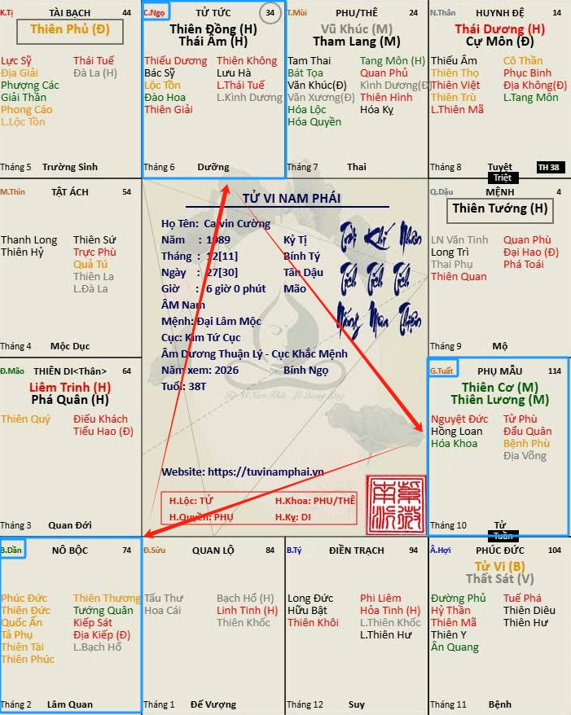
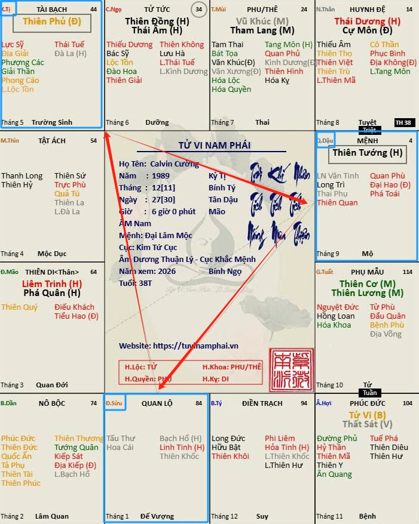
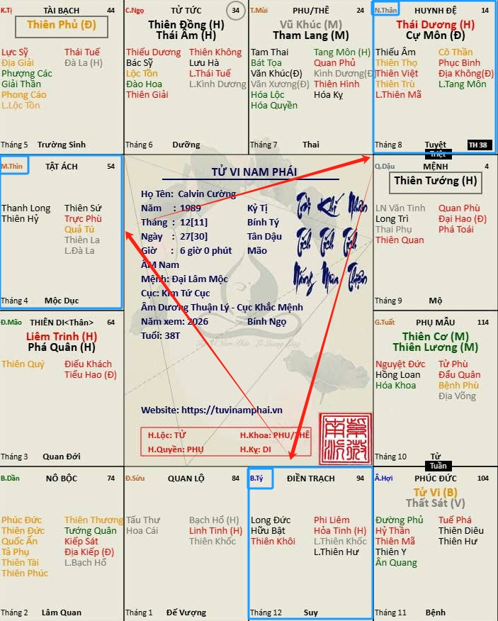
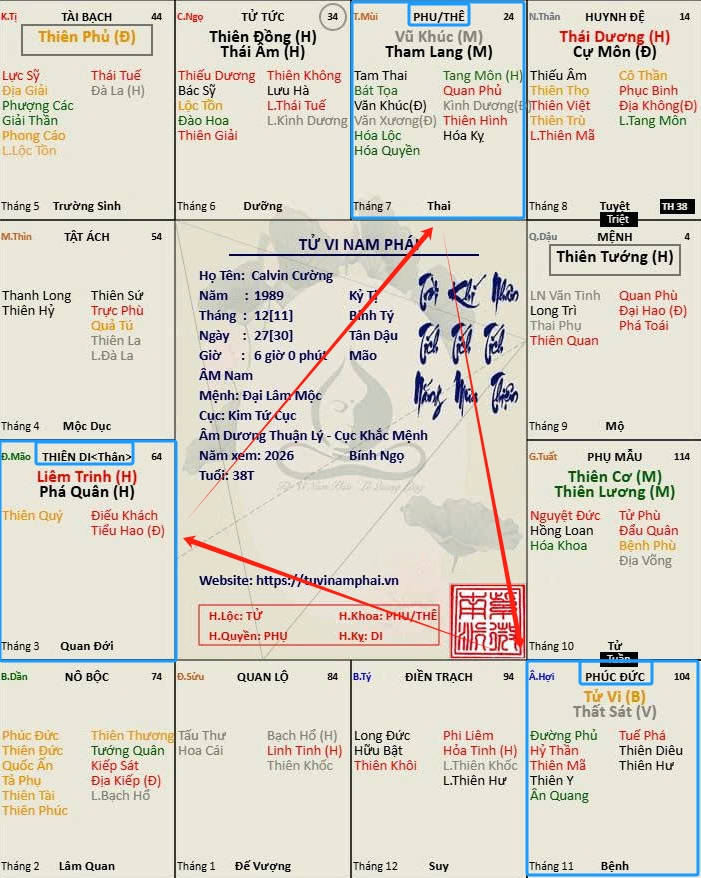
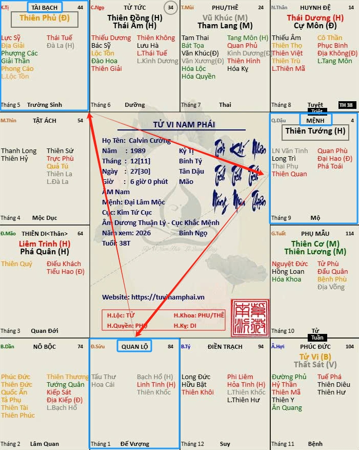
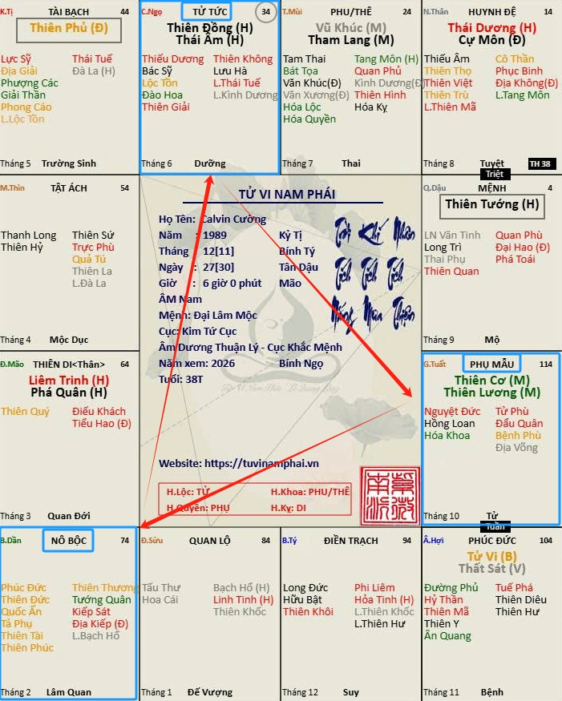
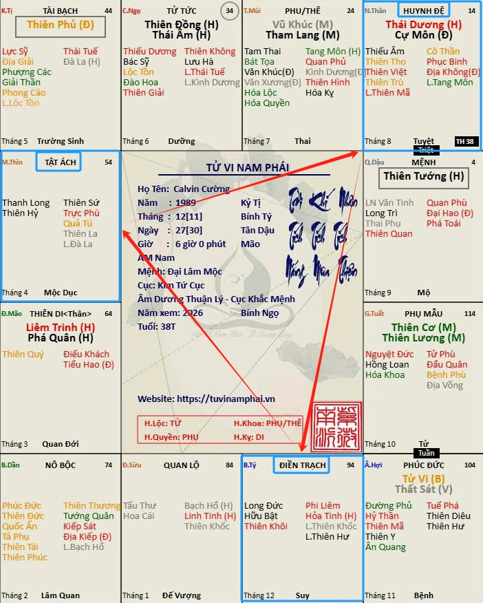
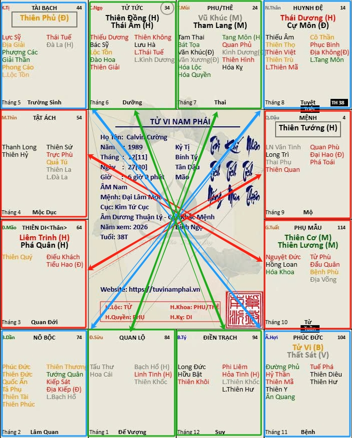

[Mục lục](../README.md)

# TỬ VI NAM PHÁI - BÀI SỐ 19: KHÁI NIỆM VỀ TAM HỢP VÀ XUNG CHIẾU TRONG TỬ VI

Ở các bài trước, chúng ta đã lần lượt tìm hiểu đầy đủ ý nghĩa cơ bản của 14 Chính Tinh khi tọa thủ tại cung Mệnh.
Xét về chính tinh ở cung mệnh, chúng ta cũng còn các phần chưa nghiên cứu, như ý nghĩa của các bộ cách của chính tinh như Thiên Tướng trong Tử Phủ Vũ Tướng có gì khác với Thiên Tướng trong bộ Phủ Tướng Triều Viên. Ý nghĩa đặc biệt khi mệnh có các bộ sao đôi như Tử Vi - Tham Lang, Liêm Trinh - Thất Sát…, và cuối cùng là trường hợp Mệnh Vô Chính Diệu.
Tuy nhiên, trước khi đi vào các phần trên, chúng ta cần nắm vững hai khái niệm nền tảng trong Tử Vi là Tam Hợp và Xung Chiếu. Rồi tiếp đến sẽ học về Thập Nhị Huyền Đồ, tức 12 thế đứng của chính tinh. Từ đó mới đủ cơ sở để luận giải các bộ cách của chính tinh, các bộ sao đôi và mệnh Vô Chính Diệu.
Hôm nay, chúng ta sẽ bắt đầu tìm hiểu ngay về hai khái niệm: Tam Hợp và Xung Chiếu.
________________________________________
1. Tam Hợp trong Tử Vi
Trong Tử Vi Đẩu Số, vị trí của 12 cung Địa Chi luôn được bố trí cố định trên lá số và không thay đổi đối với bất kỳ ai. Mặc dù cung Mệnh có thể an ở bất kỳ vị trí nào tùy theo ngày giờ sinh, nhưng thứ tự của các địa chi như cung Tý, Sửu, Dần...đến cung Hợi trên lá số luôn cố định.
Vòng Địa Chi của cung được bắt đầu từ cung Dần từ ô ở góc tay trái bên dưới, sau đó lần lượt đến cung Mão, Thìn, Tỵ, Ngọ...Tý, Sửu theo chiều kim đồng hồ. Tuy nhiên, đối với người mới học, chỉ cần ghi nhớ rằng vị trí của 12 Địa Chi trên lá số là hoàn toàn cố định, áp dụng cho mọi lá số.
Dựa trên quy luật, 12 cung với 12 Địa Chi tương ứng được chia thành 4 nhóm Tam Hợp, bao gồm:
• Thân - Tý - Thìn (Xem Hình 1)
• Tỵ - Dậu - Sửu (Xem Hình 2)
• Dần - Ngọ - Tuất (Xem Hình 3)
• Hợi - Mão - Mùi (Xem Hình 4)
Cung mệnh có thể đặt ở bất cứ cung Địa Chi nào trên lá số. Nhưng do vị trí đặt các cung khác như cung Phụ Mẫu, cung Phúc Đức, cung Điền Trạch, Nô Bộc, Thiên Di, Tật Ách, Tài Bạch, Tử Tức, Phu Thê, và Huynh Đệ...đều theo đúng trình tự này và theo chiều kim đồng hồ. Do đó, Tử Vi cũng sinh ra 4 nhóm Tam Hợp của các cung, bao gồm:
• Mệnh – Tài Bạch – Quan Lộc (Hình số 5)
Gọi tắt là Tam Hợp Mệnh - Tài - Quan.
• Phúc Đức – Phu Thê – Thiên Di (Hình số 6)
Gọi tắt là Tam Hợp Phúc - Phối - Di. Trong đó, cung Phu Thê còn được gọi là cung Phối Ngẫu.
• Nô Bộc – Phụ Mẫu – Tử Tức (Hình số 7)
Gọi tắt là Tam Hợp Nô - Phụ - Tử.
• Tật Ách – Điền Trạch – Huynh Đệ (Hình số 
Gọi tắt là Tam Hợp Tật - Điền - Bào. Cung Huynh Đệ còn được gọi là cung Bào, vì chữ "bào" mang ý nghĩa anh em cùng một bọc sinh ra. Anh chị em cùng cha khác mẹ hoặc cùng mẹ khác cha thì được gọi là anh chị em "dị bào".
Các cung nằm trong cùng một Tam Hợp luôn có mối quan hệ mật thiết và được luận giải đồng thời.
Ví dụ, khi xem cung Mệnh, không thể chỉ nhìn riêng cung Mệnh mà còn phải xét thêm cung Tài Bạch và cung Quan Lộc. Cách kiếm tiền, sử dụng tiền bạc và môi trường công việc sẽ phản ánh và bổ sung cho tính cách, năng lực cũng như định hướng cuộc sống của đương số.
Nói cách khác, Tam Hợp giúp chúng ta nhìn nhận một vấn đề dưới nhiều góc độ thay vì chỉ dựa vào một cung duy nhất.
________________________________________
2. Xung Chiếu trong Tử Vi (Xem hình số 9)
Nếu Tam Hợp biểu thị sự hỗ trợ và bổ sung lẫn nhau thì Xung Chiếu thể hiện sự tác động trực tiếp giữa hai cung nằm đối diện nhau trên lá số.
Các cặp Địa Chi xung chiếu gồm:
• Tý – Ngọ
• Sửu – Mùi
• Dần – Thân
• Mão – Dậu
• Thìn – Tuất
• Tỵ – Hợi
Tương ứng, các cặp cung xung chiếu là:
• Mệnh 
 Thiên Di
• Phụ Mẫu 
 Tật Ách
• Phúc Đức 
 Tài Bạch
• Điền Trạch 
 Tử Tức
• Quan Lộc 
 Phu Thê
• Nô Bộc 
 Huynh Đệ
Hai cung xung chiếu luôn ảnh hưởng mạnh mẽ đến nhau. Vì vậy, khi luận một cung, người học Tử Vi cũng cần xem xét cung đối diện để có cái nhìn đầy đủ hơn.
Ví dụ, cung Phúc Đức luôn xung chiếu với cung Tài Bạch.
Người có phúc dày thường gặp nhiều cơ hội thuận lợi, dễ kiếm tiền và nhận được sự trợ giúp đúng lúc. Ngược lại, mỗi khi hưởng thụ vật chất hay tiêu dùng quá mức cũng chính là đang tiêu hao phúc đức của bản thân.
Nếu chỉ biết hưởng mà không biết tạo phúc, tích đức và cống hiến, thì phúc khí sẽ dần suy giảm. Đến khi gặp khó khăn hay tai họa, con người sẽ thiếu nền tảng để vượt qua.
Đó cũng là một trong những ý nghĩa sâu sắc của mối quan hệ Phúc Đức - Tài Bạch trong Tử Vi.
________________________________________
Trong bài tiếp theo, chúng ta sẽ tiếp tục tìm hiểu Thập Nhị Huyền Đồ – hệ thống 12 trạng thái của Chính Tinh, một kiến thức vô cùng quan trọng để hiểu vì sao cùng một ngôi sao nhưng khi đứng ở những vị trí khác nhau lại biểu hiện mạnh yếu hoàn toàn khác nhau.

[Mục lục](../README.md)
