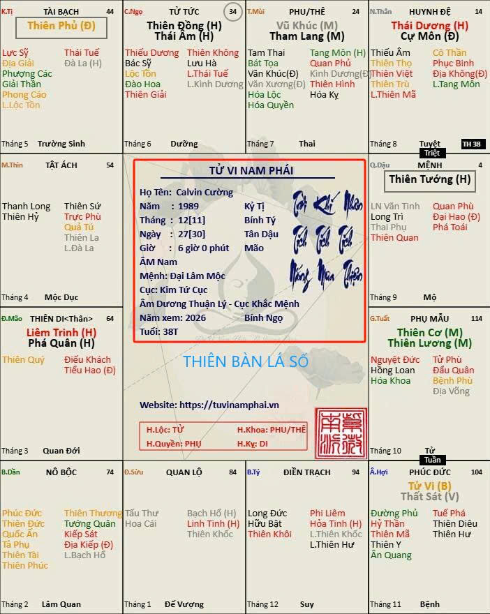
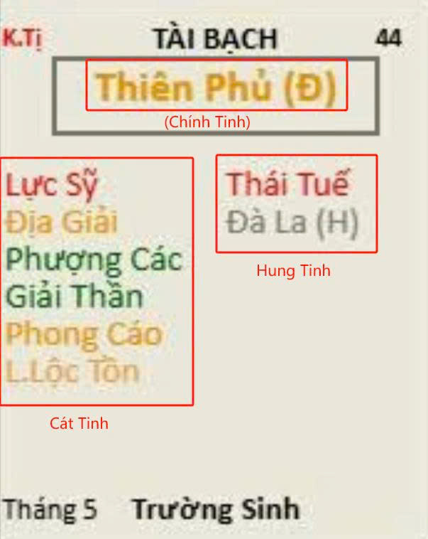

[Mục lục](../README.md)

# TỬ VI NAM PHÁI - BÀI SỐ 2: CẤU TẠO CỦA MỘT LÁ SỐ TỬ VI

Ở bài trước, chúng ta đã tìm hiểu khái quát về môn Tử Vi Đẩu Số và ý nghĩa của 12 cung trên lá số.
Tuy nhiên, nhiều người khi lần đầu nhìn vào một lá số Tử Vi thường có cảm giác "hoa mắt" bởi quá nhiều ký hiệu, tên sao, màu sắc và các con số xuất hiện trên cùng một đồ hình.
Hôm nay mình sẽ giải thích để các bạn hiểu được cấu tạo của một lá số, từ đó việc học Tử Vi sẽ trở nên dễ dàng hơn rất nhiều.
---
1. CẤU TẠO LÁ SỐ
Một lá số Tử Vi hoàn chỉnh được chia thành ba phần:
 1.1. Thiên Bàn (Xem hình số 1 trong bài viết):
Thiên bàn là phần thông tin cá nhân nằm ở trung tâm lá số. Thông thường sẽ bao gồm:
  • Họ và tên: 
Phần này chỉ để thể hiện lá số này của ai thôi chứ không ảnh hưởng đến nội dung của lá số.
  • Giới tính
Trong Tử Vi, người ta sẽ phân biệt Dương Nam, Âm Nam, Dương Nữ và Âm Nữ. Chúng ta tạm hiểu là mặc định khi sinh ra vào năm đó đã có sự phân loại như vậy, khoan hãy vội tìm hiểu tại sao vì sẽ thêm rối và mất thời gian.
  • Ngày tháng năm sinh và giờ sinh bao gồm cả Dương lịch và Âm lịch. Trong Tử Vi, người ta lấy Âm lịch làm chuẩn để lập ra lá số, vị trí các cung và các sao trong lá số.
Đặc biệt cần lưu ý giờ sinh Âm lịch so với Dương lịch được quy định như sau:
    * Giờ Tý: từ 23h00 ngày hôm trước đến 00h59 ngày hôm sau. Đây là điểm cần lưu ý vì rất dễ nhầm lẫn. Ví dụ, ai sinh vào lúc 23h15 ngày 5 tháng 3 Âm lịch thì theo Tử Vi đang được tính là sinh vào giờ Tý ngày 6 tháng 3 Âm lịch, vì 23h15 thuộc khung giờ Tý (23h00 – 00h59).
    * Giờ Sửu: 01h00 – 02h59.
    * Giờ Dần: 03h00 – 04h59.
    * ...
    * Giờ Hợi: 21h00 – 22h59.
  • Ngũ Hành của Mệnh: Biểu thị bạn thuộc mệnh Kim, Mộc, Thủy, Hỏa hay Thổ. Ngũ hành cũng là yếu tố cố định khi sinh ra vào năm đó. Ví dụ:
    * Kỷ Tỵ thuộc mệnh Mộc.
    * Bính Tý thuộc mệnh Thủy.
Chúng ta cũng tạm thời chưa cần tìm hiểu Đại Lâm Mộc khác gì với Dương Liễu Mộc hay Thạch Lựu Mộc, vì đào sâu vào nội dung này ở giai đoạn đầu chưa thật sự cần thiết và tính ứng dụng chưa cao.
  • Ngũ Hành Cục Số. Bao gồm các trường hợp:
    * Thủy Nhị Cục
    * Mộc Tam Cục
    * Kim Tứ Cục
    * Thổ Ngũ Cục
    * Hỏa Lục Cục
Nội dung này sẽ có chuyên đề phân tích riêng.
  • Âm Dương Thuận Lý, Âm Dương Nghịch Lý, Cục Sinh Mệnh hay Cục Khắc Mệnh. Đây là các yếu tố ảnh hưởng đến mức độ thành công hoặc thất bại của mỗi người. Nội dung này cũng sẽ có bài phân tích riêng.
  • Tứ Hóa của năm đang xem. Đây cũng là chuyên mục sẽ được phân tích riêng trong các bài sau. Bao gồm:
    * Hóa Lộc
    * Hóa Quyền
    * Hóa Khoa
    * Hóa Kỵ
Đây chính là các dữ liệu đầu vào để lập nên lá số. Nếu dữ liệu đầu vào sai thì toàn bộ lá số phía sau cũng sẽ sai. Bởi vậy, xác định chính xác giờ sinh luôn là công việc quan trọng hàng đầu.
Tính chính xác ở đây chính là xác định đúng giờ sinh Âm lịch theo các giờ Tý, Sửu, Dần... đến Hợi.
Mỗi giờ Âm lịch kéo dài 2 tiếng đồng hồ theo Dương lịch. Vì vậy nếu giờ Dương lịch nhập vào có chênh lệch nhỏ nhưng vẫn nằm trong cùng một khung giờ Âm lịch thì lá số vẫn không thay đổi.
---
 1.2. Địa Bàn
Địa bàn là vòng 12 cung bao quanh bên ngoài như đã trình bày ở Bài số 1. Đây là khu vực dùng để an sao và luận đoán. Toàn bộ các sao đều được sắp xếp vào 12 cung này.
---
 1.3. Nhân Bàn (Xem hình số 2 trong bài viết)
Nhân bàn là hệ thống các sao được bố trí vào từng cung. Chia làm hai loại:
    * Chính Tinh.
    * Phụ Tinh.
Chính Tinh là tên vì sao được ghi lớn ở giữa mỗi cung và là sao cai quản chính cung đó.
Phụ Tinh nếu là Cát Tinh sẽ được ghi ở cột bên trái của cung. Hung Tinh được ghi ở cột bên phải của cung. Ví dụ trong Hình số 2:
    * Thiên Phủ là Chính Tinh.
    * Cát Tinh gồm: Lực Sỹ, Địa Giải, Phượng Các, Giải Thần, Phong Cáo.
    * Hung Tinh gồm: Thái Tuế, Đà La.
Ngoài ra còn có hệ thống các sao Lưu, thay đổi và di chuyển theo từng năm chứ không cố định.
Nội dung này sẽ có phần phân tích riêng.
Hệ thống sao Tuần và Triệt cũng sẽ có bài phân tích chuyên sâu riêng.
---
## 2. CÁC CHÍNH TINH
Hệ thống 14 Chính Tinh bao gồm:
* Tử Vi
* Thiên Cơ
* Thái Dương
* Vũ Khúc
* Thiên Đồng
* Liêm Trinh
* Thiên Phủ
* Thái Âm
* Tham Lang
* Cự Môn
* Thiên Tướng
* Thiên Lương
* Thất Sát
* Phá Quân
Có thể xem 14 Chính Tinh là những nhân vật chính của một bộ phim. Khi luận đoán lá số, đây luôn là nhóm sao được xem đầu tiên.
Tính cách, nghề nghiệp, xu hướng phát triển và rất nhiều đặc điểm quan trọng của một người đều bắt nguồn từ nhóm sao này.
---
## 3. PHỤ TINH
Nếu Chính Tinh là nhân vật chính thì Phụ Tinh chính là dàn nhân vật phụ. Số lượng Phụ Tinh nhiều hơn rất nhiều so với Chính Tinh.
Một số sao quen thuộc như:
* Tả Phụ
* Hữu Bật
* Văn Xương
* Văn Khúc
* Kình Dương
* Đà La
* Hỏa Tinh
* Linh Tinh
* Địa Không
* Địa Kiếp
* Thiên Khôi
* Thiên Việt
* Long Trì
* Phượng Các
* Ân Quang
* Thiên Quý
* ...
Phụ Tinh có nhiệm vụ bổ sung, tăng cường hoặc làm thay đổi ý nghĩa của Chính Tinh. Ví dụ: Cùng là sao Tử Vi nhưng khi gặp Tả Phụ, Hữu Bật sẽ khác với khi gặp Không Kiếp.
Đó là lý do không thể chỉ nhìn một Chính Tinh mà kết luận toàn bộ lá số.
---
## 4. TỨ HÓA
Trong lá số Tử Vi, mọi người sẽ tìm thấy các sao:
* Hóa Lộc
* Hóa Quyền
* Hóa Khoa
* Hóa Kỵ
Đây được gọi là Tứ Hóa. Tứ Hóa giống như trạng thái vận hành của các sao. Có thể hiểu đơn giản:
* Hóa Lộc: biểu thị lợi ích, tài lộc.
* Hóa Quyền: biểu thị quyền lực, sự chủ động.
* Hóa Khoa: biểu thị danh tiếng, học vấn, giải cứu.
* Hóa Kỵ: biểu thị trở ngại, áp lực, phiền não.
Trong thực tế luận đoán, Tứ Hóa đóng vai trò cực kỳ quan trọng vì nó cho biết năng lượng đang vận động theo chiều hướng nào. Sẽ có bài chuyên đề riêng về từng sao này.
---
## 5. CUNG AN THÂN (Xem hình số 3)
Mỗi giờ sinh khác nhau sẽ có vị trí cung An Thân khác nhau. Theo hình ví dụ số 3 thì được gọi là Thân cư Di, có nghĩa là cung An Thân trùng với cung Thiên Di.
Ngoài ra còn có các trường hợp:
* Thân cư Quan Lộc.
* Thân cư Tài Bạch.
* Thân cư Phúc Đức.
* ...
Nội dung này sẽ có bài phân tích chuyên sâu riêng. Tuy nhiên, đại ý như sau:
* Cung Mệnh biểu thị bản chất con người, tính cách và cuộc sống thời trẻ.
* Cung An Thân biểu thị tính cách và cuộc sống về sau.
Chúng ta thường thấy có nhiều người tuổi trẻ ăn chơi nhưng khi lớn lên, thành gia lập thất lại tu chí làm ăn. Nhưng cũng có nhiều người tuổi trẻ hiền lành, đến khi có chút thành đạt lại đổ đốn ăn chơi. Đó chính là quá trình chuyển hóa từ cung Mệnh sang cung An Thân.
---
## 6. ĐẠI HẠN VÀ TIỂU HẠN
Các con số được ghi góc bên phải trên cùng của mỗi cung biểu thị giai đoạn của Đại Vận (sẽ giải thích kỹ thêm ở phần xem hạn).
Lá số Tử Vi không chỉ cho biết bản chất cuộc đời mà còn phản ánh sự thay đổi theo từng giai đoạn.
Đó là lý do có những giai đoạn rất khó khăn nhưng giai đoạn sau lại thành công rực rỡ và ngược lại.
Bao gồm:
* Đại Hạn: vận số tổng thể trong 10 năm.
* Tiểu Hạn: nguyên nhân của vận hạn trong 1 năm.
* Lưu Niên: kết quả của vận hạn trong năm đó.
* Nguyệt Hạn: vận số của tháng đó.
* Nhật Hạn: vận số của ngày hôm đó (thường thì xem đến Nhật Hạn độ chính xác rất ít nên sẽ ít ai xem phần này).
Nhờ vậy mà người nghiên cứu có thể biết được khi nào thuận lợi, khi nào khó khăn để có sự chuẩn bị phù hợp.
---
## TỔNG KẾT BÀI SỐ 2
Một lá số Tử Vi hoàn chỉnh được cấu thành từ nhiều lớp thông tin khác nhau:
* Thiên Bàn.
* Địa Bàn.
* Nhân Bàn.
* 12 Cung.
* Chính Tinh.
* Phụ Tinh.
* Hệ thống Tuần, Triệt.
* Tứ Hóa.
* An Thân.
* Đại Hạn và Tiểu Hạn.
* Các sao thuộc vòng Trường Sinh (các sao ghi bên dưới mỗi cung có chữ Trường Sinh, Mộc Dục, Quan Đới...sẽ có bài phân tích riêng).
Khi mới học, không nên cố gắng ghi nhớ toàn bộ mọi thứ cùng một lúc.
Hãy bắt đầu từ những phần cơ bản nhất, giống như xây một ngôi nhà phải bắt đầu từ nền móng.
Trong bài tiếp theo, chúng ta sẽ tìm hiểu về hệ thống 14 Chính Tinh – những "nhân vật chính" quyết định phần lớn tính cách và xu hướng cuộc đời của mỗi con người.
(Còn tiếp...)
