[Mục lục](../README.md)

# TỬ VI NAM PHÁI – BÀI SỐ 20: THẬP NHỊ HUYỀN ĐỒ

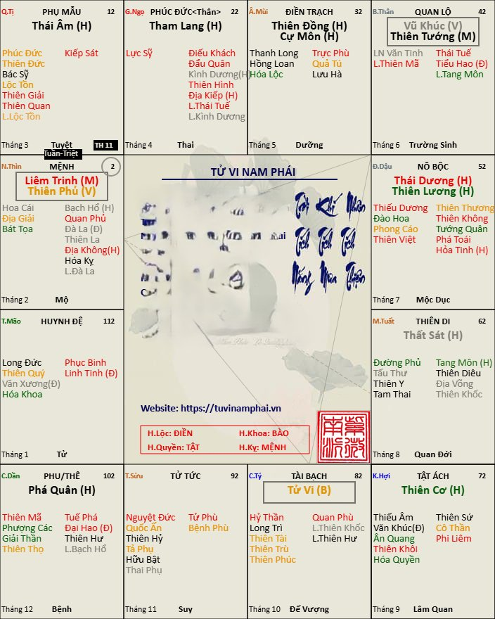

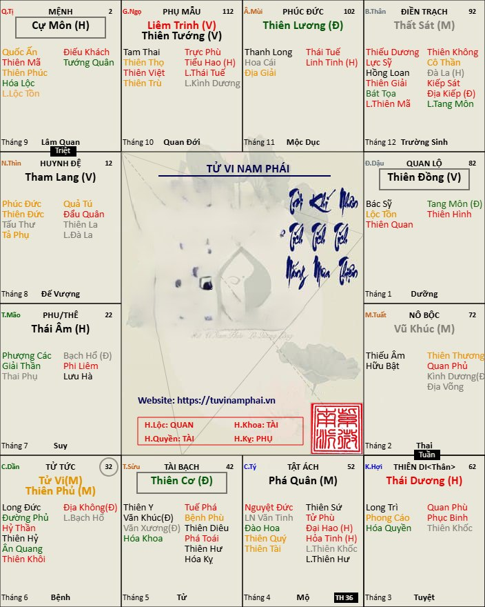

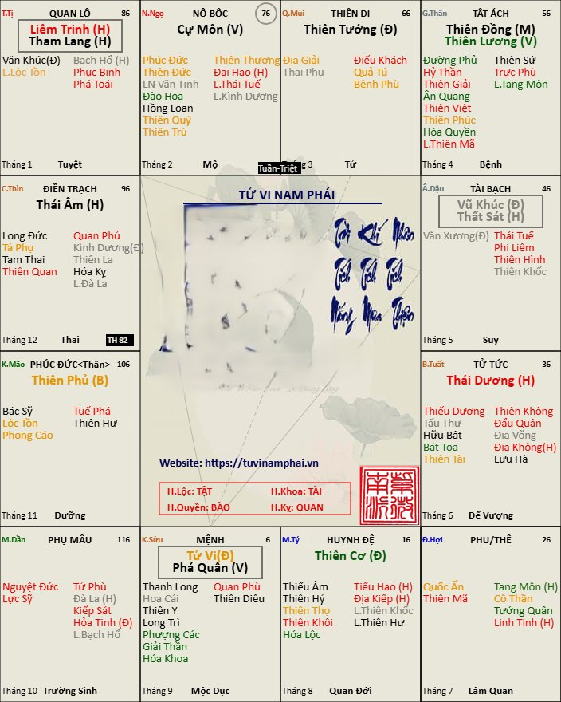

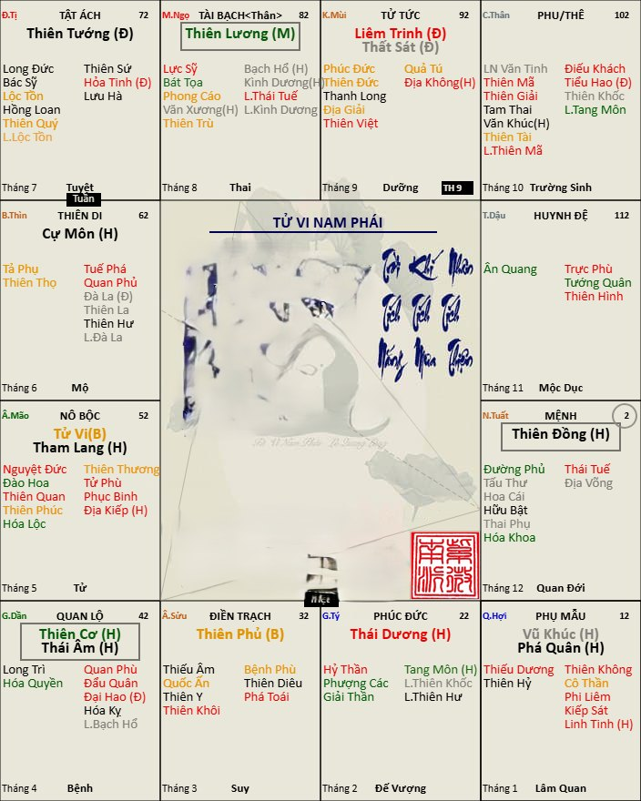

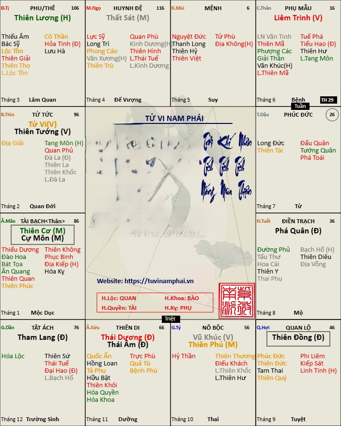

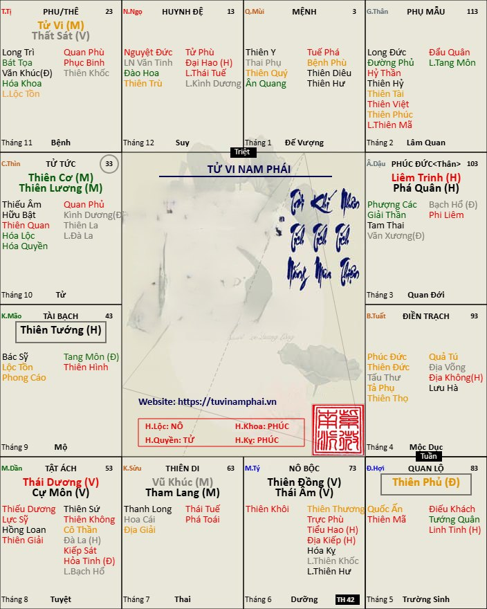

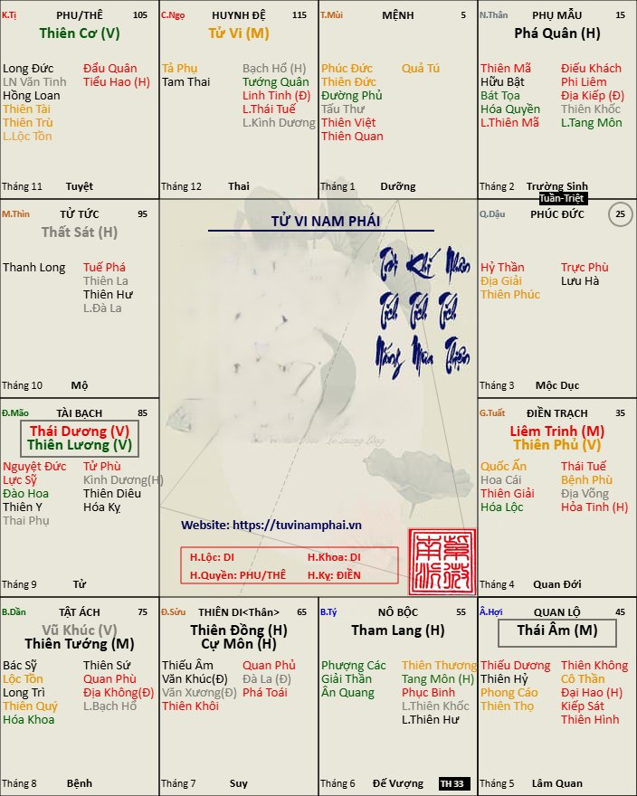

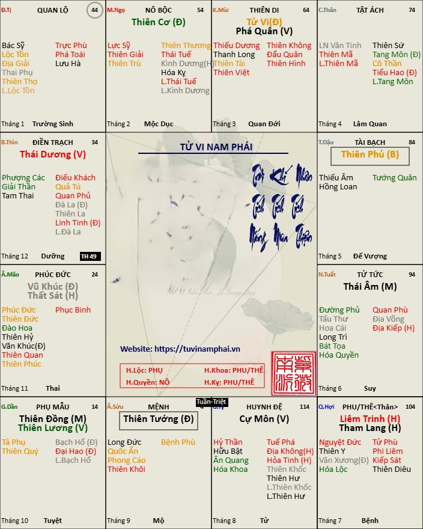

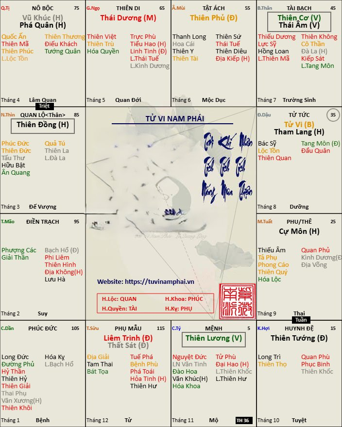

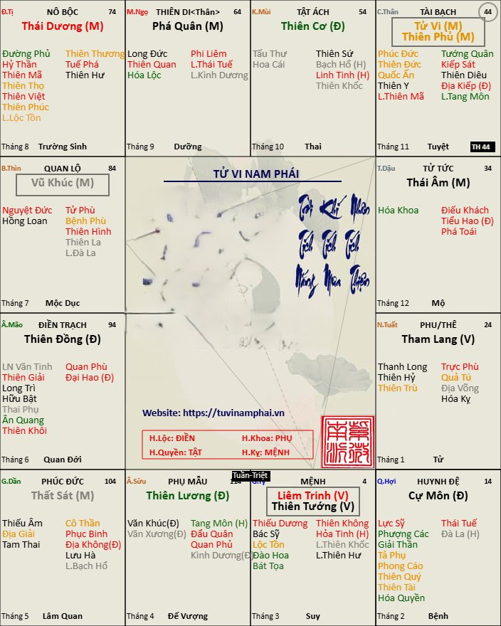

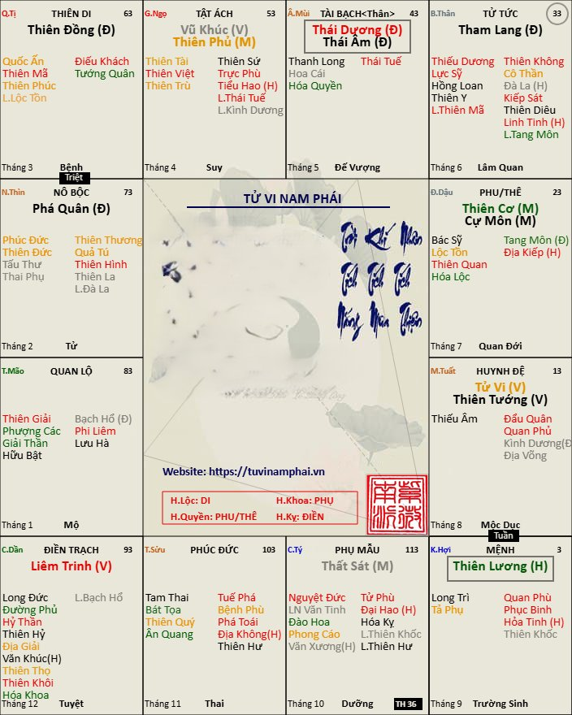

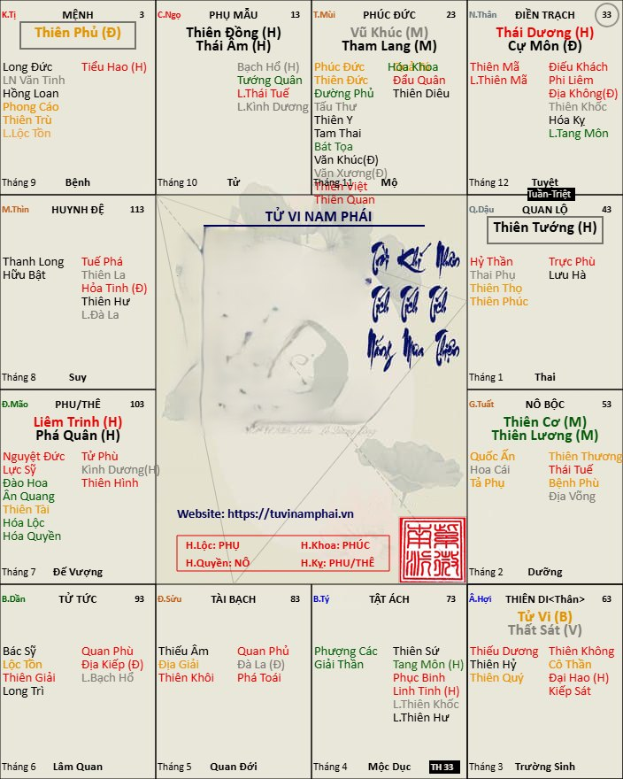

Bất kể bạn sinh vào ngày tháng năm và giờ nào, lá số của bạn cũng sẽ có cách bố cục của chính tinh giống như một trong 12 đồ hình như hình đính kèm trong bài viết, đó được gọi là Thập Nhị Huyền Đồ. Như vậy, chúng ta cứ hiểu rằng, Thập Nhị Huyền Đồ chính là 12 cách bố cục của các chính tinh khác nhau, được áp dụng cho tất cả lá số. (Các bạn khi xem hình chỉ cần xem vị trí của chính tinh, đừng quan tâm phụ tinh hay cung mệnh và các cung khác ở đâu, các lá số mẫu chỉ làm ví dụ cho bạn thấy vị trí của chính tinh thôi)
Do chỉ có 12 cách bố trí chính tinh được áp dụng cho hàng vạn lá số, nên các bạn hay dễ nhận thấy một người khác có vị trí chính tinh giống y chang lá số của bạn, đó là điều dễ hiểu. Tuy chính tinh giống nhau, nhưng phụ tinh khác nhau, vị trí tuần triệt, tứ hóa, vòng vận khác nhau…thì cuộc đời cũng khác nhau rất nhiều.
Hôm nay, mình sẽ trình bày để các bạn hiểu được ý nghĩa sự ra đời của Thập Nhị Huyền Đồ. Trong đó, chúng ta lấy vị trí sao Tử Vi làm gốc để tiến hành phân tích.
Trước khi đi vào nghiên cứu, các bạn cần hiểu rằng sao Tử Vi là ngôi sao đứng đầu trong 14 chính tinh, được xem là sao Vua, hay còn gọi là Đế Tòa Tử Vi, cũng ngôi sao đại diện cho chính môn khoa học này. Vị trí của sao Tử Vi trên lá số thể hiện thời thế của một ông Vua (hay có thể hiểu là người đứng đầu), cũng là thời thế của xã hội nói chung.
Ngoài sao Tử Vi được đại diện cho bậc Đế Vương, thì sao Thiên Phủ được xem là Hoàng Hậu. Nay ta đi vào phân tích lần lượt từng Đồ Hình, bắt đầu từ vị trí đầu tiên của Tử Vi cư ở cung Tý.
1. Đồ Hình thứ nhất: Tử Vi cư cung Tý
Cung Tý là nơi Tử Vi được sinh ra, ở vị trí này Tử Vi được xem là ấu chúa nên chỉ ở trạng thái Bình Hòa (B), ấu chúa nên ở thế khiêm nhường. Và cũng lúc này, trên Trời mở cửa Thiên La ở cung Thìn để Hoàng Hậu tức sao Thiên Phủ giáng trần…(Cung Thìn của tất cả lá số luôn có sao Thiên La, là nơi phong thần phong thánh.)
Về tổng thể, đây là cách cục tượng cho xã hội thái bình, tốt cho người tài đức, giỏi về văn hóa, khoa học và thương gia. Nếu làm nhà nước thì thông thường chỉ được trạng thái an nhàn thôi chứ quyền lực khó lên cao. Do đó chỉ có sao Vũ Khúc, Thiên Tướng, Liêm Trinh, Thiên Phủ là ở trạng thái Miếu Vượng, còn lại các chính tinh khác đều rơi vào thế lạc hãm. 
Do đây là xã hội thái bình, nên Tham Lang cư Ngọ tượng cho việc triều chính ít được quan tâm, quan viên chỉ lo vui chơi hưởng thụ. Cung Ngọ bản chất chính là vị trí nắm quyền nên Tử Vi khi ở cung Ngọ mới được trạng thái Miếu Địa, đỉnh cao của quyền lực.
2. Đồ Hình thứ 2: Tử Vi đi đến cung Sửu đi cùng với sao Phá Quân
Sau khi được sinh ra tại cung Tý, ấu chúa khi trưởng thành tất phải đi tìm sự nghiệp, vì thế tiếp sau là Tử Vi vào cung Sửu. Và vì thế ở thời này ấu chúa cần sao Phá Quân để làm tướng tiên phong, dẫn đường dẹp lối…
Đây là thời đại mà con người vừa anh hùng vừa bất nhân, bất nghĩa. Xã hội loạn lạc, ly tán, cơ hội cho những kẻ thủ đoạn và thời cơ, mọi mánh khóe đều được sử dụng. Giai đoạn này triều chính ở cung Ngọ được nắm quyền bởi những kẻ xu nịnh, chính là sao Cự Môn ở thế Vượng Địa.
3. Đồ Hình thứ 3: Tử Vi gặp sao Thiên Phủ tại cung Dần
Vào đến cung Dần, Vua gặp được Hoàng Hậu và cả hai cùng lập nghiệp, đế tòa Tử Vi lúc này ngồi quản lý tài sản chính là tượng của sao Thiên Phủ. Đây là giai đoạn mọi người đều cố gắng làm việc, cùng xây dựng xã hội thịnh vượng, do đó đa phần tất cả các chính tinh đều ở thế Miếu Vượng Đắc địa. Duy chỉ có Cự Môn là những kẻ xu nịnh không có đất diễn, khi đó vua đang có Hoàng Hậu cùng cai trị. 
Đây là giai đoạn Vua mới lập nghiệp và thành công bước đầu, do đó vị trí Thái Âm và Thái Dương vẫn còn lạc hãm, tức thực lực của Vua bấy giờ chưa thực sự quá mạnh.
4. Đồ Hình thứ 4: Tử Vi đi với Tham Lang tại cung Mão
Vua mới lập nghiệp nên có nhiều kiêu hãnh, dễ mắc sai lầm mà rơi vào ăn chơi sa đọa.
Do Tử Vi gặp Tham Lang chơi bời sa đọa, đàng điếm tửu sắc. Do đó Tử Vi ở giai đoạn này là thế yếu, không thể tự cứu giải, rất dễ gặp tai họa tửu sắc, tự mình cứu mình còn khó thì mong cứu ai được nữa. 
Các lá số hạn đến nếu gặp sao Tử Vi thông thường được cứu giải rất mạnh, tuy nhiên nếu là Tử Vi - Tham Lang thì lại rất mệt mỏi vì tính hóa giải của Tử Vi lúc này rất yếu (Tử Vi chỉ ở trạng thái Bình Hòa), do đó vẫn bị Tam Vận Trúc La nhập hạn. Cái này mình sẽ giải thích chi tiết ở phần xem hạn sau này.
5. Đồ hình thứ 5: Tử Vi đi với Thiên Tướng tại cung Thìn
Giai đoạn này do trước đó ăn chơi sa đọa, Vua sa vào lưới Thiên La (lưới nhà Trời) tại cung Thìn và lúc này Vua cần sao Thiên Tướng để dạy dỗ mà nên người, đây là giai đoạn Vua tầm sư học đạo.
Tử Vi Thiên Tướng biểu thị cho xã hội đàng hoàng uy quyền, xã hội thịnh vượng, có phép tắc, kỉ cương, môi trường tốt cho thương gia, nghệ sĩ. Không phù hợp cho phát triển công danh trong nhà nước, vì giai đoạn này Tử Vi vẫn còn đang học đạo. 
Vị trí Thái Dương và Thái Âm đồng cung ở cung Sửu, do vậy mới có câu “mấy người bất hiển công danh, bởi vì Nhật Nguyệt đồng tranh Sửu Mùi.
Sao Phá Quân lúc này xung chiếu với sao Tử Vi, tượng cho sự đối nghịch với ngôi vua, bởi vậy mới có câu “Trai bất nhân Phá Quân Thìn Tuất”.
6. Đồ Hình Thứ 6: Tử Vi Thất Sát
Thoát được lưới Thiên La, đến lúc này Vua có được bài học về mọi chuyện, vì thế, Vua cần thanh gươm báu để chỉnh đốn triều đình và sao Thất Sát được tận dụng, ở đây Thất Sát được coi là gươm báu của Vua, dùng để thanh trừng, dẹp bỏ những kẻ cản trở…
Vua đi chinh chiến, xã hội không người đứng đầu, do đó cung Ngọ vô chính diệu. Đây là thời làm giàu mau của những người nắm bắt cơ hội.
Cách cục Liêm Trinh đi với Phá Quân tức là sẽ có Tử Vi - Thất Sát và Vũ Khúc – Tham Lang trong tam hợp, thời kỳ bắt đầu biến loạn và rối ren, văn võ bá quan, ai cũng phải cố gắng cậy cục kiếm tiền vì là thời chiến loạn. Lúc bấy giờ Vua ôm ấp mộng tưởng tự cầm quân chinh chiến, thời chiến loạn học hành không còn quan trọng nữa, do đó Thiên Tướng ở thế hãm địa.
7. Đồ Hình Thứ 7: Tử Vi cư Ngọ
Sau đó vào cung Ngọ đăng quang, lúc này mới là ông Vua sáng suốt, liêm chính.
Vua ngự ngai vàng, vị trí đắc ý của bậc vương giả, rất có uy quyền, nhiều khả năng cứu giải tai họa.
Xã hội thịnh trị, giàu mạnh, môi trường tốt cho những người làm ăn chân chính.
8. Đồ Hình thứ 8: Tử Vi đi với Phá Quân tại cung Mùi
Không ai giữ mãi được ngôi báu, vì thế nên có lúc phải gãy đổ sự nghiệp, cũng hiểu là không ai được mãi cái giàu có, không ai không có lúc vấp ngã, sai lầm trong cuộc đời… và đến lúc phải đi lánh nạn. (Tử Vi gặp Phá Quân)
Xã hội sắp chuyển sang giai đoạn hỗn loạn. Môi trường tốt cho những kẻ cơ hội và những kẻ muốn làm giàu bằng phương pháp không chính đáng, tiềm ẩn nguy cơ tai họa tửu sắc, tai nạn, tù tội. Liêm Trinh đi với Tham Lang tạo thành cách Liêm Tham Tị Hợi, hình ngục nan đào.
9. Đồ hình thứ 9: Tử Vi Thiên Phủ cư Thân
Đi lánh nạn, vẫn không quên sự nghiệp, khi thất bại vẫn không nản, biết được thăng trầm của thế sự, là người quân tử vậy. Và như thế tất sẽ làm lại được sự nghiệp hay nói cách khác là: cơ hội vẫn dành cho bạn rất nhiều để bạn làm lại, để sửa chữa sai lầm, vì thế Tử Vi lại gặp Thiên Phủ tại cung Thân và lập nên nghiệp mới. Tử Vi ngồi điều hành, quản lý tài sản.
Môi trường thuận lợi cho những nhà doanh nhân, kỹ nghệ, khoa học và chuyên gia, kinh doanh, buôn bán.
10. Đồ Hình Thứ 10: Tử Vi cư Dậu
Lấy lại được cơ đồ sự nghiệp, lại quen thói ăn chơi, ở đây cũng có ý nhắc rằng dù được học Đạo rồi vẫn có thể bị ma dẫn như không, cũng có ý: lần trước ăn chơi còn có ý dè chừng, lo sợ. Còn lần này, ỷ thế, cậy có Đạo rồi nên rất ỷ lại, ở cung Dậu là đất Đế Vượng của Kim nên cậy lắm vàng, nhiều bạc mà ăn chơi! Và kết quả tất yếu là gì rồi sẽ phải đến thôi.
Tử Vi đồng cung Tham Lang, không có uy quyền, tính cứu giảm không có, xã hội không người điều khiển, đầy gian trá và tham vọng. Môi trường của kẻ cơ hội, ăn bám.
11. Đồ hình Thứ 11: Tử Vi cư cung Tuất
Tử Vi lại sa vào cửa Địa Võng, Vua lại phải nhờ Thiên Tướng là Thầy của mình tới phá lưới Địa Võng để giải vây, nhưng đây là đất của sự định tội nên khó mà thoát được nhân quả.
Xã hội rối ren, môi trường thuận lợi cho văn học, chuyên gia, học vấn.
12. Đồ Hình Thứ 12: Tử Vi Thất Sát tại cung Hợi
Đến đây là đã kết thúc cõi Trần rồi, xuống cõi giới khác gọi là Quỷ Môn Quan, nên vào cung Hợi, Tử Vi cùng Thất Sát chuẩn bị bước vào một chu kỳ mới của luân hồi.
Xã hội không người điều khiển, đầy tranh chấp. Mỗi người đều kiêu hãnh về tài năng của bản thân, đa phần đều bỏ nhà ra đi lập nghiệp mới có thành tựu.
Đây cũng là môi trường đầy những kẻ táo bạo, liều lĩnh.
Trên đây là chu kì qua 12 cung số, thể hiện 12 thời kỳ của Đế Tòa Tử Vi, qua đó, ta hiểu được đạo của trời đất luôn biến hóa, lúc thì chính đạo đắc thời, lúc thì tà đạo đắc thời, nhưng rồi thành bại hư vinh bỗng chốc cũng hóa thành hư không. Ai không hiểu đạo trời rồi cũng phải bị định tội rồi xuống Quỷ Môn Quan.
Trong các bài tiếp theo, chúng ta sẽ bắt đầu phân tích từng Đồ Hình để tìm hiểu các bộ cách của chính tinh trong Tam Hợp. Mời các bạn tiếp tục đón đọc và nghiên cứu.
