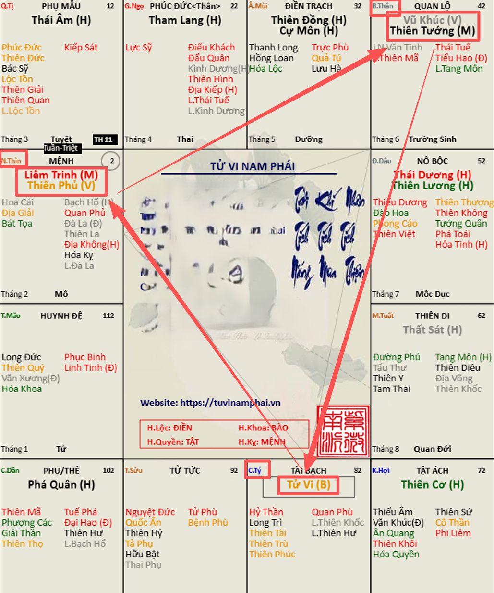
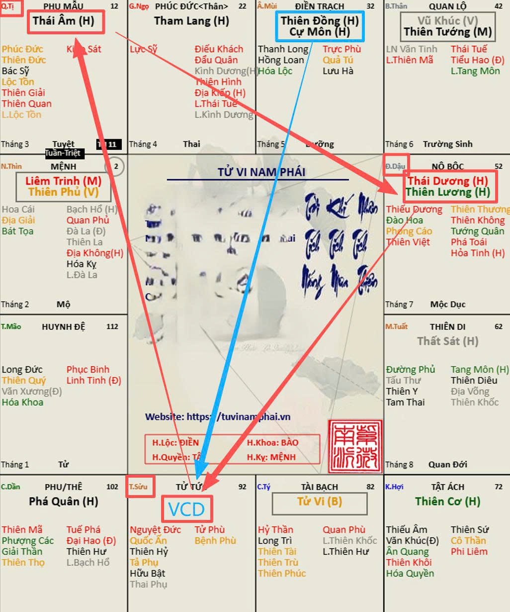
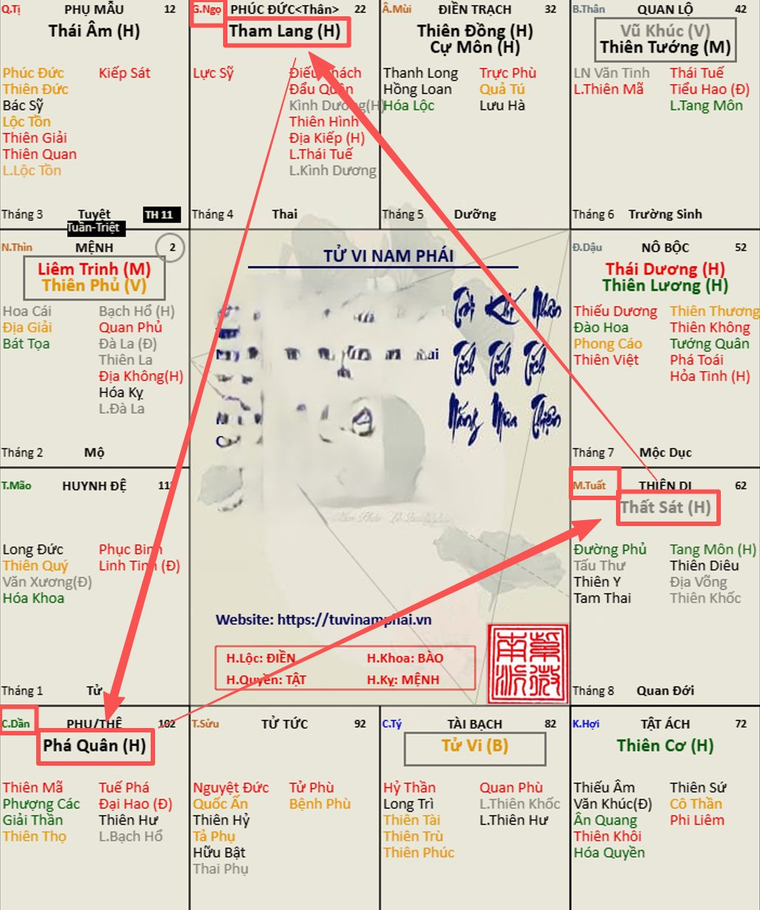
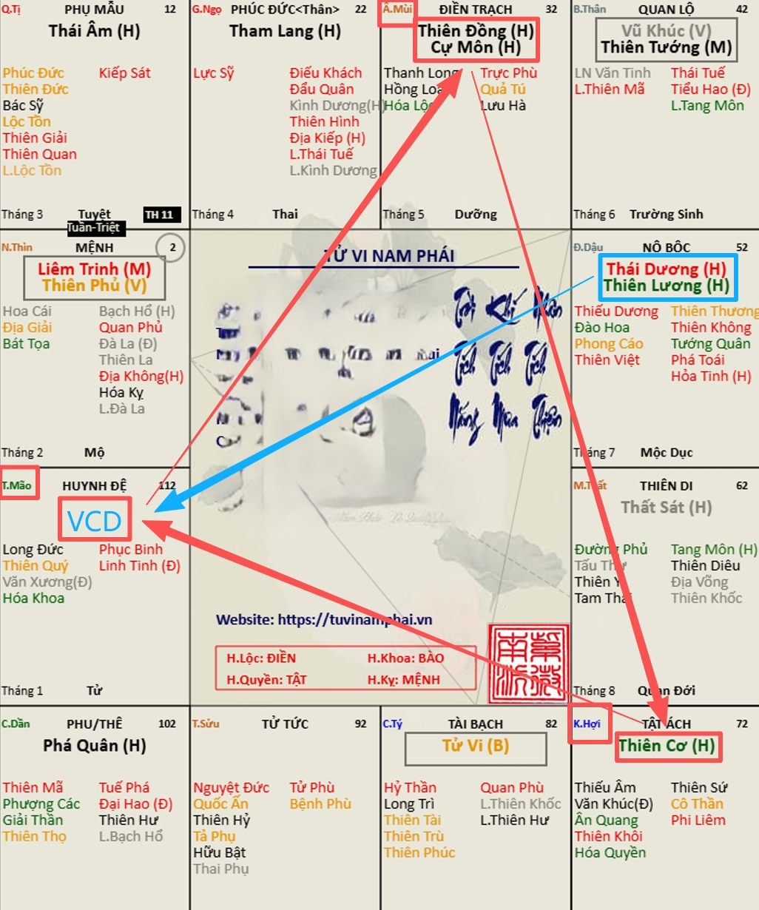

[Mục lục](../README.md)

# TỬ VI NAM PHÁI - BÀI SỐ 21: CÁC BỘ CÁCH CỦA CHÍNH TINH TRONG HUYỀN ĐỒ SỐ 1

Ở bài số 20, chúng ta đã làm quen với Thập Nhị Huyền Đồ – một trong những nền tảng quan trọng của Tử Vi Nam Phái. Đây là phần kiến thức khá khó đối với người mới học vì xuất hiện nhiều khái niệm và thuật ngữ mới. Tuy nhiên, các bạn cũng không cần phải hiểu hết ngay từ đầu, bởi trong các bài sau chúng ta sẽ liên tục quay lại và khai triển từng phần một.
Các bạn chỉ cần ghi nhớ một ý đơn giản:
Một lá số Tử Vi tuy có hàng triệu biến hóa, nhưng xét về bố cục của 14 chính tinh thì chỉ xoay quanh 12 hệ khung cố định, gọi là Thập Nhị Huyền Đồ.
Có thể hình dung giống như thời trang. Quần áo ngoài đời có vô số mẫu mã khác nhau, nhưng cách phối đồ thì chỉ xoay quanh một số kiểu cơ bản như áo sơ mi với quần tây, áo thun với quần jean, váy liền thân... Tử Vi cũng tương tự như vậy.
Hôm nay, chúng ta sẽ bắt đầu tìm hiểu cách gọi tên các bộ sao trong Huyền Đồ số 1, đồng thời học cách xác định tên gọi của Mệnh khi nằm trong từng bộ cách đó.
________________________________________
1. Bộ cách Tử Phủ Vũ Tướng (TPVT)
Theo hình số 1, tam hợp gồm:
• Cung Tý có sao Tử Vi. 
• Cung Thìn có Liêm Trinh + Thiên Phủ. 
• Cung Thân có Vũ Khúc + Thiên Tướng. 
Ba cung này tạo thành bộ cách mang tên Tử Phủ Vũ Tướng (TPVT).
Tùy theo cung Mệnh nằm ở đâu trong tam hợp này mà tên gọi sẽ khác nhau:
• Mệnh tại Tý: gọi là Mệnh Tử Vi cư Tý thuộc bộ Tử Phủ Vũ Tướng. 
• Mệnh tại Thìn: gọi là Mệnh Liêm Trinh – Thiên Phủ thuộc bộ Tử Phủ Vũ Tướng. 
• Mệnh tại Thân: gọi là Mệnh Vũ Khúc – Thiên Tướng thuộc bộ Tử Phủ Vũ Tướng. 
Điều cần ghi nhớ là tên bộ cách luôn giữ nguyên, chỉ có tên của Mệnh thay đổi theo chính tinh đang tọa thủ tại cung Mệnh.
________________________________________
2. Bộ cách Âm Dương Lương
Theo hình số 2, tam hợp gồm:
• Cung Tị có Thái Âm. 
• Cung Dậu có Thái Dương + Thiên Lương. 
• Cung Sửu không có chính tinh, gọi là Vô Chính Diệu (VCD). 
Bộ tam hợp này được gọi là Âm Dương Lương.
Khi cung Mệnh nằm trong bộ cách này:
• Mệnh tại Tị: gọi là Mệnh Thái Âm thuộc bộ Âm Dương Lương. 
• Mệnh tại Dậu: gọi là Mệnh Thái Dương – Thiên Lương thuộc bộ Âm Dương Lương. 
• Mệnh tại Sửu: gọi là Mệnh Vô Chính Diệu Sửu – Mùi được Cự Đồng chiếu. 
Ở đây cần lưu ý một điểm rất quan trọng.
Đối với Mệnh Vô Chính Diệu, cung Mệnh không có chính tinh nên không lấy tam hợp để gọi tên, mà lấy chính tinh của cung xung chiếu.
Trong trường hợp này, cung Mùi có Thiên Đồng và Cự Môn, vì vậy mệnh được gọi là Vô Chính Diệu được Cự Đồng chiếu.
Đây là nguyên tắc chung cho mọi trường hợp Vô Chính Diệu sau này.
________________________________________
3. Bộ cách Sát Phá Tham (Sát Phá Lang)
Theo hình số 3, tam hợp gồm:
• Cung Dần có Phá Quân. 
• Cung Ngọ có Tham Lang. 
• Cung Tuất có Thất Sát. 
Ba sao này hợp thành bộ cách Sát Phá Tham, hay còn gọi là Sát Phá Lang.
Tên gọi của Mệnh được xác định như sau:
• Mệnh tại Dần: Mệnh Phá Quân cư Dần thuộc bộ Sát Phá Tham. 
• Mệnh tại Ngọ: Mệnh Tham Lang cư Ngọ thuộc bộ Sát Phá Tham. 
• Mệnh tại Tuất: Mệnh Thất Sát cư Tuất thuộc bộ Sát Phá Tham. 
________________________________________
4. Bộ cách Cơ Cự Đồng
Theo hình số 4, tam hợp gồm:
• Cung Hợi có Thiên Cơ. 
• Cung Mùi có Thiên Đồng + Cự Môn. 
• Cung Mão không có chính tinh (Vô Chính Diệu). 
Tam hợp này được gọi là Cơ Cự Đồng.
Nếu cung Mệnh nằm trong bộ cách này thì:
• Mệnh tại Hợi: gọi là Mệnh Thiên Cơ tại Hợi thuộc bộ Cơ Cự Đồng. 
• Mệnh tại Mùi: gọi là Mệnh Cự Đồng thuộc bộ Cơ Cự Đồng. 
• Mệnh tại Mão: gọi là Mệnh Vô Chính Diệu Mão – Dậu được Thái Dương Thiên Lương chiếu. 
Giống như trường hợp đã trình bày ở trên, do cung Mệnh không có chính tinh nên tên gọi sẽ lấy theo chính tinh của cung xung chiếu, chứ không lấy theo tam hợp.
________________________________________
Tổng kết bài số 21
Qua bài học hôm nay, các bạn chỉ cần ghi nhớ hai nguyên tắc cơ bản:
• Thứ nhất, mỗi Huyền Đồ sẽ hình thành những bộ cách riêng, được đặt tên theo các chính tinh nằm trong tam hợp. 
• Thứ hai, tên của Mệnh được gọi theo chính tinh đang tọa thủ tại cung Mệnh. Riêng trường hợp Vô Chính Diệu thì lấy chính tinh của cung xung chiếu để gọi tên. 
Ở bài tiếp theo, chúng ta sẽ tiếp tục tìm hiểu các bộ cách của những Huyền Đồ còn lại. Khi học hết 12 Huyền Đồ, các bạn sẽ nhận ra rằng hầu như mọi lá số Tử Vi đều có thể được nhận diện rất nhanh chỉ bằng cách xác định mình đang thuộc bộ cách nào. Đây cũng là bước đầu tiên để tiến tới việc luận giải lá số một cách hệ thống và chính xác.
