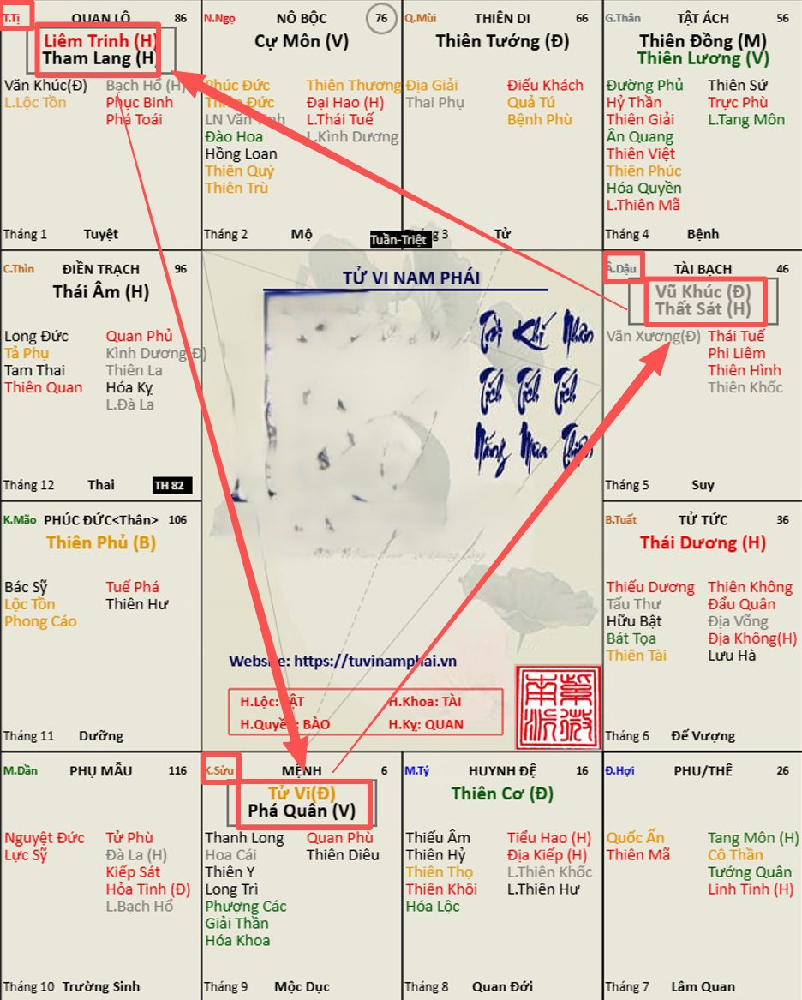
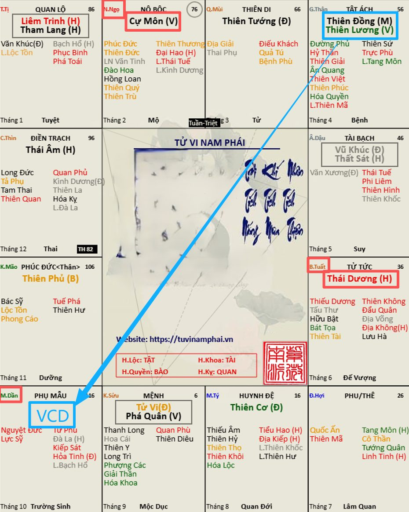
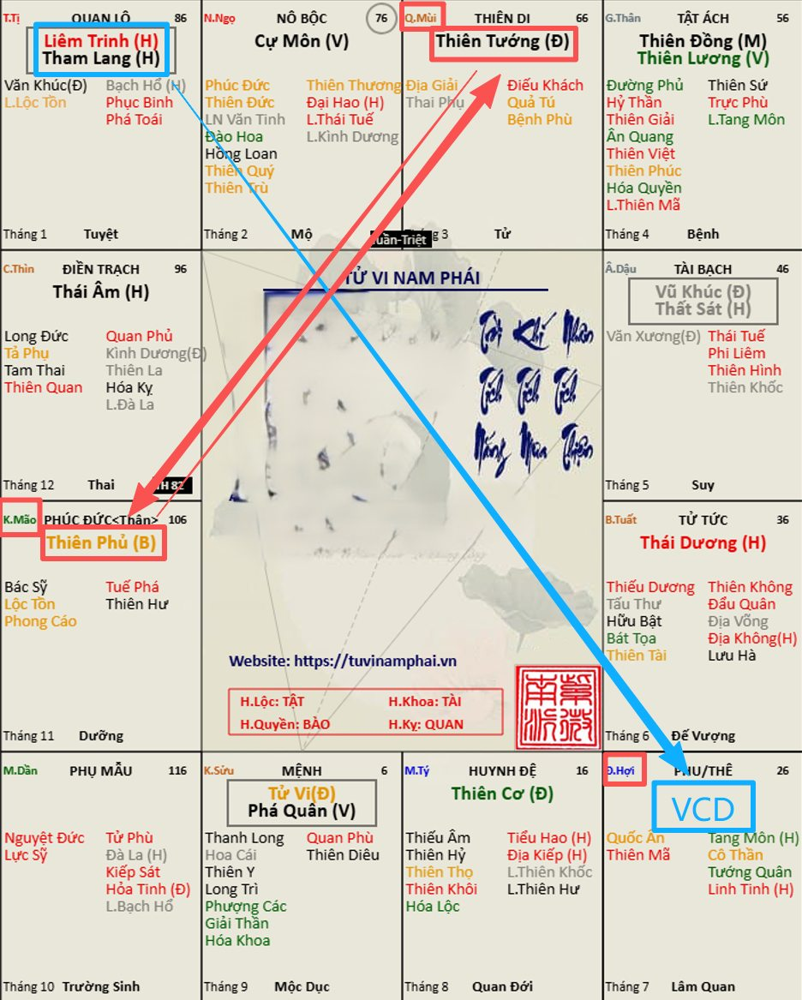
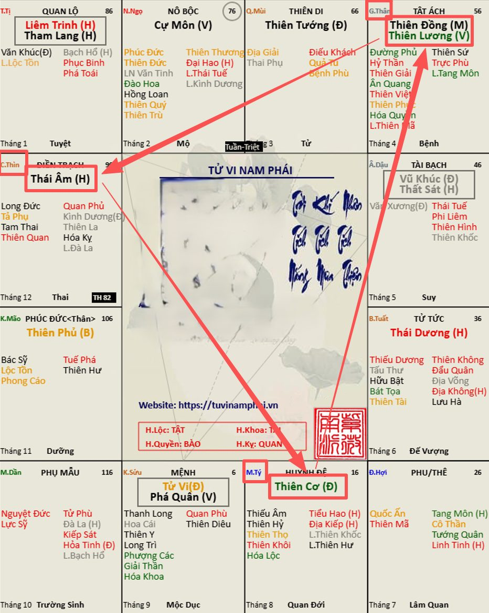

[Mục lục](../README.md)

# TỬ VI NAM PHÁI - BÀI SỐ 22: CÁC BỘ CÁCH CỦA CHÍNH TINH TRONG HUYỀN ĐỒ SỐ 2

Ở bài số 21, chúng ta đã tìm hiểu cách gọi tên cung Mệnh trong Huyền Đồ số 1, đồng thời làm quen với một số bộ cách của chính tinh.
Có một số bạn thắc mắc vì sao bài trước còn thiếu nhiều bộ cách... Điều này hoàn toàn dễ hiểu, bởi bài số 21 chỉ phân tích Huyền Đồ số 1, trong khi Thập Nhị Huyền Đồ gồm tới 12 bố cục khác nhau. Vì vậy, không thể xuất hiện đầy đủ tất cả các bộ sao trong một Huyền Đồ.
Như mình đã giải thích ở bài số 20, Thập Nhị Huyền Đồ chỉ là 12 khung bố cục cố định của 14 chính tinh. Các bạn có thể hình dung giống như 12 mẫu bài văn, hoặc đơn giản hơn, dù một người mặc trang phục theo phong cách nào thì cũng vẫn thuộc một nhóm như áo sơ mi, áo thun, vest hay đầm váy... 
Cần lưu ý các bộ cách chỉ là cách phân loại tổng quát, giúp chúng ta nắm được nền tảng của môn Tử Vi, chứ chưa phải là phương pháp luận giải một lá số cụ thể.
Hôm nay, chúng ta sẽ tiếp tục tìm hiểu cách gọi tên các bộ sao trong Huyền Đồ số 2.
________________________________________
1. Bộ cách Sát Phá Liêm Tham (SPLT)
Theo Hình số 1 đính kèm, tam hợp gồm:
• Cung Sửu: Tử Vi + Phá Quân.
• Cung Tị: Liêm Trinh + Tham Lang.
• Cung Dậu: Vũ Khúc + Thất Sát.
Ba cung này tạo thành bộ cách Sát Phá Liêm Tham (SPLT).
Tùy theo vị trí cung Mệnh mà tên gọi sẽ khác nhau:
• Mệnh tại Sửu: gọi là Mệnh Tử Phá, thuộc bộ Sát Phá Liêm Tham.
• Mệnh tại Tị: gọi là Mệnh Liêm Tham, thuộc bộ Sát Phá Liêm Tham.
• Mệnh tại Dậu: gọi là Mệnh Vũ Sát, thuộc bộ Sát Phá Liêm Tham.
Nhiều bạn có lẽ đã từng nghe câu phú:
"Liêm Tham Tị Hợi, hình ngục nan đào."
Câu phú này chính là nói đến trường hợp Mệnh Liêm Tham tại cung Tị trong Huyền Đồ số 2, hoặc tại cung Hợi trong Huyền Đồ số 8.
Tuy nhiên, những bạn có Mệnh Liêm Tham cũng không cần quá lo lắng. Một câu phú không bao giờ đủ để kết luận số mệnh của một con người. Sau này, khi học đến phần luận giải chuyên sâu, mình sẽ phân tích đầy đủ để các bạn hiểu vì sao câu phú này chỉ đúng trong những điều kiện nhất định.
Ở bài này các bạn cần đặc biệt lưu ý phân biệt rõ 2 bộ cách Sát Phá Tham và Sát Phá Liêm Tham, đây là hai bộ hoàn toàn khác nhau.
• Sát Phá Tham chỉ nói đến ba sao Thất Sát – Phá Quân – Tham Lang khi đơn thủ trong tam hợp.
• Sát Phá Liêm Tham là bộ cách đầy đủ gồm Tử Vi – Phá Quân – Liêm Trinh – Tham Lang – Vũ Khúc – Thất Sát phân bố trong cùng một tam hợp.
Đây là điểm rất quan trọng mà người mới học cần ghi nhớ.
________________________________________
2. Tam hợp Cự Môn – Thái Dương
Theo Hình số 2, tam hợp gồm:
• Cung Ngọ: Cự Môn.
• Cung Tuất: Thái Dương.
• Cung Dần: Vô Chính Diệu.
Nếu cung Mệnh nằm trong tam hợp này thì:
• Mệnh tại Ngọ: gọi là Mệnh Cự Môn cư Ngọ.
• Mệnh tại Tuất: gọi là Mệnh Thái Dương cư Tuất.
• Mệnh tại Dần: gọi là Mệnh Vô Chính Diệu được Đồng Lương chiếu.
Điểm cần lưu ý là tam hợp này chỉ có hai chính tinh, nên thông thường không có tên gọi riêng cho cả bộ.
Một số tài liệu gọi đây là bộ Cự Nhật, nhưng trên thực tế, tên gọi Cự Nhật chỉ dùng khi Cự Môn và Thái Dương đồng cung, tạo thành bộ sao đôi tại cung Dần hoặc cung Thân, chứ không dùng để chỉ tam hợp này.
________________________________________
3. Bộ cách Phủ Tướng Triều Viên
Theo Hình số 3, tam hợp gồm:
• Cung Mão: Thiên Phủ.
• Cung Mùi: Thiên Tướng.
• Cung Hợi: Vô Chính Diệu.
Do tam hợp này chỉ có hai chính tinh là Thiên Phủ và Thiên Tướng, nên được gọi là Phủ Tướng Triều Viên.
Nếu Mệnh nằm trong tam hợp này thì:
• Mệnh tại Mão: gọi là Mệnh Thiên Phủ cư Mão, thuộc bộ Phủ Tướng Triều Viên.
• Mệnh tại Mùi: gọi là Mệnh Thiên Tướng cư Mùi, thuộc bộ Phủ Tướng Triều Viên.
• Mệnh tại Hợi: gọi là Mệnh Vô Chính Diệu được Liêm Tham chiếu.
________________________________________
4. Bộ cách Cơ Nguyệt Đồng Lương
Theo Hình số 4, tam hợp gồm:
• Cung Tý: Thiên Cơ.
• Cung Thìn: Thái Âm.
• Cung Thân: Thiên Đồng + Thiên Lương.
Tam hợp này được gọi là Cơ Nguyệt Đồng Lương. Trong đó, Thái Âm tượng trưng cho mặt trăng, nên thường được gọi tắt là Nguyệt.
Nếu cung Mệnh nằm trong bộ cách này thì:
• Mệnh tại Tý: gọi là Mệnh Thiên Cơ cư Tý, thuộc bộ Cơ Nguyệt Đồng Lương.
• Mệnh tại Thìn: gọi là Mệnh Thái Âm cư Thìn, thuộc bộ Cơ Nguyệt Đồng Lương.
• Mệnh tại Thân: gọi là Mệnh Đồng Lương cư Thân, thuộc bộ Cơ Nguyệt Đồng Lương.
Người xưa có câu phú:
"Đồng Lương đắc cách Dần Thân,
Khi xưa bạch thủ mà nay sang giàu."
Ý câu phú muốn nói đến trường hợp Thiên Đồng và Thiên Lương đồng cung tại Dần hoặc Thân. Đây là cách cục tay trắng dựng nghiệp mà trở nên giàu có, thường được cổ nhân đánh giá cao. Tuy nhiên, cũng giống như các câu phú khác, muốn luận đoán chính xác vẫn phải xét toàn bộ lá số chứ không thể chỉ dựa vào một bộ sao.
________________________________________
TỔNG KẾT BÀI SỐ 22
Qua Huyền Đồ số 2, chúng ta đã tiếp tục làm quen với bốn nhóm bố cục quan trọng:
• Sát Phá Liêm Tham
• Tam hợp Cự Môn – Thái Dương
• Phủ Tướng Triều Viên
• Cơ Nguyệt Đồng Lương
Các bạn không cần cố ghi nhớ tất cả ngay từ đầu. Chỉ cần hiểu rằng mỗi Huyền Đồ là một cách sắp xếp khác nhau của 14 chính tinh, từ đó hình thành nên những bộ cách và tên gọi khác nhau. Khi học hết 12 Huyền Đồ, các bạn sẽ nhận ra quy luật lặp lại của các chính tinh và việc ghi nhớ sẽ trở nên rất tự nhiên.
Ở bài tiếp theo, chúng ta sẽ tiếp tục tìm hiểu các bộ cách trong những Huyền Đồ còn lại.
