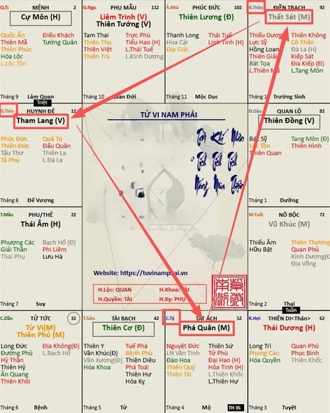
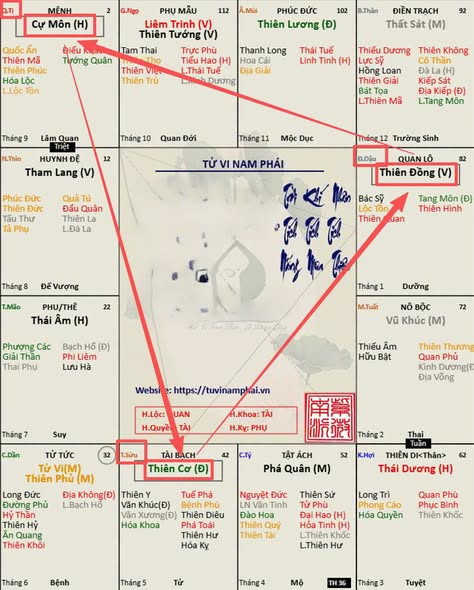
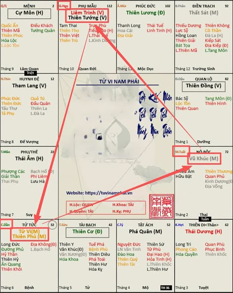
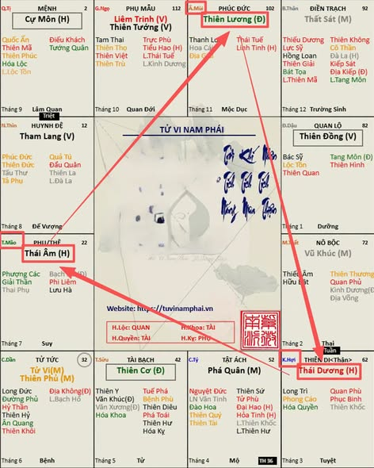

[Mục lục](../README.md)

# TỬ VI NAM PHÁI - BÀI SỐ 23: CÁC BỘ CÁCH CỦA CHÍNH TINH TRONG HUYỀN ĐỒ SỐ 3

Ở bài số 22, chúng ta đã tìm hiểu cách gọi tên cung Mệnh trong Huyền Đồ số 2.

Hôm nay, chúng ta sẽ tiếp tục nghiên cứu các bộ cách của chính tinh trong Huyền Đồ số 3, đồng thời làm quen với hai nhóm sao rất quan trọng là Cơ Cự Đồng và Âm Dương Lương.

---

## 1. Bộ cách Sát Phá Tham (SPT)

Theo Hình số 1, tam hợp gồm:

- Cung Tý: Phá Quân.
- Cung Thìn: Tham Lang.
- Cung Thân: Thất Sát.

Ba cung này tạo thành bộ Sát Phá Tham.

Bộ Sát Phá Tham cũng xuất hiện trong Huyền Đồ số 1, tuy nhiên trạng thái của chính tinh hoàn toàn khác nhau.

- Huyền Đồ số 1: Sát Phá Tham ở thế Lạc Hãm.
- Huyền Đồ số 3: Sát Phá Tham ở thế Miếu Vượng.

Chính vì vậy, mặc dù cùng là bộ Sát Phá Tham nhưng sức mạnh và khả năng phát huy của các chính tinh giữa hai Huyền Đồ có sự khác biệt rất lớn.

---

## 2. Tam hợp Cơ Cự Đồng

Theo Hình số 2, tam hợp gồm:

- Cung Tị: Cự Môn.
- Cung Dậu: Thiên Đồng.
- Cung Sửu: Thiên Cơ.

Nếu cung Mệnh nằm trong tam hợp này thì sẽ được gọi như sau:

- Mệnh tại Tị: Mệnh Cự Môn cư Tị.
- Mệnh tại Dậu: Mệnh Thiên Đồng cư Dậu.
- Mệnh tại Sửu: Mệnh Thiên Cơ cư Sửu.

Ba chính tinh này hợp thành bộ Cơ Cự Đồng, một trong những bộ cách rất thường gặp trong Tử Vi.

---

## 3. Bộ cách Tử Phủ Vũ Tướng (TPVT)

Theo Hình số 3, tam hợp gồm:

- Cung Dần: Tử Vi + Thiên Phủ.
- Cung Ngọ: Liêm Trinh + Thiên Tướng.
- Cung Tuất: Vũ Khúc.

Nếu cung Mệnh nằm trong tam hợp này thì:

- Mệnh tại Dần: gọi là Mệnh Tử Phủ cư Dần, thuộc bộ Tử Phủ Vũ Tướng.
- Mệnh tại Ngọ: gọi là Mệnh Liêm Tướng cư Ngọ, thuộc bộ Tử Phủ Vũ Tướng.
- Mệnh tại Tuất: gọi là Mệnh Vũ Khúc cư Tuất, thuộc bộ Tử Phủ Vũ Tướng.

Đây là một trong những bộ cách quan trọng nhất trong Tử Vi, thường được nghiên cứu song song với bộ Sát Phá Tham để thấy sự đối lập về tính chất giữa hai nhóm sao.

---

## 4. Bộ cách Âm Dương Lương

Theo Hình số 4, tam hợp gồm:

- Cung Hợi: Thái Dương.
- Cung Mão: Thái Âm.
- Cung Mùi: Thiên Lương.

Tam hợp này được gọi là Âm Dương Lương.

Nếu cung Mệnh nằm trong tam hợp này thì:

- Mệnh tại Hợi: gọi là Mệnh Thái Dương cư Hợi, thuộc bộ Âm Dương Lương.

Ngoài ra, Mệnh Thái Dương tại Hợi còn có tên riêng là Nhật Trầm Thủy Bể. Một số mệnh đặc biệt sẽ có tên riêng, sau này mình sẽ có một bài viết giới thiệu đầy đủ.

- Mệnh tại Mão: gọi là Mệnh Thái Âm cư Mão, thuộc bộ Âm Dương Lương.
- Mệnh tại Mùi: gọi là Mệnh Thiên Lương cư Mùi, thuộc bộ Âm Dương Lương.

---

## TỔNG KẾT BÀI SỐ 23

Qua Huyền Đồ số 3, chúng ta tiếp tục làm quen với hai nhóm bố cục quan trọng là:

- Cơ Cự Đồng
- Âm Dương Lương

Điểm đặc biệt của Huyền Đồ số 3 (cũng như Huyền Đồ số 9) là không có bất kỳ cung nào Vô Chính Diệu. Đồng thời, đây cũng là hai Huyền Đồ có hệ thống chính tinh ở trạng thái mạnh nhất, với phần lớn các sao ở thế Miếu hoặc Vượng, nên khả năng phát huy đặc tính của từng bộ sao rất rõ rệt.

Việc nắm vững các bộ cách trong từng Huyền Đồ sẽ giúp chúng ta hình thành tư duy nhận diện bố cục lá số nhanh hơn, thay vì phải ghi nhớ từng vị trí chính tinh một cách rời rạc.

Ở bài tiếp theo, chúng ta sẽ tiếp tục nghiên cứu các bộ cách trong những Huyền Đồ còn lại.

[Mục lục](../README.md)
