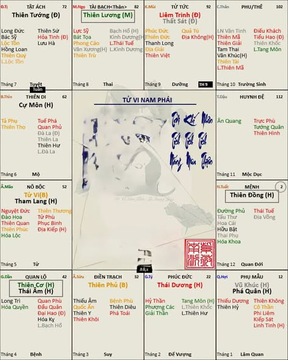
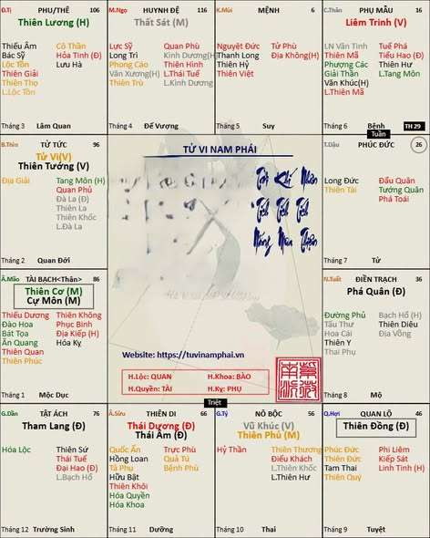
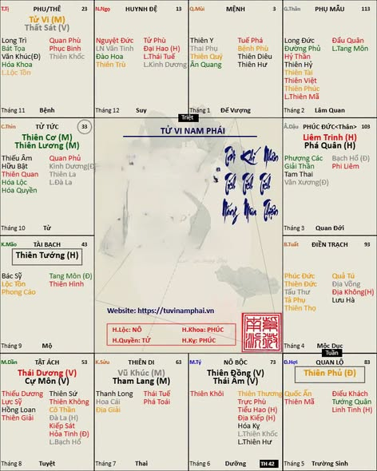

[Mục lục](../README.md)

# TỬ VI NAM PHÁI - BÀI SỐ 24: CÁC BỘ CÁCH CỦA CHÍNH TINH TRONG CÁC HUYỀN ĐỒ CÒN LẠI

Ở các bài trước, chúng ta đã lần lượt tìm hiểu các bộ tam hợp chính tinh và cách gọi tên cung Mệnh trong Huyền Đồ số 1, 2 và 3.

Đến các Huyền Đồ số 4, 5 và 6, chúng ta sẽ dễ dàng nhận thấy các bộ tam hợp chính tinh thực chất vẫn được lặp lại như ở ba Huyền Đồ đầu tiên. Điểm khác biệt chỉ nằm ở vị trí cung Mệnh, còn quy tắc gọi tên và cách phân loại vẫn hoàn toàn giống nhau.

Để tránh lặp lại quá nhiều nội dung, mình sẽ trình bày ngắn gọn cách gọi tên cung mệnh ở các huyền đồ số 4, 5 và 6 như sau: (bạn nào chưa hiểu kịp có thể comment trên bài viết, mình sẽ giải đáp cặn kẽ)

---

## 1. Huyền Đồ số 4 (hình số 1 đính kèm)

- Mệnh Thái Dương cư Tý hoặc Cự Môn cư Thìn thuộc tam hợp Thái Dương – Cự Môn.
- Mệnh Thiên Phủ cư Sửu hoặc Thiên Tướng cư Tị thuộc tam hợp Phủ Tướng Triều Viên.
- Mệnh Cơ Âm cư Dần, Thiên Lương cư Ngọ hoặc Thiên Đồng cư Tuất thuộc tam hợp Cơ Nguyệt Đồng Lương.
- Mệnh Tử Tham cư Mão, Liêm Sát cư Mùi hoặc Vũ Phá cư Hợi thuộc tam hợp Sát Phá Liêm Tham.
- Mệnh Vô Chính Diệu (VCD) cư Thân được Cơ Âm chiếu.
- Mệnh VCD cư Dậu được Tử Tham chiếu.

---

## 2. Huyền Đồ số 5 (hình số 2 đính kèm)

- Mệnh Vũ Phủ cư Tý, Tử Tướng cư Thìn hoặc Liêm Trinh cư Thân thuộc tam hợp Tử Phủ Vũ Tướng.
- Mệnh Âm Dương cư Sửu hoặc Thiên Lương cư Tị thuộc tam hợp Âm Dương Lương.
- Mệnh Tham Lang cư Dần, Thất Sát cư Ngọ hoặc Phá Quân cư Tuất thuộc tam hợp Sát Phá Tham.
- Mệnh Cự Cơ cư Mão hoặc Thiên Đồng cư Hợi thuộc tam hợp Cơ Cự Đồng.
- Mệnh VCD cư Mùi được Âm Dương chiếu.
- Mệnh VCD cư Dậu được Cự Cơ chiếu.

---

## 3. Huyền Đồ số 6 (hình số 3 đính kèm)

- Mệnh Đồng Âm cư Tý hoặc Cơ Lương cư Thìn thuộc tam hợp Cơ Nguyệt Đồng Lương.
- Mệnh Tham Vũ cư Sửu, Tử Sát cư Tị hoặc Liêm Phá cư Dậu thuộc tam hợp Sát Phá Liêm Tham.
- Mệnh Cự Nhật cư Dần thuộc tam hợp Cự Môn – Thái Dương.
- Mệnh Thiên Tướng cư Mão hoặc Thiên Phủ cư Hợi thuộc tam hợp Phủ Tướng Triều Viên.
- Mệnh VCD cư Ngọ được Đồng Âm chiếu.
- Mệnh VCD cư Mùi được Vũ Tham chiếu.
- Mệnh VCD cư Thân được Cự Nhật chiếu.
- Mệnh VCD cư Tuất được Cơ Lương chiếu.

---

## 4. Huyền Đồ số 7 đến số 12

Quan sát toàn bộ 12 Huyền Đồ, chúng ta sẽ nhận thấy chúng được sắp xếp thành từng cặp đối xứng:

- Huyền Đồ số 7 đối xứng với Huyền Đồ số 1.
- Huyền Đồ số 8 đối xứng với Huyền Đồ số 2.
- Huyền Đồ số 9 đối xứng với Huyền Đồ số 3.
- Tương tự, Huyền Đồ số 10, 11 và 12 lần lượt đối xứng với Huyền Đồ số 4, 5 và 6.

Chính vì tính chất đối xứng này nên nếu tồn tại một mệnh Tử Phủ cư Dần thì cũng sẽ tồn tại một mệnh Tử Phủ cư Thân; nếu có Liêm Sát cư Sửu thì cũng sẽ có Liêm Sát cư Mùi; hay Cự Cơ cư Mão thì cũng sẽ có Cự Cơ cư Dậu.

Đó là lý do trong nhiều sách hoặc trong cách gọi truyền thống, người ta thường gọi luôn hai cung đối xứng với nhau, chẳng hạn:

- Tử Phủ Dần – Thân
- Liêm Sát Sửu – Mùi
- Cự Cơ Mão – Dậu

Cách gọi này nhằm bao quát cả hai bố cục đối xứng của cùng một bộ chính tinh.

---

## TỔNG KẾT TOÀN BỘ CÁC TAM HỢP CHÍNH TINH TRONG 12 HUYỀN ĐỒ

Qua toàn bộ 12 Huyền Đồ, chúng ta tổng hợp được 9 nhóm bộ cách của chính tinh, gồm:

- Tử Phủ Vũ Tướng
- Phủ Tướng Triều Viên
- Sát Phá Tham
- Sát Phá Liêm Tham
- Cơ Cự Đồng
- Âm Dương Lương
- Cơ Nguyệt Đồng Lương
- Tam hợp Cự Môn – Thái Dương
- 12 vị trí của Mệnh Vô Chính Diệu (VCD)

---

## NHÌN NHANH VỀ ĐẶC TÍNH CỦA 9 BỘ TAM HỢP

Mỗi bộ tam hợp không chỉ là sự kết hợp của các chính tinh, mà còn đại diện cho một nhóm tính chất và vai trò xã hội khác nhau. Có thể hình dung một cách khái quát như sau:

- Tử Phủ Vũ Tướng: tượng trưng cho tầng lớp lãnh đạo, quản lý, quan chức, doanh nhân lớn, những người giỏi tổ chức, điều hành và xây dựng nền tảng bền vững.
- Phủ Tướng Triều Viên: tượng trưng cho tầng lớp phụ tá, cố vấn, quản trị, hành chính, kinh doanh, là những người giỏi duy trì trật tự, ổn định tổ chức, đứng một một bộ phận, một mảng kinh doanh.
- Sát Phá Tham: tượng trưng cho tầng lớp khai phá, kinh doanh, đầu tư, quân sự, kỹ thuật, những người dám mạo hiểm, thích cạnh tranh và tạo ra sự thay đổi.
- Sát Phá Liêm Tham: tượng trưng cho những người cải cách, tiên phong, cách mạng, sẵn sàng phá bỏ khuôn mẫu cũ để xây dựng cái mới. Đây là nhóm sao có tính biến động mạnh nhất.
- Cơ Cự Đồng: tượng trưng cho tầng lớp học giả, nhà nghiên cứu, kỹ sư, chuyên gia, giáo viên, lấy tư duy, tri thức và kỹ năng chuyên môn, kỹ năng nghề nghiệp...làm nền tảng phát triển.
- Âm Dương Lương: tượng trưng cho tầng lớp trí thức, học thuật, pháp luật, y học, giáo dục, tôn giáo...
- Cơ Nguyệt Đồng Lương: tượng trưng cho những người làm công tác phục vụ cộng đồng, giáo dục, tư vấn, chăm sóc, từ thiện hoặc nghiên cứu.
- Tam hợp Cự Môn – Thái Dương: tượng trưng cho tầng lớp diễn giả, luật sư, chính trị gia, truyền thông, ngoại giao, những người nổi bật nhờ khả năng giao tiếp và gây ảnh hưởng.
- Mệnh Vô Chính Diệu (VCD): không đại diện cho một tầng lớp cố định mà là nhóm người có khả năng thích nghi rất mạnh, thành bại chủ yếu phụ thuộc vào các sao chiếu và hoàn cảnh phát triển của từng lá số.

Đây chỉ là những nét khái quát để giúp người học dễ hình dung đặc tính cơ bản và dễ dàng so sánh từng bộ tam hợp với nhau. Khi luận đoán thực tế, vẫn cần kết hợp với toàn bộ lá số, tứ hóa, cát tinh, sát tinh và vận hạn mới có thể đưa ra kết luận, chứ không thể chắc chắn mệnh bạn thuộc bộ nào là sẽ theo các ngành nghề như kể trên.

---

Đến đây, chúng ta đã hoàn thành việc hệ thống hóa toàn bộ các bộ tam hợp của chính tinh trong 12 Huyền Đồ.

Ở bài tiếp theo, chúng ta sẽ bắt đầu nghiên cứu ý nghĩa của từng bộ sao đôi. Khi đó, các bạn sẽ hiểu vì sao cùng là sao Tử Vi, nhưng khi đi trong tam hợp Tử Phủ Vũ Tướng thì ý nghĩa lại khác với khi đi trong tam hợp Sát Phá Liêm Tham. Tương tự, cùng là Thiên Cơ, nhưng nếu đi trong bộ Cơ Cự Đồng hay Cơ Nguyệt Đồng Lương thì tính chất và biểu hiện cũng hoàn toàn khác nhau.

Đó cũng chính là nền tảng để bước sang giai đoạn luận giải lá số một cách sâu sắc và chính xác hơn.
