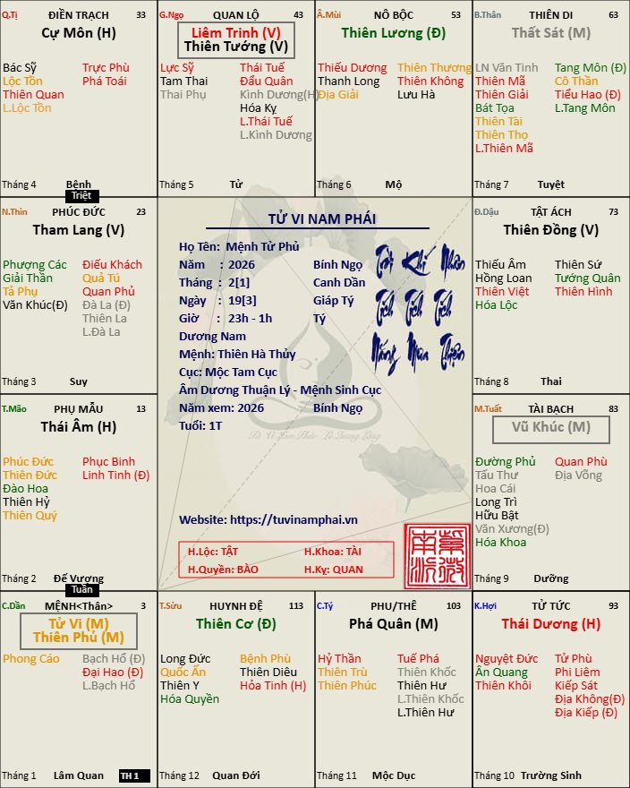

[Mục lục](../README.md)

# TỬ VI NAM PHÁI - BÀI SỐ 25: LUẬN GIẢI CUNG MỆNH THÔNG QUA CHÍNH TINH BỘ ĐÔI (PHẦN 1)

## NGUYÊN TẮC LUẬN GIẢI CHUNG KHI CUNG MỆNH CÓ 2 CHÍNH TINH

Điều đầu tiên các bạn cần nắm rõ là, khi cung Mệnh có hai chính tinh đồng cung (ví dụ như Tử Vi - Tham Lang), thì không bao giờ được chỉ luận riêng từng sao, mà phải xét theo ba tầng ý nghĩa.

________________________________________

### Thứ nhất: Luận theo bộ cách chung của tam hợp

Hai chính tinh luôn nằm trong một hệ thống lớn.

Ví dụ: Tử Vi - Tham Lang thuộc hệ Sát Phá Liêm Tham, nên trước hết người này mang khí chất chung của cả tổ hợp:

• Mạnh mẽ;

• Có năng lực thích nghi;

• Có khả năng phát triển trong nhiều lĩnh vực khác nhau;

• Dễ nắm quyền khi gặp thời.

Đây là "khí chất nền" của cung Mệnh.

________________________________________

### Thứ hai: Xét ngũ hành bản mệnh để biết ứng với sao nào mạnh hơn

Ví dụ:

• Tử Vi thuộc hành Thổ.

• Tham Lang thuộc hành Thủy.

• Đương số mang bản mệnh Mộc.

Theo ngũ hành: hành Thủy của Tham Lang sinh hành Mộc của bản mệnh và hành Thổ của Tử Vi khắc hành Mộc của bản mệnh. Như vậy, bản mệnh tiếp nhận khí của Tham Lang hơn khí của Tử Vi.

Kết quả là: tính cách, sở thích, cách xử lý công việc…đều biểu hiện thiên về Tham Lang nhiều hơn.

Ví dụ người này thường: cao ráo; nhiều lông tóc; nhanh nhẹn; giỏi giao tiếp; thích hưởng thụ; linh hoạt theo thời cuộc.

Trong khi những nét đặc trưng của Tử Vi như: Dáng người tầm thước, không cao. Tính cách trầm ổn, uy nghi, từ tốn…sẽ giảm đi đáng kể.

Điều này không có nghĩa Tử Vi mất tác dụng, mà chỉ là mức độ biểu hiện yếu hơn so với Tham Lang.

________________________________________

### Thứ ba: Xét phụ tinh và Tuần Triệt

Sau khi xác định sao nào hợp mệnh hơn, cần tiếp tục xét hệ thống phụ tinh để biết chính tinh nào được phát huy. Ví dụ:

Sao Tử Vi rất ưa khi được hội chiếu các phụ tinh như:

• Tả Phụ;

• Hữu Bật;

• Văn Xương;

• Văn Khúc;

• Hóa Khoa;

• Hóa Quyền.

Khi hội đủ các cát tinh này, dù bản mệnh không thật sự hợp với Tử Vi thì khí của Tử Vi vẫn được nâng lên rất mạnh. Người đó vẫn có thể trở thành:

• Lãnh đạo;

• Chủ doanh nghiệp;

• Người đứng đầu một tổ chức;

• hoặc giữ chức vụ cao trong cơ quan nhà nước. Kể cả làm kinh doanh tự do cũng làm ông chủ lớn có nhiều nhân viên giỏi bên dưới.

Ngược lại, nếu hội nhiều sát tinh như:

• Kình Dương;

• Đà La;

• Hỏa Tinh;

• Linh Tinh;

thì phần lớn sát khí sẽ kích phát Tham Lang hơn là Tử Vi. Lúc đó Tử Vi đôi khi chỉ còn biểu hiện là vẻ ngoài điềm đạm, trong khi bản chất bên trong lại rất linh hoạt, khôn khéo và nhiều mưu lược.

Đây chính là lý do hai người cùng có Mệnh Tử Vi - Tham Lang nhưng cuộc đời và tính cách lại rất khác nhau.

Từ nguyên tắc trên, chúng ta sẽ lần lượt nghiên cứu từng bộ chính tinh đồng cung khi tọa thủ cung Mệnh. Ở phần số 1, chúng ta nghiên cứu mệnh Tử Vi Thiên Phủ, thuộc bộ Tử Phủ Vũ Tướng.

________________________________________

## MỆNH TỬ VI - THIÊN PHỦ (TỬ PHỦ DẦN THÂN)

### 1. Ngũ hành bản mệnh ảnh hưởng đến bộ Tử Phủ

Khác với nhiều bộ sao khác, Tử Vi và Thiên Phủ đều thuộc hành Thổ. Vì vậy, ngũ hành bản mệnh không làm nghiêng về một chính tinh nào, mà quyết định trực tiếp mức độ phát huy của toàn bộ tổ hợp Tử Phủ.

#### 1.1. Đương số mệnh Thổ

Đây là cách cục lý tưởng nhất. Khí Thổ đồng hành với cả hai chính tinh nên các phẩm chất tốt đẹp của Tử Phủ được phát huy tối đa.

Người này thường:

• Điềm tĩnh;

• Uy tín;

• Bao dung;

• Có năng lực quản trị;

• Dễ trở thành lãnh đạo hoặc chủ doanh nghiệp.

________________________________________

#### 1.2. Đương số Mệnh Hỏa

Hỏa ở mệnh sinh cho Thổ của chính tinh. Người này có thêm sự nhiệt huyết và quyết đoán. So với Mệnh Thổ, họ:

• Năng động hơn;

• Dám hành động hơn;

• Ít bảo thủ hơn.

• Tuy nhiên, vì bản mệnh Hỏa sinh xuất cho hành Thổ của hai chính tinh nên khí của bản mệnh bị tiêu hao. Người này thường phải lao tâm lao lực mới gây dựng được sự nghiệp. Thành công càng lớn thì sự đánh đổi về thời gian, sức khỏe và tinh thần cũng càng nhiều.

________________________________________

#### 1.3. Đương số Mệnh Kim

Hành Thổ của Tử Vi và Thiên Phủ sinh cho hành Kim của mệnh. Khí của bộ Tử Phủ bị tiết ra ngoài. Người vẫn rất giỏi quản lý nhưng thường:

• Gánh vác nhiều trách nhiệm, hay lo cho người khác;

• Thành quả đến sau quá trình cống hiến.

• Nhưng nhờ sự cho đi, người mệnh Kim được tăng thọ lên cao, đó cũng là ý nghĩa của việc chính tinh hành Thổ sinh xuất cho hành Kim của mệnh.

________________________________________

#### 1.4. Đương số Mệnh Mộc

Hành Mộc của mệnh khắc hành Thổ của chính tinh. Khí của Tử Phủ bị suy giảm, người vẫn có tố chất lãnh đạo nhưng:

• Nội tâm nhiều mâu thuẫn;

• Khó giữ sự ổn định lâu dài;

• Thường phải cố gắng vất vả nhiều hơn người khác mới giữ được vị trí.

________________________________________

#### 1.5. Đương số mệnh Thủy

Hành Thổ và hành Thủy tương phá lẫn nhau. Uy quyền của Tử Phủ vẫn còn, nhưng đương số dễ:

• Chịu nhiều áp lực, vị trí càng cao áp lực càng lớn.

• Thường phải giải quyết công việc cho người khác.

Nếu hội thêm nhiều sát tinh thì dễ sinh cảm giác cô độc, nặng nề và mệt mỏi về tinh thần.

________________________________________

### 2. Bộ cách Tử Phủ Vũ Tướng - Hệ thống quản trị hoàn chỉnh

Trong hệ thống Tử Phủ Vũ Tướng, mỗi chính tinh đảm nhiệm một chức năng riêng.

Tử Vi: Nhà lãnh đạo tối cao, quyết định phương hướng

Thiên Phủ: Quản lý tài chính, ngân khố và nguồn lực

Vũ Khúc: Thực thi tài chính, quản trị tài sản, tính toán hiệu quả kinh tế

Thiên Tướng: Quản trị nhân sự, pháp chế, đào tạo kiến thức.

Liêm Trinh: Giám sát, thanh tra, đốc thúc.

Bốn sao này kết hợp tạo thành một bộ máy quản trị hoàn chỉnh, vì vậy trong xã hội thường tượng trưng cho tầng lớp lãnh đạo, quản lý và những người nắm quyền điều hành các tổ chức lớn.

________________________________________

### 4. Đặc điểm của Tử Phủ đồng cung

Tử Vi là Đế tinh đứng đầu Nam Bắc Đẩu, mang tính khai sáng và lãnh đạo.

Thiên Phủ là chủ tinh đứng đầu của Nam Đẩu, thiên về bảo tồn và ổn định.

Hai chủ tinh cùng tọa Mệnh giống như hai vị nguyên thủ cùng điều hành một quốc gia. Nếu phối hợp hài hòa sẽ tạo nên người có tài thao lược, biết cân bằng giữa phát triển và gìn giữ. Nhưng nếu mất cân bằng thì dễ xuất hiện sự giằng co nội tâm giữa đổi mới và bảo thủ, khiến đương số nhiều lúc bỏ lỡ cơ hội hoặc thiếu quyết đoán.

Tử Phủ đồng cung thường chủ về:

• Tài thao lược;

• Năng lực tổ chức;

• Tinh thần trách nhiệm cao;

• Quan hệ xã hội rộng;

• Dễ có địa vị, tài sản và danh tiếng.

Tuy nhiên, vì hai chủ tinh đều mang tính cô độc cao nên đương số cũng dễ có cảm giác cô đơn, khó tìm được người thật sự đồng điệu, đôi khi cũng do chính đương số luôn có cảm giác bản thân là tôn quý tôn quyền, là bề trên, nên tạo sự khó gần.

Nếu cung Mệnh, cung Phu Thê hoặc Phụ Mẫu lại gặp thêm Cô Thần, Quả Tú hay nhiều sát tinh thì sự cô độc càng rõ, duyên với lục thân tại cung đó cũng trở nên mỏng hơn.

________________________________________

### 5. Các cách cục nổi bật của mệnh Tử Vi Thiên Phủ

• Hội Tả Phụ, Hữu Bật: địa vị cao, nhiều người trợ giúp.

• Hội Văn Xương, Văn Khúc: học vấn tốt, danh tiếng lớn, tài sản dồi dào.

• Phụ Bật Xương Khúc hội đủ: dễ trở thành nhân vật có uy tín trong chính trị, quản trị hoặc học thuật.

• Lộc Mã giao trì: phú quý song toàn. Tức cung mệnh có Thiên Mã, thiên di có Lộc Tồn hoặc Hóa Lộc, hoặc ngược lại. Nếu vị trí Thiên Mã ở trên đất Lâm Quan, Trường Sinh thì gặp thời sẽ giàu có nhanh chóng.

• Lộc Văn củng Mệnh: có Lộc tinh và Văn tinh vừa giàu có vừa nổi danh.

• Hội Kình Dương, Đà La, Hỏa Tinh, Linh Tinh: bề ngoài trung hậu nhưng bên trong dễ mưu sâu, nhiều thị phi.

• Gặp Địa Không, Địa Kiếp hoặc Không Vong: dễ cô độc, sự nghiệp nhiều lần thăng trầm, duyên với người thân khá bạc.

• Mệnh gặp Tuần Triệt, hoặc các đại vận ở các tuổi dựng nghiệp gặp phải Tuần Triệt, đương số chỉ có thể đi làm thuê, có làm lãnh đạo cũng là lãnh đạo dưới trướng chứ không phải ông chủ thực sự, đó là cách mệnh của người có giỏi giang nhưng cũng không gặp thời. Hội nhiều cát tinh thì là người không thích công danh lợi lộc, chính họ cũng muốn sự an nhàn chứ không thích tranh đấu.

[Mục lục](../README.md)
