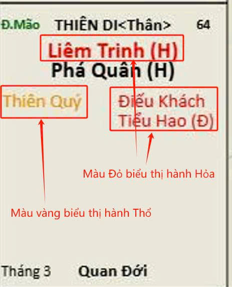
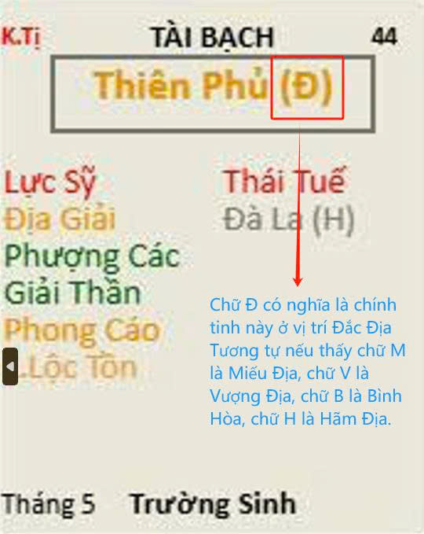
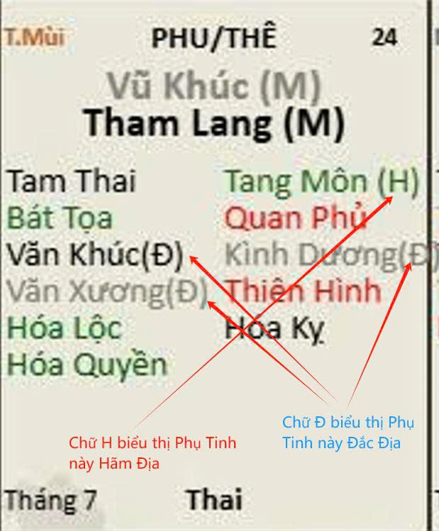
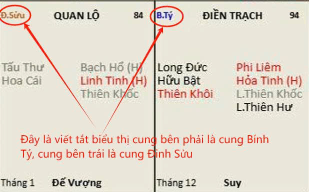

[Mục lục](../README.md)

# BÀI SỐ 3: CẤU TẠO CỦA MỘT LÁ SỐ TỬ VI (PHẦN TIẾP THEO)

Các bạn có thể vào trang Facebook chính chủ này của mình, tìm album Tử Vi Nam Phái để đọc đầy đủ các bài viết và ôn tập lại khi cần thiết nhé.
1. VỊ TRÍ TỐT XẤU CỦA CHÍNH TINH (HÌNH SỐ 1)
Đối với chính tinh, vị trí tốt xấu được phân chia thành 5 cấp độ:
• Miếu Địa
• Vượng Địa
• Đắc Địa
• Bình Hòa
• Hãm Địa
Thứ tự từ tốt đến xấu lần lượt là: Miếu Địa → Vượng Địa → Đắc Địa → Bình Hòa → Hãm Địa.
Trong hình số 1, ký hiệu bên cạnh mỗi chính tinh được hiểu như sau:
• M: Miếu Địa
• V: Vượng Địa
• Đ: Đắc Địa
• B: Bình Hòa
• H: Hãm Địa
Giải thích ý nghĩa:
• Miếu Địa: Là vị trí tốt nhất của một chính tinh, nơi sao phát huy tối đa năng lực.
• Vượng Địa: Vị trí rất thuận lợi, năng lượng của sao mạnh và ổn định.
• Đắc Địa: Vị trí phù hợp, sao thể hiện đúng bản chất.
• Bình Hòa: Vị trí trung tính, không tốt cũng không xấu rõ rệt.
• Hãm Địa: Vị trí bất lợi, sao bị suy yếu hoặc biểu hiện sai lệch tính chất.
Tuy nhiên, cần hiểu rằng đây chỉ là phân loại mang tính tương đối. Không nên vội kết luận tốt hay xấu chỉ dựa vào Miếu, Vượng hay Hãm. Ví dụ: không phải cứ cung Mệnh có chính tinh Miếu Địa là chắc chắn tốt, hoặc Hãm Địa là chắc chắn xấu. Thực tế, mức độ cát hung còn phụ thuộc rất nhiều yếu tố khác như:
• Phụ tinh đi kèm
• Hệ thống Tuần – Triệt
• Tứ Hóa
• Sự phối hợp toàn cục của lá số
Ví như học sinh giỏi nhất lớp sau này lại đi làm thuê cho cậu học sinh yếu kém trong lớp vậy. Chưa vội thấy thành tích học giỏi nhất lớp là mừng rỡ và kết luận về sự thành đạt sau này.
2. VỊ TRÍ TỐT XẤU CỦA PHỤ TINH (HÌNH SỐ 2)
Đối với phụ tinh, mức độ phân chia đơn giản hơn:
• Đắc địa (Đ)
• Hãm địa (H)
Một số sao không có ký hiệu Đ hoặc H thì được xem là có tính chất cố định, không thay đổi theo vị trí.
Nguyên tắc chung đối với phụ tinh:
• Cát Tinh Đắc địa thì luôn luôn là tốt. Cát Tinh hãm địa thì tính chất tốt bị suy yếu khá nhiều.
• Hung tinh Đắc địa thì sự bùng phát mạnh mẽ và bền bĩ, mức độ xấu ở mức 50/50. Hãm địa thường có tính chất xấu và sẽ gây tác hại nhiều hơn là lợi ích.
Tuy nhiên, không thể chỉ dựa vào trạng thái này để kết luận cát hung.
Phụ tinh luôn phải xét trong mối quan hệ tổng thể với:
• Chính tinh nào cai quản tại cung đó
• Tuần – Triệt
• Tứ Hóa
• Toàn cục lá số
Có thể hiểu đơn giản: Một đứa trẻ có tính hiếu thắng, thích đánh lộn nếu đặt trong môi trường quân đội hoặc thể thao đối kháng thì lại trở thành ưu điểm. Nhưng nếu đặt trong môi trường không phù hợp thì lại phá làng phá xóm.
Do đó, tốt xấu luôn mang tính tương đối và phụ thuộc hoàn cảnh.
3. THIÊN CAN VÀ ĐỊA CHI LÀ GÌ?
Thiên Can gồm 10 yếu tố:
• Giáp, Ất
• Bính, Đinh
• Mậu, Kỷ
• Canh, Tân
• Nhâm, Quý.
Địa Chi gồm 12 yếu tố:
• Tý, Sửu, Dần, Mão
• Thìn, Tỵ, Ngọ, Mùi
• Thân, Dậu, Tuất, Hợi
Ví dụ, bạn tuổi Kỷ Tỵ, có nghĩa Thiên Can là Kỷ và Địa Chi là Tỵ. Chúng ta đọc hiểu trước như vậy. Sau này ứng dụng thế nào sẽ có phần chuyên sâu.
4. NGŨ HÀNH VÀ MÀU SẮC TRONG LÁ SỐ
Trong lá số Tử Vi, ngũ hành được thể hiện thông qua màu sắc và ký hiệu để người học dễ phân biệt.
Bao gồm 5 hành:
• Kim
• Mộc
• Thủy
• Hỏa
• Thổ
Ngũ hành trong lá số gồm 3 lớp:
• Ngũ hành của chính tinh
• Ngũ hành của phụ tinh
• Ngũ hành của cung (Địa bàn)
Ý nghĩa màu sắc: Mỗi màu sắc trên lá số tương ứng với một hành trong ngũ hành, giúp người xem dễ nhận biết sự tương sinh – tương khắc.
• Màu trắng tượng trưng cho hành Kim 
• Màu xanh lá cây tượng trưng cho hành Mộc 
• Màu đen hoặc xanh dương tượng trưng cho hành Thủy 
• Màu đỏ tượng trưng cho hành Hỏa 
• Màu vàng tượng trưng cho hành Thổ 
(Xem hình ví dụ số 3)
Sự Tương Sinh – Tương Khắc của Ngũ Hành:
Ngũ Hành Tương Sinh gồm:
• Thủy sinh Mộc (nước nuôi dưỡng cây cối tươi tốt) 
• Mộc sinh Hỏa (gỗ là nguyên liệu tạo ra lửa) 
• Hỏa sinh Thổ (vạn vật cháy rụi trở về đất) 
• Thổ sinh Kim (kim loại được tìm thấy trong lòng đất) 
• Kim sinh Thủy (kim loại nóng chảy thành dạng lỏng) 
Ngũ Hành Tương Khắc gồm:
• Thủy khắc Hỏa (nước dập lửa) 
• Hỏa khắc Kim (lửa làm nóng chảy kim loại) 
• Kim khắc Mộc (kim loại dùng để chặt cây) 
• Mộc khắc Thổ (cây cối hút chất dinh dưỡng của đất) 
• Thổ khắc Thủy (đê đất ngăn dòng chảy)
5. ĐỊA CHI CỦA MỘT CUNG (HÌNH SỐ 4)
Trong 12 ô của lá số (hay còn gọi là Địa Bàn ở bài học số 1), mỗi ô đã được xác định sẵn là cung Tý, Sửu, Dần, Mão… và có kèm màu sắc để phân biệt ngũ hành. Ví dụ, trong hình số 4, chữ nhỏ “B.Tý” ở góc bên trái biểu thị cung này là cung Tý. Màu xanh dương biểu thị cung này thuộc hành Thủy.
Chúng ta tạm đọc hiểu rằng, cung này là cung Tý, cung kia là cung Ngọ…cung Tý thì hành Thủy, cung Sửu thì hành Thổ…và không cần nhớ vì Lá Số đã có ghi rõ chữ và màu sắc, chỉ cần đọc hiểu thôi. Còn việc ứng dụng nó thế nào thì sau này các bài phân tích sau này sẽ hướng dẫn rõ.
TỔNG KẾT BÀI SỐ 3
Qua bài này, chúng ta đã hiểu thêm các yếu tố quan trọng trong cấu trúc của một lá số Tử Vi:
• Mức độ Miếu – Vượng – Đắc – Bình – Hãm của chính tinh
• Trạng thái Đắc – Hãm của phụ tinh
• Thiên Can và Địa Chi
• Ngũ hành và cách thể hiện trong lá số
• Cung nào trong lá số là cung Tý, cung Sửu, cung Dần…cung Hợi, các cung đó là hành Kim hay hành Thủy hay hành Mộc…
Những kiến thức này giúp người học bắt đầu nhìn lá số một cách có hệ thống hơn, thay vì chỉ thấy một “bức hình phức tạp” gồm nhiều ký hiệu rời rạc.
Trong bài tiếp theo, chúng ta sẽ đi sâu hơn vào cách luận giải cung Mệnh khi có các Chính Tinh khác nhau tọa thủ.

[Mục lục](../README.md)
