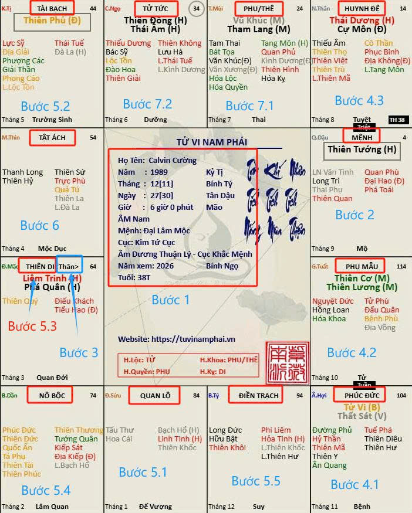

[Mục lục](../README.md)

# TỬ VI NAM PHÁI - BÀI SỐ 4: TRÌNH TỰ LUẬN GIẢI TỬ VI

Ở 3 bài trước, chúng ta đã nắm qua về kết cấu của một lá số. Trong Tử Vi vẫn còn rất nhiều khái niệm cơ bản như: thế nào là Tam Hợp, thế nào là Xung Chiếu, Nhị Hợp, Lục Hại, Giáp Cung, ngũ hành của Tam Hợp là gì...Tuy nhiên, mình cảm thấy chưa cần thiết phải tìm hiểu ngay ở thời điểm này. Khi nào ứng dụng đến phần luận giải chính thức thì lúc đó mình sẽ có những bài viết riêng về các định nghĩa trên. Như vậy các bạn có thể vừa học xong là ứng dụng được ngay, tránh lan man và nhàm chán với quá nhiều khái niệm lý thuyết, dễ gây rối rắm cho người mới học.
Trong bài này, mình sẽ trình bày trình tự để xem một lá số. Đây có lẽ là một trong những bài học quan trọng nhất đối với người mới học Tử Vi.
Trong thực tế, đa số những người mới tiếp xúc với Tử Vi đều giống nhau: vừa mở lá số ra là đi tìm xem mình giàu hay nghèo, lấy vợ đẹp hay xấu, có làm sếp được hay không, hoặc năm nay có gặp vận hạn gì không...Đó là cách xem quá vội vã. Trước hết, chưa chắc đương số đã cung cấp chính xác giờ sinh nên cần có sự kiểm nghiệm ban đầu. Thứ hai, cho dù lá số đã đúng thì cuộc sống vẫn còn rất nhiều yếu tố tác động cần xem xét. Nếu chưa hiểu tổng thể con người mà đã đi xem từng sự kiện riêng lẻ thì rất dễ đưa ra kết luận sai hoặc quá khập khiễng.
Ví dụ, mình từng khuyên một người bạn hãy từ bỏ ngay những cơ hội làm giàu hiện tại, nhưng bạn ấy không nghe. Kết quả là hiện nay đã phải vào tù, hẹn 10 năm nữa làm lại cuộc đời. Đó là bởi vì khi nhìn tổng thể lá số, mình thấy những cơ hội đó không phải là cơ hội mà là tai họa đang chờ phía trước
Cho nên, trước khi học các kỹ thuật luận đoán cao cấp, chúng ta cần hiểu rõ trình tự luận giải một lá số. Cụ thể như sau:
________________________________________
BƯỚC 1: NHÌN TỔNG QUAN THIÊN BÀN
Điều đầu tiên không phải xem sao nào đẹp hay xấu. Mà là xem các thông tin cơ bản trên Thiên Bàn. Bao gồm:
• Họ tên
• Năm sinh
• Tháng sinh
• Ngày sinh
• Giờ sinh
• Giới tính
Mục đích của bước này là kiểm tra xem lá số đã được lập đúng hay chưa.
Trong thực tế, rất nhiều trường hợp giờ sinh bị nhớ sai. Khi xem số, chúng ta cần hỏi kỹ phụ huynh hoặc người thân về ngày tháng năm và giờ sinh; đồng thời xác định rõ đó là Dương lịch hay Âm lịch. Quan trọng nhất là phải quy đổi chính xác sang giờ Âm lịch.
Có những trường hợp khá khó xác định. Ví dụ, đương số nói sinh lúc 7 giờ sáng, trong khi giờ Mão kéo dài từ 5 giờ đến 6 giờ 59 phút, còn giờ Thìn kéo dài từ 7 giờ đến 8 giờ 59 phút. Nếu chỉ lấy mốc 7 giờ sáng thì rất dễ xác định nhầm giờ sinh là giờ Mão hay giờ Thìn. Cần nghiệm lý kỹ lưỡng để xác định.
Trong những trường hợp như vậy cần đối chiếu thêm về tính cách, hoàn cảnh gia đình, các sự kiện lớn trong cuộc đời và cả vận hạn đã trải qua. Thậm chí có những trường hợp hai lá số ở hai giờ khác nhau nhưng cho ra tính cách và vận hạn khá giống nhau. Lúc đó cần người có kinh nghiệm thực chiến phong phú mới có thể tìm ra điểm khác biệt.
Chỉ cần sai một giờ Âm lịch là toàn bộ vị trí cung Mệnh, cung Thân và hệ thống sao có thể thay đổi hoàn toàn.
Do đó, trước khi luận đoán bất cứ điều gì, việc đầu tiên luôn là kiểm tra tính chính xác của lá số.
________________________________________
BƯỚC 2: XEM CUNG MỆNH
Sau khi xem nền tảng, bắt đầu đi vào trung tâm của lá số. Đó là cung Mệnh. Cung Mệnh cho biết:
• Tính cách
• Tư duy
• Khả năng nhận thức
• Năng lực bẩm sinh
• Sở trường
• Sở đoản
• Cách nhìn nhận cuộc sống
• Thể hiện nội lực, tâm can của con người, thiên hướng của con người về suy nghĩ
• Thọ trường (có những cung mệnh quá yếu dễ có rủi ro yểu mệnh nên ngay từ đầu cần hạn chế xem tiếp các phần sự nghiệp hay tiền tài, mà khuyên đương số nên dùng Phật Pháp hóa giải ngay kẻo muộn, hóa giải thế nào mình sẽ có bài viết riêng).
Tại sao phải xem cung Mệnh trước? Bởi vì tất cả những gì xảy ra trong cuộc đời đều bắt nguồn từ chính con người đó. Ví dụ:
• Một người lý trí sáng suốt, ít ham việc nhẹ lương cao, hoặc có các sao hóa giải mạnh sẽ khó bị dính "Hợp Đồng Kỳ Nghỉ" hoặc bị dụ qua Cam chích điện...Khi có sao hóa giải mạnh thì tự nhiên ngay lúc bị dụ dỗ ký hợp đồng lại không có đủ tiền trong người hoặc vay không ai cho.
• Một người thích ăn chắc mặt bền sẽ khó vỡ nợ chứng khoán, tiền ảo hơn là người liều lĩnh thích mạo hiểm.
• Mệnh chi phối hết 11 cung còn lại, có thể ngày bé bị cha mẹ chi phối nhưng không nhiều, lúc lớn lên thì khác. Mệnh có thể quyết định bạn bè, việc học hành, chuyện yêu đương, chuyện vợ con.
Cho nên muốn biết cuộc đời một người ra sao thì trước tiên phải biết người đó như thế nào. Theo kinh nghiệm của mình và nhiều tiền bối, sau khi xem xong cung mệnh, nếu đương số (chủ nhân lá số) xác nhận ứng số trên 80% thì có thể khẳng định ngày tháng năm và giờ sinh đã cung cấp là đúng. Nếu không ứng lắm thì cần xem xét lại tính chính xác của ngày giờ sinh để đỡ mất thời gian xem tiếp các cung còn lại.
________________________________________
BƯỚC 3: XEM CUNG AN THÂN
Mệnh chủ về tuổi thơ và giai đoạn tạo dựng cuộc sống (thông thường được xác định là giai đoạn trước 30 tuổi hoặc trước lúc thành gia lập thất).
Cung An Thân chủ về quá trình trưởng thành và sự thụ hưởng thành quả sau này. Bắt đầu sau 30 tuổi hoặc sau lúc thành gia lập thất, mọi thứ sẽ thay đổi dần qua cung An Thân.
Có thể hiểu đơn giản rằng: Mệnh là gieo nhân, còn Thân là gặt quả.
Người trẻ tuổi chịu khó học hành, làm việc, tích lũy kinh nghiệm thì về già sẽ được hưởng thành quả tương xứng. Đây chính là mối quan hệ nhân quả giữa Mệnh và Thân.
Cung An Thân còn biểu thị cách thể hiện ra bên ngoài và xu hướng phát triển khi trưởng thành.
Ví dụ:
• Có người tuổi trẻ rất hiền lành nhưng càng lớn tuổi càng trở nên nóng nảy hoặc quyết liệt.
• Có người trẻ tuổi đầy tham vọng nhưng càng về sau lại thích cuộc sống bình yên, an phận.
Những thay đổi đó thường phản ánh rất rõ qua cung An Thân.
Cho nên Mệnh và Thân luôn phải được xem cùng nhau.
________________________________________
BƯỚC 4: XEM NỀN TẢNG GIA ĐÌNH DÒNG HỌ
Sau khi hiểu được bản thân đương số là người như thế nào, chúng ta bắt đầu xem xét đến nền tảng gia đình và dòng họ.
Thông thường nên xem cung Phúc Đức trước, sau đó xem đến cung Phụ Mẫu và Huynh Đệ.
Một cung Mệnh không quá đẹp nhưng vẫn có thể sống sung sướng nếu cung Phúc Đức và cung Phụ Mẫu tốt. Khi đó, cho dù bản thân đương số không quá xuất sắc thì vẫn được hưởng nền tảng kinh tế, giáo dục hoặc các điều kiện thuận lợi từ gia đình.
Ngoài ra, cung Phúc Đức biểu thị tiền kiếp làm nhiều việc thiện, kiếp này cuộc sống vẫn ít rủi ro lớn, nhất là rủi ro yểu mệnh. Tất cả những lá số có cung Phúc Đức kém thì biểu thị nghiệp chướng đã gây ra ở tiền kiếp, có rủi ro đột tử lớn, khi đó việc luận đoán tuổi thọ chỉ là đưa ra mức tối đa tham khảo. Ví dụ đưa ra mức tối ta tuổi thọ là 70 tuổi, nhưng cung Phúc Đức kém thì hoàn toàn có thể về với các cụ từ bất kỳ thời điểm nào từ lúc sinh ra đến 70 tuổi. Đây là lý giải vì sao thời gian lìa trần thế của mỗi người khác nhau mặc dù lá số giống nhau.
Cung Phúc Đức còn biểu thị sự hỗ trợ từ ông bà, cô dì chú bác. Phần này mình sẽ có sự phân tích chuyên sâu sau.
Sau khi xem cung Phúc Đức xong, tiếp theo là xem đến Phụ Mẫu và Huynh Đệ để xem mức độ hỗ trợ từ cha mẹ và anh chị em trong nhà.
________________________________________
BƯỚC 5: XEM SỰ NGHIỆP TIỀN TÀI CỦA ĐƯƠNG SỐ
Sự nghiệp cần sự tổng hợp của cung Mệnh, cung Quan Lộ, cung Tài Bạch, cung Phu Thê, 2 cung giáp với Quan Lộ là cung Nô Bộc và cung Điền Trạch. (Mình đã có trình bày phần này ở mục Tản Mạn về Tử Vi phần số 9 trong Album: Tản Mạn về Tử Vi của mình. Các bạn tìm đọc lại nhé).
Khi xem sự nghiệp ở các cung trên, chúng ta chỉ xem được năng lực gầy dựng sự nghiệp, tính chất công việc chứ chưa thể vội vàng khẳng định sự thành bại. Cần xem đến bước cuối cùng là bước xem Vận Hạn mới khẳng định được. Đây là lý do vì sao cung Mệnh có Tử Vi, Thiên Phủ, tam hợp mệnh tài quan sáng sủa...nhưng vẫn đi làm thuê.
________________________________________
BƯỚC 6: XEM CUNG TẬT ÁCH
Xem cung Tật Ách để biết những tính cách ẩn của đương số, sự liều lĩnh bất chợt, những nguyên nhân gây ra tai họa, và những bệnh tật phải trải qua. 
Đây cũng là cung mình đánh giá rất quan trọng; nếu giàu có nhưng lại bị những bệnh tật hành hạ thì cũng không sung sướng gì. Các cung liên quan đến cung Tật Ách mình đã trình bày ở mục Tản Mạn về Tử Vi phần số 8 trong Album: Tản Mạn về Tử Vi của mình. Các bạn tìm đọc lại nhé.
________________________________________
BƯỚC 7: XEM HÔN NHÂN GIA ĐÌNH, CON CÁI
Đối với những bạn có cung an thân đặt ở cung Phu Thê, thì tình trạng hạnh phúc gia đình tác động trực tiếp đến cuộc sống của bạn nên cung này thường được xem từ bước số 3.
Đối với những bạn khác, thì cung này xem cuối cùng để biết được tình trạng hạnh phúc hôn nhân, sự tương tác giữa vợ chồng con cái, sự nghiệp của vợ/chồng con cái một cách tổng quan nhất. Cần nhớ rằng nếu muốn xem chính xác sự nghiệp của vợ chồng con cái cần phải xem chính lá số của người đó, ở đây ta chỉ có thể đánh giá sự tương tác là chính thôi.
Thông qua xem cung Phu Thê, có thể xác định đương số nên kết hôn sớm hay muộn sẽ tốt hơn. Xem cung Tử Tức coi con cái có hiếu thuận không, có nên sinh nhiều con không…và rất nhiều lợi ích khác, sau này sẽ có những bài chuyên sâu.
________________________________________
BƯỚC 8: XEM ĐẠI HẠN – TIỂU HẠN
Đây là bước cuối cùng. Rất nhiều người làm ngược lại: Chưa hiểu lá số nhưng đã hỏi năm nay có giàu không, có cưới vợ không, có thăng chức không. Đó là cách xem thiếu nền tảng.
Muốn biết một năm tốt hay xấu thì trước tiên phải hiểu bản chất lá số gốc.
Đại Hạn và Tiểu Hạn chỉ là sự thay đổi tạm thời trên nền tảng vốn có của mỗi người. Nó biểu thị giai đoạn nào bạn có nhiều cơ hội thành công, giai đoạn nào có nhiều rủi ro. Nên nhớ rằng Vận Hạn chỉ nêu ra “cơ hội” thôi, chứ ngồi không rung đùi, không làm mà đòi có ăn thì…biết kết quả rồi đấy! 
Có một điểm lưu ý rằng, cần xem qua phần vận trình của vận hạn mới có thể đánh giá thực tế đương số có thành công hay không. Từ bước 1 đến bước 7 chỉ là xem nền tảng thôi chứ chưa thể vội kết luận, ví dụ bạn sinh ra rất thông minh, nhưng đại vận đầu tiên trong đời gia đình lại có nhiều biến cố như cha mẹ ly dị, vỡ nợ, kinh tế khó khăn không có điều kiện đi học, bạn bè lại rủ rê các con đường mặt trái xã hội, thế là các nền tảng về thông minh mà mình xem được ở cung Mệnh, Quan Lộ, Tài Bạch…xem như tạch.
________________________________________
TỔNG KẾT BÀI SỐ 4
Người mới học Tử Vi nên ghi nhớ trình tự luận giải như trên. Tất nhiên, mỗi người sẽ có một cách luận giải riêng. Trên đây mình chỉ đưa ra trình tự mà mình thường hay sử dụng để các bạn có một hướng đi cơ bản trước. 
Khi nắm vững trình tự này, việc học các kỹ thuật luận đoán nâng cao sau này sẽ dễ dàng hơn rất nhiều. Bởi vì trong Tử Vi, biết ý nghĩa của các sao chưa chắc đã luận đúng, nhưng biết xem đúng trình tự thì khả năng luận sai sẽ giảm đi rất nhiều.
Ở các bài sau, chúng ta sẽ đi vào thực chiến để luận chi tiết cung Mệnh, ý nghĩa các sao khi ở cung Mệnh, khi đó mọi người có thể thực hành ngay và luôn mệnh số của bản thân và những người xung quanh.
Chắc hẵn nhiều bạn đã học qua Tử Vi mà xem bài của mình sẽ nghĩ rằng: "Ơ, mới bài số 5 đã vào thực chiến rồi à? Học vậy là thiếu nền tảng cơ bản quá..v..v.." Tuy nhiên, đây cũng như việc phương pháp dạy võ thuật ngày nay cần khác xưa vậy, nếu như cho bạn đứng tấn, chẻ củi 3 năm rồi mới dạy đòn thế thì ngày thứ 3 bạn đã chạy mất dép rồi...và từ đó rất khó mà lan tỏa kiến thức cho tất cả mọi người cùng tiếp cận.
