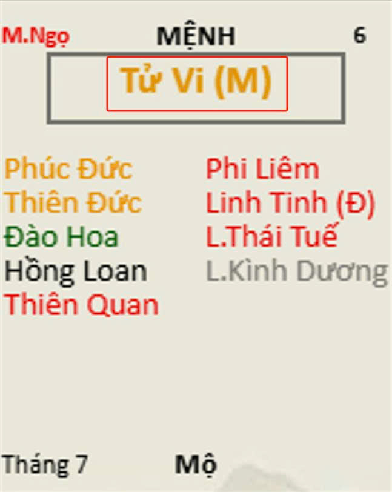

[Mục lục](../README.md)

# BÀI SỐ 5: LUẬN GIẢI CUNG MỆNH THÔNG QUA CHÍNH TINH (Phần 1)

Ở bài số 4, mình đã trình bày rõ lý do vì sao khi luận giải một lá số Tử Vi cần phải xem cung Mệnh trước tiên. Việc luận giải kỹ lưỡng cung Mệnh chính là nền tảng cho toàn bộ quá trình xem lá số, đồng thời cũng là tiền đề quan trọng để luận đoán vận hạn sau này. Vì vậy, các bạn cố gắng nắm thật vững phần này.
Ví dụ, cùng là một hạn về thị phi như va quẹt xe ngoài đường rồi bị người khác chửi bới một cách vô lý.
• Nếu đương số là người hiền lành, nhẫn nhịn thì thường sẽ lặng lẽ bỏ đi, coi như không có chuyện gì xảy ra.
• Nếu đương số là người "không chịu thua ai" thì chắc chắn sẽ xuống xe cãi vã, mất thời gian đôi co với những người chỉ xuất hiện trong cuộc đời mình vài giây.
• Nếu gặp người nóng tính hơn nữa thì có thể lao vào đánh nhau, gây thương tích và kéo theo nhiều hậu quả khác.
Như vậy, cùng một vận hạn nhưng do tính cách khác nhau nên kết quả và hậu quả cũng hoàn toàn khác nhau.
Trong bài này và loạt bài sắp tới, mình sẽ lần lượt hướng dẫn cách luận giải cung Mệnh thông qua ý nghĩa của các Chính Tinh. Sau đó sẽ tiếp tục trình bày ý nghĩa của toàn bộ Phụ Tinh khi tọa thủ tại cung Mệnh. Cuối cùng, chúng ta sẽ đi vào phần quan trọng hơn là luận giải các bộ cách khác nhau giữa Chính Tinh và Phụ Tinh; tìm hiểu Chính Tinh nào đi với Phụ Tinh nào sẽ tạo thành cách cục gì, ý nghĩa của cách cục đó ra sao và sức mạnh của nó như thế nào.
Các bạn có thể hiểu đơn giản rằng:
"Bộ cách" là sự phối hợp giữa Chính Tinh và Phụ Tinh theo những tổ hợp nhất định để tạo nên các đặc tính đặc biệt cho lá số.
Ví dụ:
• Sao Tử Vi tượng trưng cho người lãnh đạo, người đứng đầu. Vì vậy Tử Vi rất cần đi cùng Tả Phụ, Hữu Bật là những sao tượng trưng cho quân thần tá sứ, người phò tá. Một nhà lãnh đạo muốn làm nên nghiệp lớn thì cần có người hỗ trợ xung quanh.
• Hoặc bộ Thái Dương và Thái Âm vốn là những sao thiên về giao tiếp, ngoại giao. Nếu đi cùng Đào Hoa và Hồng Loan là các sao làm tăng sức hút bên ngoài, nam thì đẹp trai, nữ thì xinh gái, thì khả năng giao tiếp và tạo dựng quan hệ sẽ càng phát huy mạnh mẽ hơn. Nhất là trong xã hội hiện đại ngày nay, không ai có thời gian để cạo nước sơn ra xem gỗ có tốt không, ngoại hình góp phần rất quan trọng không ít.
________________________________________
CÁC NHÓM CHÍNH TINH TẠI CUNG MỆNH
Khi luận giải cung Mệnh thông qua Chính Tinh, chúng ta sẽ gặp ba nhóm trường hợp chính:
1. Cung Mệnh có một Chính Tinh tọa thủ (Đơn Thủ)
Bao gồm 14 trường hợp:
• Tử Vi
• Thiên Phủ
• Vũ Khúc
• Thiên Tướng
• Thái Dương
• Thái Âm
• Thiên Cơ
• Thiên Lương
• Liêm Trinh
• Thất Sát
• Phá Quân
• Tham Lang
• Thiên Đồng
• Cự Môn
Đây là nhóm tương đối dễ học vì tính chất của Chính Tinh được thể hiện khá rõ ràng.
2. Cung Mệnh có hai Chính Tinh đồng cung
Ví dụ:
• Tử Vi - Thiên Phủ
• Tử Vi - Thất Sát
• Tử Vi - Tham Lang
• Tử Vi - Phá Quân
• Vũ Khúc - Tham Lang
• Liêm Trinh - Phá Quân
• Thái Dương - Cự Môn
Còn rất nhiều tổ hợp khác, mình sẽ trình bày chi tiết ở các bài sau. Nhóm có 2 chính tinh thì việc luận giải sẽ khó hơn. Có bạn hỏi mình rằng, sao này biểu thị cho hiền lành, sao kia biểu thị cho nóng nảy, vậy tóm lại người này hiền hay dữ? Mình sẽ có câu giải đáp cho các bạn sau này ^^!
3. Cung Mệnh không có Chính Tinh
Trường hợp này gọi là Mệnh Vô Chính Diệu (VCD).
Đây là một dạng cách cục đặc biệt và cũng là một trong những dạng khó luận giải nhất của Tử Vi. Do đó mình sẽ dành riêng một bài để cùng nghiên cứu chuyên sâu về cách mệnh này.
________________________________________
5.1 SAO TỬ VI ĐƠN THỦ TẠI CUNG MỆNH
(Xem hình đính kèm)
Sao Tử Vi là ngôi sao mang tên của chính bộ môn Tử Vi Đẩu Số, là vì sao đứng đầu trong 14 Chính Tinh, hay còn gọi là sao Vua, Đế Tòa. (Đây là tượng hình thôi chứ không phải bạn có mệnh Tử Vi là mừng rỡ vì là bản thân là Đế Tòa nhé, giống như việc con Đại Bàng là biểu tượng của nước Mỹ vậy thôi ^^)
Trong bài này mình chỉ giới hạn ở việc trình bày tính chất cơ bản của sao Tử Vi khi tọa thủ tại cung Mệnh, nhằm giúp các bạn có khái niệm ban đầu trước khi đi sâu hơn. Mình sẽ không trình bày toàn bộ các nội dung chuyên sâu như tượng hình, ngũ hành, hóa khí, ý nghĩa tại từng cung hay ý nghĩa khi lâm hạn, vì như vậy sẽ quá dài, dễ lan man và khó ghi nhớ đối với người mới học.
Phần chuyên sâu cho từng ngôi sao sẽ được trình bày trong chuyên đề riêng mang tên CHƯ TINH LUẬN. Các bạn cứ đón đọc trong thời gian tới.
Bây giờ chúng ta sẽ tìm hiểu những đặc trưng cơ bản của người có sao Tử Vi tọa thủ tại cung Mệnh.
Đặc điểm ngoại hình:
• Người có sao Tử Vi ở cung Mệnh thông thường có vóc dáng tầm thước, không quá cao.
• Khuôn mặt thường vuông vức, đầy đặn và cân đối.
Đặc điểm tính cách:
• Luôn có ý thức về vị thế của bản thân, tự xem mình là người có phẩm giá, có khí chất của người đứng đầu nên đôi khi tạo cảm giác khó gần.
• Tuy nhiên, người mệnh Tử Vi đa phần rất hiền lành, thích che chở và chăm lo cho người khác.
• Cái hiền của Tử Vi thể hiện từ khuôn mặt, lời ăn tiếng nói, cử chỉ hành động cho đến suy nghĩ bên trong.
• Tử Vi thường toát ra vẻ dịu dàng, phúc hậu, đầy đặn, khiến người đối diện cảm thấy dễ chịu, quý mến và nể phục.
Ưu điểm:
• Tính tình đôn hậu, hào hiệp, thẳng thắn.
• Có tố chất lãnh đạo và khả năng quản lý.
• Hiếu khách.
• Giao thiệp rộng.
• Ham học hỏi.
• Hiểu biết nhiều lĩnh vực.
• Có khả năng tổ chức công việc.
Người có sao Tử Vi thường không muốn làm mất lòng người khác.
Cho dù biết ai tốt, ai xấu thì họ vẫn cố gắng dùng lời nói và hành động để giữ hòa khí, hạn chế xung đột đến mức thấp nhất.
Chính vì vậy, đàn ông mệnh Tử Vi thường khá hiền. Phụ nữ mệnh Tử Vi cũng thuộc nhóm người lành tính và sống tình cảm.
Nhược điểm:
Bởi vì bản tính quá hiền lành nên khi bước ra môi trường xã hội phức tạp, người mệnh Tử Vi đôi khi khó giữ được lập trường của mình.
• Dễ mềm lòng.
• Dễ tin người.
• Dễ nghe lời xu nịnh.
• Khó thích nghi với những biến cố xảy ra quá đột ngột.
• Khả năng chịu áp lực trong môi trường quá khắc nghiệt thường không cao bằng một số sao mang tính sát phạt mạnh.
Trong cuộc sống và công việc:
• Sống biết điều.
• Từ tốn.
• Có lòng nhân hậu.
• Không quá bon chen vụ lợi.
• Chăm lo tốt cho bản thân và gia đình.
Trong tập thể, người mệnh Tử Vi thường muốn giữ vai trò chủ động, muốn được quyền quyết định hoặc ít nhất là có tiếng nói quan trọng trong công việc.
Trong giao tiếp và các hoạt động vui chơi, Tử Vi khá phóng khoáng, nhưng vẫn biết điểm dừng và ít khi sa đà quá mức.
Trong tình cảm:
Người mệnh Tử Vi thường rất nặng tình cảm.
Vì thương người và hay giúp đỡ người khác nên đôi khi dễ bị lợi dụng, đặc biệt là trong chuyện tiền bạc.
Nhiều trường hợp vì quá tin người hoặc quá thương người mà dẫn đến trạng thái bao đồng, ôm việc vào mình và chịu thiệt thòi.
________________________________________
Bên trên là những tính chất cơ bản của người có sao Tử Vi tọa thủ tại cung Mệnh, nhằm giúp chúng ta có cái nhìn khái quát về ý nghĩa của Chính Tinh này trước khi đi sâu vào các trường hợp phức tạp hơn. 
Ở bài tiếp theo, chúng ta sẽ tìm hiểu lần lượt các Chính Tinh khác.
Tuy nhiên, cần lưu ý rằng các đặc tính trên chủ yếu áp dụng cho trường hợp sao Tử Vi không bị phá cách. Nếu Tử Vi gặp nhiều sát tinh, ám tinh hoặc những bộ sao bất lợi thì các tính chất nêu trên có thể biến đổi ít nhiều, thậm chí thay đổi rất lớn. Do đó, không nên vội vàng kết luận chỉ dựa trên một Chính Tinh đơn lẻ khi chưa có kiến thức tổng thể về toàn bộ lá số.

[Mục lục](../README.md)
