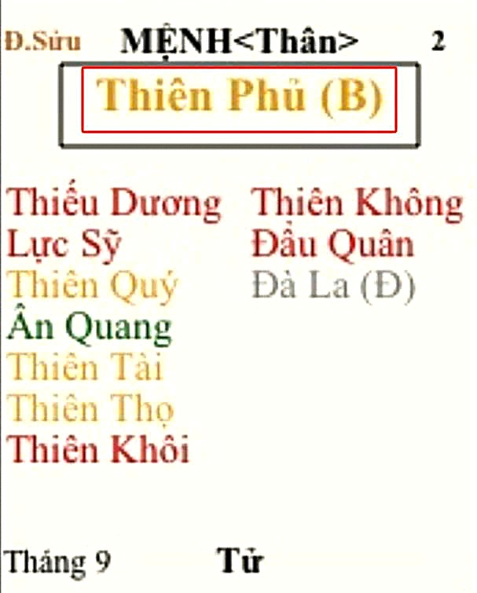

[Mục lục](../README.md)

# TỬ VI NAM PHÁI - BÀI SỐ 6: LUẬN GIẢI CUNG MỆNH THÔNG QUA CHÍNH TINH (PHẦN 2)

SAO THIÊN PHỦ
Ở bài số 5, chúng ta đã tìm hiểu sơ lược về tính cách và ưu nhược điểm của người có mệnh Tử Vi. Từ đó, nếu bản thân bạn, con em hoặc người thân của bạn có mệnh Tử Vi thì nên nhắc nhở họ rằng: hiền lành là tốt, nhưng không nên quá tin người; tốt bụng là đáng quý, nhưng quá tốt bụng lại rất dễ bị lợi dụng.
Biết giữ sự cân bằng, không quá tốt để trở thành nhu nhược, cũng không trở thành người xấu, ấy chính là giữ được Trung Đạo mà Đức Phật đã dạy. Đây là một ví dụ về việc ứng dụng kiến thức Tử Vi vào thực tế cuộc sống.
Hôm nay, chúng ta tiếp tục tìm hiểu về chính tinh thứ hai, đó là sao Thiên Phủ.
________________________________________
1. ĐẶC ĐIỂM NGOẠI HÌNH
Người có Thiên Phủ tọa thủ tại cung Mệnh thường có những đặc điểm sau:
• Thân hình đầy đặn hoặc dễ phát tướng.
• Da trắng hoặc sáng màu (Ai phơi nắng cũng sẽ đen, nhưng người Thiên Phủ hay có tông da trắng sẵn có và nhanh nhả nắng hơn).
• Khuôn mặt tròn, đầy đặn, thanh tú và cân đối.
• Mũi thường to, tròn và đẹp.
• Tướng mạo nhìn chung mang cảm giác phúc hậu, dễ tạo thiện cảm với người đối diện.
Đặc biệt, nữ mệnh Thiên Phủ thường mang khí chất của một quý phu nhân, dung nhan đoan trang, phúc hậu. Sau tuổi trung niên, đa phần dễ phát tướng và có xu hướng đầy đặn hơn so với thời trẻ.
________________________________________
2. ĐẶC ĐIỂM TÍNH CÁCH
Thiên Phủ là một chính tinh mang tính chất ôn hòa, ổn trọng và giàu tính bao dung.
Người có Thiên Phủ nhập Mệnh thường:
• Khoan hồng, nhân hậu.
• Có lòng từ thiện.
• Có sự cảm thông với người khác.
• Suy nghĩ chín chắn trước khi hành động.
• Biết tính toán và tìm phương án giải quyết những công việc khó khăn.
• Không quá câu nệ những chuyện nhỏ nhặt.
• Có nghĩa khí và trọng tình cảm.
Thiên Phủ rất dễ tạo dựng niềm tin với người khác, nhờ đó thường có nhiều bạn bè tri kỷ và hay gặp quý nhân giúp đỡ trong cuộc sống.
Người mệnh Thiên Phủ thường yêu thích sự hòa hợp, ghét xung đột và luôn cố gắng duy trì bầu không khí hài hòa trong các mối quan hệ. Kể cả khi gặp sát tinh khiến đương số nóng nảy hoặc bộc phát trong nhất thời, thì sau khi cơn giận qua đi, người mệnh Thiên Phủ vẫn có xu hướng muốn hòa hoãn và khôi phục các mối quan hệ.
________________________________________
3. KHẢ NĂNG LÃNH ĐẠO VÀ QUẢN LÝ
Thiên Phủ cũng là một sao có năng lực lãnh đạo.
Tuy nhiên, khả năng lãnh đạo của Thiên Phủ khác với Tử Vi.
Nếu Tử Vi có thiên hướng khai sáng, sáng tạo và lãnh đạo ở vị thế bề trên, thì Thiên Phủ lại giỏi quản lý, duy trì và phát triển những nền tảng đã được xây dựng sẵn, đặc biệt trong các lĩnh vực tài chính, kho quỹ và quản trị nguồn lực.
Nói cách khác:
• Tử Vi giỏi khai quốc.
• Thiên Phủ giỏi trị quốc.
Thiên Phủ phát huy tốt nhất khi hệ thống đã vận hành ổn định. Họ có khả năng quản lý nguồn lực, tài chính và nhân sự rất tốt.
Tuy nhiên:
• Thiên Phủ thường thiếu tính đột phá.
• Thiếu sự quyết liệt khi cần thay đổi lớn.
• Dễ bị ảnh hưởng bởi ý kiến của người khác.
• Khả năng quyết đoán không mạnh bằng các sao như Thất Sát, Phá Quân hay Tử Vi.
Người xưa xem Tử Vi là sao chủ về quyền quý, tước lộc. Trong khi đó Thiên Phủ chủ về tiền bạc, tài sản và sự sung túc. Điều này phản ánh quan niệm của cổ nhân: quyền lực được đặt cao hơn sự giàu có.
________________________________________
4. THIÊN PHỦ VÀ TIỀN BẠC
Thiên Phủ là một trong những sao có duyên với tiền bạc nhất trong Tử Vi.
Người có Thiên Phủ tọa Mệnh thường:
• Có khả năng quản lý tài chính tốt.
• Có tư duy tích lũy tài sản.
• Giỏi quản lý ngân sách.
• Có năng lực điều hành các hoạt động liên quan đến kinh tế và tài chính.
• Có duyên với việc quản lý tiền bạc. Khi còn đi học thường dễ được giao làm thủ quỹ lớp; khi đi làm cũng thường được tín nhiệm giao phụ trách các công việc liên quan đến tài chính, kế toán hoặc quản lý nguồn vốn.
Thiên Phủ rất phù hợp với các lĩnh vực:
• Tài chính.
• Kế toán.
• Ngân hàng.
• Kho quỹ.
• Quản lý tài sản.
• Kinh doanh.
• Điều hành doanh nghiệp.
Tuy nhiên, điều thú vị là Thiên Phủ yêu tiền không phải vì bản thân đồng tiền. Thiên Phủ yêu những thứ mà tiền có thể mua được.
Đó có thể là:
• Nhà đẹp.
• Xe đẹp.
• Đồ hiệu.
• Công nghệ.
• Trang sức.
• Những trải nghiệm cao cấp.
• Cuộc sống tiện nghi và sang trọng.
Vì vậy, Thiên Phủ thường kiếm tiền giỏi nhưng cũng tiêu tiền rất mạnh cho những thứ mình yêu thích.
________________________________________
5. THIÊN PHỦ VÀ CÁI ĐẸP
Thiên Phủ là người rất yêu cái đẹp.
Họ có thể say mê:
• Âm nhạc.
• Hội họa.
• Kiến trúc.
• Thời trang.
• Trang trí nội thất.
• Mỹ thuật.
• Những vật dụng tinh xảo và có giá trị thẩm mỹ cao.
Ngôi nhà của Thiên Phủ thường được chăm chút cẩn thận.
Họ thích:
• Hoa đẹp.
• Đồ trang trí đẹp.
• Không gian sống sang trọng.
• Quần áo chỉn chu.
• Những nơi có tính thẩm mỹ cao.
Có thể nói Thiên Phủ là một trong những sao biết hưởng thụ cuộc sống nhất trong hệ thống Tử Vi.
________________________________________
6. THIÊN PHỦ TRONG CÁC MỐI QUAN HỆ
Thiên Phủ là mẫu người hướng ngoại và rất coi trọng các mối quan hệ. Họ không phải là mẫu người thích sống cô độc.
Ngược lại, Thiên Phủ phát huy tốt nhất năng lực của mình khi làm việc trong tập thể hoặc trong môi trường có nhiều sự tương tác với người khác.
Đối với Thiên Phủ:
• Người thân là tài sản.
• Bạn bè là tài sản.
• Đối tác là tài sản.
• Các mối quan hệ xã hội cũng là tài sản.
Thiên Phủ có khả năng thấu hiểu cảm xúc của người khác khá tốt.
Họ biết cân nhắc nhiều góc nhìn khác nhau trước khi đưa ra quyết định.Chính vì vậy mà Thiên Phủ thường là những nhà ngoại giao bẩm sinh.
Họ có khả năng:
• Hòa giải mâu thuẫn.
• Dàn xếp bất hòa.
• Kết nối các nhóm người khác nhau.
• Xây dựng sự đồng thuận.
________________________________________
7. NHƯỢC ĐIỂM CỦA THIÊN PHỦ
Bên cạnh những ưu điểm rất lớn, Thiên Phủ cũng tồn tại nhiều hạn chế.
- Thiếu quyết đoán: 
Vì luôn muốn cân nhắc mọi mặt nên Thiên Phủ thường mất nhiều thời gian để đưa ra quyết định. Nhiều người cảm thấy Thiên Phủ:
• Do dự.
• Chần chừ.
• Thiếu dứt khoát.
Trong nội tâm, Thiên Phủ thường phải đấu tranh rất nhiều trước khi quyết định một việc quan trọng.
- Quá tin vào vẻ bề ngoài:
Thiên Phủ thường đánh giá người khác thông qua:
• Cách ăn mặc.
• Cách giao tiếp.
• Phong thái bên ngoài.
Một người lịch sự, bóng bẩy và cư xử khéo léo thường rất dễ tạo được lòng tin nơi Thiên Phủ.
Chính vì vậy, Thiên Phủ cũng là một trong những nhóm người dễ trở thành mục tiêu của những kẻ lừa đảo có trình độ và biết xây dựng hình ảnh đẹp.
- Thích hưởng thụ:
Thiên Phủ thích cuộc sống tiện nghi.
Do đó đôi khi:
• Ngại cực khổ.
• Thiếu tinh thần chiến đấu dài hạn.
• Muốn đạt được kết quả tốt nhưng đôi khi lại không muốn bỏ ra quá nhiều công sức hoặc thời gian tương xứng.
Điều này khiến không ít người mệnh Thiên Phủ có năng lực nhưng chưa phát huy được hết tiềm năng của mình.
________________________________________
8. NỮ MỆNH THIÊN PHỦ
Nữ mệnh Thiên Phủ thường:
• Dịu dàng.
• Có sự cảm thông.
• Hành xử lý trí.
• Giỏi giao tiếp và đối nhân xử thế.
• Biết chăm sóc gia đình.
• Có gu thẩm mỹ tốt.
Họ thích:
• Trang trí nhà cửa.
• Ăn mặc đẹp.
• Mua sắm.
• Những vật dụng mới.
Thông thường, nữ mệnh Thiên Phủ coi trọng gia đình, bạn bè và các mối quan hệ thân thiết.
Tình cảm của họ khá sâu sắc, nhưng cách biểu hiện thường thiên về hành động thực tế hơn là những lời nói lãng mạn.
________________________________________
9. THIÊN PHỦ THỜI HIỆN ĐẠI
Trong xã hội ngày nay, người mệnh Thiên Phủ thường có xu hướng:
• Thích đồ hiệu.
• Thích công nghệ.
• Thích những trải nghiệm cao cấp.
• Thích ăn uống ở những nơi sang trọng hơn là ở các quán bình dân, quán cóc vỉa hè.
Thiên Phủ kiếm tiền giỏi nên khi tiêu tiền cũng rất "chất". Ăn phải ngon, mặc phải đẹp, xài phải là đồ hiệu, đi phải là xe sang…
Đối với trẻ em có mệnh Thiên Phủ, từ nhỏ thường đã bộc lộ thiên hướng đòi hỏi cha mẹ về mặt vật chất và thích những món đồ có giá trị cao hơn mức trung bình.
________________________________________
TỔNG KẾT BÀI 6
Tóm lại, Thiên Phủ là hình tượng của sự sung túc, ổn định, hòa hợp và quản lý tài chính.
Người mệnh Thiên Phủ thường sống tình cảm, nhân hậu, có năng lực quản lý và rất coi trọng các mối quan hệ xung quanh.
Tuy nhiên, điểm yếu lớn nhất của Thiên Phủ là sự thiếu quyết đoán, dễ tin người và có xu hướng đánh giá mọi việc thông qua hình thức bên ngoài. Khi thành đạt, Thiên Phủ cũng có xu hướng tiêu dùng theo phong cách sang trọng và hưởng thụ nhiều hơn mức cần thiết, vì vậy cần học cách quản lý chi tiêu và tiết kiệm hợp lý.
Nếu khắc phục được những điểm yếu này thì Thiên Phủ là một trong những cách mệnh dễ có cuộc sống ổn định, sung túc và hạnh phúc.
Những nội dung trên chỉ phản ánh tính chất cơ bản của sao Thiên Phủ đơn thủ khi tọa Mệnh. Trong thực tế, luận đoán còn phải xét thêm tổ hợp với các bộ chính tinh khác, các phụ tinh đi kèm, Tuần - Triệt, Tứ Hóa và toàn bộ bố cục lá số mới có thể đưa ra kết luận chính xác.
Ở các bài tiếp theo, chúng ta tiếp tục tìm hiểu các chính tinh còn lại để có cái nhìn tổng quan về tính chất cơ bản và phân biệt sự khác nhau cơ bản giữa các chính tinh đó. Từ đó tạo thành bức tranh tổng thể về 14 chính tinh, tạo nền tảng cơ bản để học phần luận về chi tiết của từng sao trong phần CHƯ TINH LUẬN sau này.
