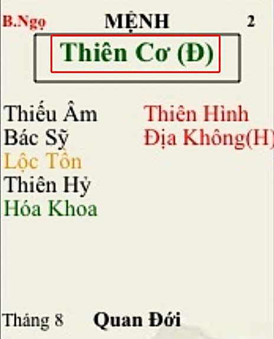

[Mục lục](../README.md)

# TỬ VI NAM PHÁI - BÀI SỐ 7: LUẬN GIẢI CUNG MỆNH THÔNG QUA CHÍNH TINH (PHẦN 3)

SAO THIÊN CƠ
Ở bài số 6, chúng ta đã tìm hiểu sơ lược về tính cách và ưu nhược điểm của người có mệnh Thiên Phủ. Từ đó, nếu bản thân bạn, con em hoặc người thân của bạn có mệnh Thiên Phủ thì khi chọn nghề nghiệp nên ưu tiên các lĩnh vực như tài chính, ngân hàng, kế toán, quản lý kho bãi, quản lý ngân sách hoặc các công việc liên quan đến quản trị nguồn lực.
Nếu Thiên Phủ sáng sủa thì kinh tế thường khá sung túc, việc hưởng thụ cuộc sống cũng không có gì đáng nói. Tuy nhiên, nếu Thiên Phủ bị phá cách thì cần học cách tiết kiệm và quản lý chi tiêu hợp lý hơn.
Thiên Phủ đi với bộ sao nào thì mạnh, gặp phụ tinh nào thì bị phá cách, mình sẽ trình bày chi tiết trong phần CHƯ TINH LUẬN sau này.
Hôm nay, chúng ta tiếp tục nghiên cứu về chính tinh thứ ba, đó là sao Thiên Cơ.
________________________________________
1. ĐẶC ĐIỂM NGOẠI HÌNH
Người có Thiên Cơ tọa Mệnh thường có đặc điểm:
• Thân hình lộ xương, nhiều xương ít thịt.
• Vai và khớp xương lộ khá rõ hơn người thường.
• Trán cao, dựng.
• Ánh mắt linh hoạt, nhanh nhẹn.
Nếu Thiên Cơ ở Miếu, Vượng hoặc Đắc Địa thì ngoại hình thường cân đối, thần thái thông minh, nhanh nhẹn, ăn mặc chỉnh tề và có phong cách riêng.
Nếu Thiên Cơ Hãm Địa thì thân hình thường gầy hơn, thần sắc dễ lộ vẻ lo nghĩ hoặc lao tâm.
________________________________________
2. ĐẶC ĐIỂM TÍNH CÁCH
Thiên Cơ là sao chủ về trí tuệ, sự biến hóa, mưu lược và khả năng thích nghi.
Người mệnh Thiên Cơ thường:
• Thông minh.
• Phản ứng nhanh, có khả năng tùy cơ ứng biến rất tốt.
• Ham học hỏi, tò mò với kiến thức mới. Thích nghiên cứu và tìm tòi.
Thiên Cơ là mẫu người dùng đầu óc nhiều hơn dùng sức lực.
Khi gặp vấn đề, họ thường suy nghĩ tìm giải pháp trước khi hành động.
Thiên Cơ thích động não, thích phân tích, thích tìm hiểu nguyên nhân gốc rễ của sự việc hơn là làm việc theo cảm tính.
Đây cũng là một trong những chính tinh có khả năng thích nghi mạnh nhất trong hệ thống Tử Vi.
________________________________________
3. TRÍ TUỆ VÀ NĂNG LỰC HỌC TẬP
Trong hệ thống các chính tinh, Thiên Cơ là một trong những sao nổi bật nhất về học tập, nghiên cứu và tư duy.
Người có Thiên Cơ tọa Mệnh thường:
• Tiếp thu nhanh.
• Ghi nhớ tốt.
• Có năng khiếu phân tích.
• Có tư duy logic.
• Có khả năng dự đoán và đánh giá tình huống.
Thiên Cơ rất phù hợp với:
• Nghiên cứu.
• Giảng dạy.
• Phân tích dữ liệu.
• Kế hoạch chiến lược.
• Tư vấn.
• Cố vấn.
• Tham mưu.
Điểm mạnh nhất của Thiên Cơ là nhìn thấy nhiều khả năng khác nhau của một vấn đề và nhanh chóng tìm ra phương án giải quyết.
Tuy nhiên nhược điểm là học rất nhiều nhưng đôi khi không đào sâu đến cùng một lĩnh vực. Người xưa gọi là: "Đa học nhưng không chuyên." Cho nên nếu người mệnh Thiên Cơ biết tập trung toàn bộ trí lực vào một chuyên môn nhất định thì thành tựu thường rất cao.
________________________________________
4. NGHỀ NGHIỆP PHÙ HỢP
Thiên Cơ phù hợp với những nghề sử dụng trí tuệ hơn là lao động chân tay. Ví dụ:
• Giáo viên.
• Giảng viên.
• Nhà nghiên cứu.
• Nhà tư vấn.
• Trợ lý điều hành.
• Cố vấn chiến lược.
• Chuyên gia phân tích.
• Kỹ sư thiết kế.
• Kiến trúc sư.
• Chuyên viên nhân sự.
• Nhà hoạch định chính sách.
Trong môi trường tổ chức, Thiên Cơ thường giỏi làm quân sư, tham mưu hoặc cố vấn hơn là người đứng đầu. Nếu Tử Vi là hình tượng của vị vua thì Thiên Cơ giống vị quân sư đứng phía sau hiến kế. Nhiều khi người lãnh đạo nổi tiếng nhưng người quyết định thành bại của cả tập thể lại chính là người mang khí chất Thiên Cơ.
Nếu Thiên Cơ Hãm Địa thì sự khéo léo có thể chuyển sang tay nghề thủ công:
• Thợ cơ khí.
• Thợ kim hoàn.
• Thợ chế tác.
• Thợ kỹ nghệ.
• Các nghề đòi hỏi sự tỉ mỉ và khéo tay.
________________________________________
5. THIÊN CƠ VÀ KHẢ NĂNG GIAO TIẾP
Thiên Cơ là một trong những sao giao tiếp mạnh nhất.
Người mệnh Thiên Cơ thường:
• Nói chuyện có duyên.
• Trình bày dễ hiểu.
• Có khả năng thuyết phục.
• Thích trao đổi thông tin.
• Thích chia sẻ kiến thức.
Họ có khả năng kết nối với nhiều kiểu người khác nhau. Mọi người thường cảm thấy dễ nói chuyện với Thiên Cơ. Đây cũng là lý do người mệnh Thiên Cơ rất phù hợp với:
• Công tác đào tạo.
• Tư vấn khách hàng.
• Nhân sự.
• Marketing.
• Truyền thông.
Nếu phát triển đúng hướng, Thiên Cơ có thể trở thành những người diễn thuyết hoặc đào tạo rất xuất sắc.
________________________________________
6. THIÊN CƠ VÀ TÂM LINH
Thiên Cơ là sao có duyên với các lĩnh vực mang tính học thuật và huyền học. Người mệnh Thiên Cơ thường có hứng thú với:
• Triết học.
• Tôn giáo.
• Tâm linh.
• Mệnh lý.
• Huyền học.
Bản chất của Thiên Cơ luôn muốn tìm hiểu nguyên nhân sâu xa của mọi sự việc. Do đó họ thường đặt câu hỏi:
• Vì sao sự việc này xảy ra?
• Vì sao con người lại như vậy?
• Vì sao số phận mỗi người khác nhau?
Chính đặc tính thích truy tìm bản chất này khiến nhiều người mệnh Thiên Cơ bước vào con đường nghiên cứu tâm linh hoặc huyền học.
________________________________________
7. NHƯỢC ĐIỂM CỦA THIÊN CƠ
Bên cạnh những ưu điểm nổi bật, Thiên Cơ cũng có nhiều điểm yếu như sau:
- Hay thay đổi: Thiên Cơ là một sao động, do đó:
• Dễ thay đổi mục tiêu.
• Dễ đổi ý.
• Dễ đứng núi này trông núi nọ.
Khi thiếu sự kiên trì, công việc rất dễ dang dở giữa chừng.
- Nghĩ quá nhiều: Đầu óc Thiên Cơ hiếm khi được nghỉ ngơi. Họ thường xuyên:
• Lo chuyện tương lai.
• Nghĩ chuyện quá khứ.
• Phân tích đủ mọi khả năng.
Điều này dễ dẫn đến:
• Stress.
• Mất ngủ.
• Ưu phiền.
• Lao tâm.
- Quá tin vào trí thông minh của bản thân:
Người mệnh Thiên Cơ đôi khi bị chính sự thông minh của mình đánh lừa. Khi chưa đủ dữ liệu nhưng đã tự tin đưa ra kết luận thì rất dễ thất bại. Đây là nhược điểm khá phổ biến của người có Thiên Cơ mạnh.
- Thiếu tính kiên trì:
Thông minh là ưu điểm. Nhưng nếu thiếu sự bền bỉ thì thành tựu thường không tương xứng với năng lực. Đây chính là điểm yếu lớn nhất của nhiều người mệnh Thiên Cơ.
________________________________________
8. NỮ MỆNH THIÊN CƠ
Nữ mệnh Thiên Cơ thường:
• Hiền lành.
• Nữ tính.
• Chăm chỉ.
• Hiếu thuận.
• Khéo léo.
• Nhanh nhẹn.
Họ sống tình cảm nhưng hành động thường dựa trên lý trí, ít khi nào bị u mê, lụy tình, trừ khi bị dính sao Tang Môn ở mệnh, cái này mình sẽ có bài phân tích sau.
Đối với người thân và bạn bè thường rất nhiệt tình giúp đỡ.
Nếu được nhiều cát tinh hỗ trợ thì có thể trở thành người phụ nữ vượng phu ích tử, giỏi quán xuyến gia đình và hỗ trợ tốt cho sự nghiệp của chồng con.
________________________________________
TỔNG KẾT BÀI SỐ 7
Tóm lại, Thiên Cơ là hình tượng của trí tuệ, sự linh hoạt, khả năng thích nghi và năng lực tư duy. Người mệnh Thiên Cơ thường thông minh, ham học hỏi, giao tiếp tốt, có khả năng nghiên cứu, phân tích và hoạch định chiến lược.
Tuy nhiên, nhược điểm lớn nhất của Thiên Cơ là suy nghĩ quá nhiều, thiếu tính ổn định và đôi khi thiếu sự kiên trì để theo đuổi mục tiêu đến cùng. Nếu biết tập trung trí lực vào một lĩnh vực chuyên sâu và rèn luyện tính bền bỉ thì Thiên Cơ là một trong những cách mệnh dễ đạt thành tựu lớn bằng chính tri thức và trí tuệ của mình.
________________________________________
Lưu ý: Những tính chất trên chỉ phản ánh ý nghĩa cơ bản của sao Thiên Cơ khi tọa thủ cung Mệnh. Trong thực tế, luận đoán còn phải xét thêm vị trí của Thiên Cơ ở các cung, các chính tinh và phụ tinh đi kèm, Tuần - Triệt, Tứ Hóa và toàn bộ bố cục lá số mới có thể đưa ra kết luận chính xác. 
Đặc biệt, Thiên Cơ tượng trưng cho bộ não của con người, do đó rất dễ bị các phụ tinh đánh phá, làm biến đổi tính cách 180 độ, ví dụ, Thiên Cơ gặp Linh Hỏa, Hóa Kỵ dễ nổi nóng mà phá hỏng thế cuộc. Thiên Cơ gặp Đà La thì mưu mô xảo quyệt, lắm hèn kế bẩn. 
Các trường hợp bộ cách của sao Thiên Cơ sẽ được phân tích đầy đủ trong phần CHƯ TINH LUẬN sau này.
Ở các bài tiếp theo, chúng ta tiếp tục tìm hiểu các chính tinh còn lại để có cái nhìn tổng quan về tính chất cơ bản và phân biệt sự khác nhau cơ bản giữa các chính tinh đó.
