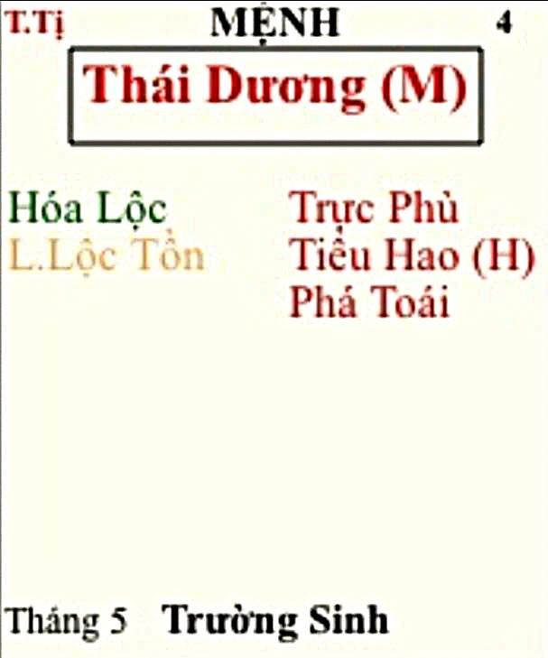

[Mục lục](../README.md)

# TỬ VI NAM PHÁI - BÀI SỐ 8: LUẬN GIẢI CUNG MỆNH THÔNG QUA CHÍNH TINH (PHẦN 4)

SAO THÁI DƯƠNG
Ở bài số 7, chúng ta đã tìm hiểu sơ lược về tính cách và ưu nhược điểm của người có mệnh Thiên Cơ. Từ đó, nếu bản thân bạn, con em hoặc người thân của bạn có mệnh Thiên Cơ đắc cách thì khi lựa chọn nghề nghiệp nên ưu tiên các lĩnh vực sử dụng trí tuệ như nghiên cứu, giảng dạy, cố vấn, tham mưu, hoạch định chiến lược, kỹ sư, kiến trúc sư, các bộ cách đặc biệt còn có thể làm CEO, chủ doanh nghiệp các chuỗi kinh doanh lớn... Nếu Thiên Cơ lạc hãm hoặc kém cách thì cũng có thể phát triển tốt ở các ngành nghề đòi hỏi sự khéo léo như cơ khí, chế tác, kim hoàn, thủ công mỹ nghệ... Chỉ cần tập trung theo đuổi một chuyên môn nhất định thì vẫn có thể đạt được thành tựu cao.
Thiên Cơ là một chính tinh rất dễ thay đổi tính chất khi đi cùng các phụ tinh khác nhau. Cụ thể Thiên Cơ kết hợp với bộ sao nào sẽ phát huy ưu điểm, gặp bộ sao nào sẽ bị phá cách, mình sẽ trình bày chi tiết trong phần CHƯ TINH LUẬN sau này.
Hôm nay, chúng ta sẽ tiếp tục nghiên cứu chính tinh thứ tư, đó là sao Thái Dương.
________________________________________
1. ĐẶC ĐIỂM NGOẠI HÌNH
Người có Thái Dương tọa thủ cung Mệnh, thường có những đặc điểm sau:
• Gương mặt giống cha hơn giống mẹ.
• Thân hình gầy ốm hoặc cân đối.
• Da hồng hào, sắc mặt tươi sáng (người sinh ban ngày từ giờ Dần đến giờ Ngọ thường có sắc mặt sáng hơn).
• Khuôn mặt tạo cảm giác đường hoàng và uy nghi.
• Thần thái sáng sủa, tự tin, phong thái bệ vệ, dễ thu hút ánh nhìn.
• Càng lớn tuổi dễ tóc ở trán có xu hướng bị xói (không ứng cho tất cả mọi người).
Nhìn chung, người mệnh Thái Dương thường mang khí chất nổi bật, có phong thái của người lãnh đạo hoặc người có địa vị trong tập thể.
________________________________________
2. ĐẶC ĐIỂM TÍNH CÁCH
Thái Dương tượng trưng cho Mặt Trời, vì vậy tính cách cũng mang đặc trưng của ánh sáng: mạnh mẽ, cởi mở và thích tỏa sáng.
Người có Thái Dương nhập Mệnh thường:
• Thông minh, sáng dạ.
• Chính trực, ngay thẳng.
• Cương nghị, có chính kiến.
• Tích cực, chủ động trong công việc.
• Có chí tiến thủ và hoài bão lớn.
• Thái Dương sáng sủa có thể nhìn xa trông rộng, có tầm nhìn nhiều năm về sau. Họ có thể đánh giá được tình hình phát triển xã hội ở nhiều năm sau, từ đó họ có sự chuẩn bị ở giai đoạn hiện tại, ví dụ họ chuẩn bị học tiếng Trung Quốc vì nhìn thấy cơ hội hợp tác tốt hơn tiếng Anh ở nhiều năm về sau.
• Thích giúp đỡ người khác.
• Rất khôn ngoan trong chi tiêu, nếu thấy cơ hội hợp tác lớn, mối quan hệ có lợi, ắt sẽ chịu bỏ tiền ra chiêu đãi rất phóng khoán, thậm chí có người chấp nhận thuê xe sang đi ký hợp đồng lớn. Nếu thấy mối quan hệ không có lợi về sau, thông thường hiếm khi phóng khoán với người đó.
• Trong một số trường hợp, người mệnh Thái Dương thông thường tính cách không hợp với cha của mình.
Nhìn chung đây là mẫu người sống hướng ngoại, thích tham gia các hoạt động tập thể, thích giao lưu kết bạn và ghét cảm giác cô độc.
Nam mệnh hay nữ mệnh Thái Dương đều có xu hướng thích ra ngoài, thích môi trường đông người, thích tham gia các hoạt động xã hội.
________________________________________
3. KHẢ NĂNG LÃNH ĐẠO
Thái Dương là một trong những chính tinh có tố chất lãnh đạo tốt.
Người mệnh Thái Dương:
• Thích đứng đầu.
• Thích chỉ huy.
• Không thích bị người khác sai khiến.
• Có khả năng truyền cảm hứng cho tập thể.
• Có tầm nhìn xa và chí hướng lớn.
Thái Dương chủ về quyền quý trước, sau đó mới chủ về tài phú. Người xưa xem Thái Dương là biểu tượng của danh vọng, địa vị và quyền lực.
Đây cũng là mẫu người coi trọng sự nghiệp hơn nhiều phương diện khác trong cuộc sống. Họ thường xem công việc là một phần không thể tách rời của bản thân, luôn mong muốn khẳng định giá trị thông qua thành tựu sự nghiệp.
Nếu Thái Dương đóng tại Mệnh thì rất dễ trở thành người được nhiều người biết đến nhờ một tài năng, một thành tựu hoặc một dấu ấn đặc biệt.
________________________________________
4. KHẢ NĂNG GIAO TIẾP
Thái Dương có năng lực giao tiếp rất tốt. Họ thường rất:
• Hoạt ngôn.
• Biết cách diễn đạt.
• Có khả năng tranh luận.
• Dễ học ngoại ngữ.
• Có tài ngoại giao.
Người mệnh Thái Dương thường rất tự tin khi đứng trước đám đông, dễ trở thành diễn giả, người dẫn dắt hoặc người phát biểu chính trong các cuộc họp. Với bộ cách tốt, họ có thể làm lĩnh vực truyền thông, làm diễn viên hay người dẫn chương trình nổi tiếng.
Họ thích được lắng nghe họ trình bày, thích được công nhận và được người khác ghi nhận năng lực của mình.
________________________________________
5. THÁI DƯƠNG VÀ CUỘC SỐNG
Thái Dương luôn mang trong mình nguồn năng lượng tích cực.
Họ thích:
• Cuộc sống sôi động.
• Những nơi náo nhiệt.
• Tiệc tùng.
• Hoạt động cộng đồng.
• Những công việc mang tính thử thách.
Thái Dương giống như Mặt Trời, luôn muốn lan tỏa năng lượng cho mọi người xung quanh.
Họ tốt bụng, ít khi để bụng lâu. Khi bị tổn thương có thể phản ứng rất mạnh, nhưng sau đó cũng dễ tha thứ.
Chính vì vậy mà người mệnh Thái Dương thường có rất nhiều bạn bè và mối quan hệ xã hội.
________________________________________
6. THÁI DƯƠNG VÀ DANH DỰ
Điểm nổi bật nhất của Thái Dương là lòng tự trọng rất cao. Họ:
• Cực kỳ coi trọng danh dự.
• Rất sĩ diện.
• Không thích bị coi thường.
• Không thích bị người khác chỉ trích trước đám đông.
Có thể nói danh tiếng đối với Thái Dương đôi khi còn quan trọng hơn cả tiền bạc.
Có những người mệnh Thái Dương sẵn sàng từ bỏ một công việc có thu nhập cao nếu cảm thấy công việc đó không mang lại vị thế hoặc không được người khác coi trọng.
Đây cũng là nguyên nhân khiến nhiều người mệnh Thái Dương dễ bị áp lực tâm lý, thậm chí rơi vào trạng thái trầm cảm khi gặp thất bại lớn trong sự nghiệp hoặc bị ảnh hưởng đến danh dự.
________________________________________
7. NHƯỢC ĐIỂM CỦA THÁI DƯƠNG
Bên cạnh những ưu điểm nổi bật, Thái Dương cũng có nhiều hạn chế. Ví dụ như:
- Thái Dương có lòng tự tôn rất cao. Do đó:
• Khó tiếp thu ý kiến trái chiều.
• Không thích bị phê bình.
• Có xu hướng muốn người khác làm theo ý mình.
Nếu gặp nhiều sát tinh thì tính cách này dễ phát triển thành bảo thủ, độc đoán hoặc gia trưởng.
- Thích thể hiện nổi bật bản thân:
Thái Dương thích trở thành trung tâm của sự chú ý.
Họ yêu thích sự nổi bật, đôi khi có phần khoa trương hoặc phô trương.
Khi bước vào một tập thể, Thái Dương thường vô thức muốn trở thành người dẫn dắt hoặc người được chú ý nhiều nhất.
________________________________________
8. THÁI DƯƠNG TRONG GIA ĐÌNH
Trong Tử Vi, vị trí sao Thái Dương đặt ở cung nào, từ đó lấy cung đó để kết hợp xem sự thành đạt của:
• Người cha.
• Người chồng.
• Con trai trưởng.
Ví dụ: người cha của mình cần kết hợp xem cung Phụ Mẫu và cung có sao Thái Dương. Cụ thể sau này mình sẽ có chuyên đề riêng hướng dẫn về cái này.
Người có Thái Dương tọa Mệnh thường ít nhiều được cha mẹ kỳ vọng hoặc đầu tư nhiều hơn anh chị em khác.
Đối với nữ mệnh, Thái Dương khiến người phụ nữ trở nên mạnh mẽ, có chí hướng như nam giới, giỏi giang, độc lập và thường có duyên với người khác phái.
Nếu hội nhiều cát tinh thì nữ mệnh Thái Dương thường là người vượng phu ích tử, vừa giỏi sự nghiệp vừa quán xuyến tốt gia đình. Đi cùng sát tinh thì nữ mệnh có thiên hướng đi đứng, lời nói và cư xử mạnh mẽ cọc cằn như đàn ông.
________________________________________
TỔNG KẾT BÀI SỐ 8
Tóm lại, Thái Dương là hình tượng của ánh sáng, danh vọng, quyền lực và sự lãnh đạo.
Người mệnh Thái Dương thường thông minh, chính trực, cởi mở, hào phóng, có chí lớn, giỏi giao tiếp và rất phù hợp với những công việc cần khả năng lãnh đạo hoặc làm việc trước công chúng (truyền thông, diễn viên, MC…)
Tuy nhiên, điểm yếu lớn nhất của Thái Dương là quá coi trọng danh tiếng và sự tự tôn bản thân nên đôi khi dễ từ bỏ cơ hội kiếm tiền lớn khi thấy bản thân không được tôn trọng. Nếu biết hài hòa thì Thái Dương là một trong những cách mệnh rất dễ đạt được địa vị, danh tiếng và thành công lớn trong xã hội.
________________________________________
Lưu ý: Những tính chất trên chỉ phản ánh ý nghĩa cơ bản của sao Thái Dương đơn thủ khi tọa thủ cung Mệnh. Trong thực tế luận đoán còn phải xét thêm bộ cách và vị trí của Thái Dương ở 12 cung (ví dụ Thái Dương cư ở cung Ngọ được gọi là Nhật Lệ Trung Thiên, cung Hợi là Nhật Trầm Thủy Bể...), xét thêm các phụ tinh đi kèm, Tuần - Triệt, Tứ Hóa và toàn bộ bố cục lá số mới có thể đưa ra kết luận chính xác. 
Đặc biệt, Thái Dương rất nhạy cảm với các sát tinh và ám tinh. Khi bị phá cách, những ưu điểm như chính trực, tự tin và lãnh đạo có thể biến thành kiêu ngạo, độc đoán, háo danh hoặc cực đoan. Các bộ cách cụ thể của sao Thái Dương sẽ được mình trình bày đầy đủ trong phần CHƯ TINH LUẬN sau này.

[Mục lục](../README.md)
