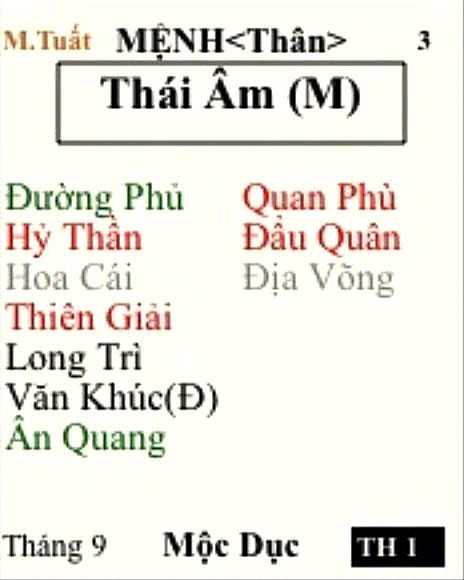

[Mục lục](../README.md)

# TỬ VI NAM PHÁI - BÀI SỐ 9: LUẬN GIẢI CUNG MỆNH THÔNG QUA CHÍNH TINH (PHẦN 5)

SAO THÁI ÂM
Ở bài số 8, chúng ta đã tìm hiểu sơ lược về tính cách và ưu nhược điểm của người có mệnh Thái Dương. Từ đó, nếu bản thân bạn, con em hoặc người thân của bạn có mệnh Thái Dương sáng sủa thì khi lựa chọn nghề nghiệp nên ưu tiên các lĩnh vực như lãnh đạo, quản trị, ngoại giao, truyền thông, giáo dục, MC, diễn giả, chính trị hoặc các công việc thường xuyên xuất hiện trước công chúng.
Thái Dương sáng sủa có thể phát triển mạnh trong nhiều môi trường, từ cơ quan nhà nước, doanh nghiệp tư nhân cho đến công ty nước ngoài. Nếu được nhiều cát tinh hội hợp thì ít nhất cũng có thể đảm nhiệm vị trí quản lý cấp trung, đắc cách hoàn toàn còn có thể giữ những chức vụ lãnh đạo cao.
Ngược lại, nếu Thái Dương bị lạc hãm hoặc phá cách thì cần học cách tiết chế bớt sĩ diện và kiên trì hơn trước thất bại. Khi đó con đường sự nghiệp thường vất vả hơn, dễ phải làm kinh doanh nhỏ hoặc lao động chân tay tùy theo mức độ phá cách của lá số.
Thái Dương đi cùng bộ sao nào thì phát huy mạnh nhất, gặp bộ sao nào thì bị phá cách và cách hóa giải ra sao... mình sẽ trình bày chi tiết trong phần CHƯ TINH LUẬN sau này.
Hôm nay, chúng ta sẽ tiếp tục nghiên cứu chính tinh thứ năm, đó là sao Thái Âm.
________________________________________
1. ĐẶC ĐIỂM NGOẠI HÌNH
Người có Thái Âm tọa thủ cung Mệnh thường có những đặc điểm sau:
• Khuôn mặt tròn hoặc đầy đặn, đường nét thanh tú.
• Da trắng sáng, mềm mại.
• Thân hình cân đối, nữ mệnh thường hơi đầy đặn hơn.
• Sau tuổi trung niên, nam hay nữ đều khá dễ tăng cân nếu không chú ý chế độ ăn uống và vận động. Đa phần sẽ vất vả trong việc giảm cân ^^.
• Thần thái ôn hòa, nhẹ nhàng, tạo cảm giác gần gũi.
• Cử chỉ, lời nói lịch thiệp, nho nhã.
• Ánh mắt hiền hòa, giàu cảm xúc và có sức thu hút.
Nữ mệnh Thái Âm thường có dung mạo xinh đẹp, dịu dàng và nữ tính. Nam mệnh Thái Âm cũng thường mang vẻ thư sinh, phong nhã, đôi khi cử chỉ mềm mại hơn các chính tinh khác.
Trong gia đình, người có Thái Âm tọa Mệnh cũng thường có nhiều nét giống mẹ hơn giống cha. Tuy nhiên, đây chỉ là xu hướng thường gặp, không đúng cho toàn bộ trường hợp.
________________________________________
2. ĐẶC ĐIỂM TÍNH CÁCH
Thái Âm tượng trưng cho Mặt Trăng, chủ về cảm xúc, nội tâm, sự tinh tế và khả năng quan sát.
Người có Thái Âm nhập Mệnh thường:
• Thông minh.
• Dịu dàng.
• Khiêm tốn.
• Hướng nội.
• Giàu lòng trắc ẩn.
• Có khả năng quan sát rất tốt.
• Tinh tế trong giao tiếp.
• Kiên nhẫn và biết nhường nhịn.
Họ ít khi thích đối đầu trực diện với người khác mà thường lựa chọn cách giải quyết mềm mỏng, khéo léo để giữ hòa khí.
Thái Âm cũng là mẫu người rất biết quan tâm đến cảm xúc của người khác. Họ có khả năng đồng cảm cao, dễ nhận ra những thay đổi rất nhỏ trong tâm trạng của đối phương và thường là người lắng nghe rất tốt.
Các tính chất trên có thể thay đổi đáng kể khi Thái Âm đi cùng nhiều sát tinh hoặc ám tinh. Khi đó, đương số dễ có những lúc sân si, không giữ được sự điềm đạm vốn có.
________________________________________
3. THÁI ÂM VÀ TRÍ TUỆ
Thái Âm là một trong những chính tinh có khả năng quan sát, ghi nhớ và trực giác mạnh nhất trong hệ thống Tử Vi.
Người mệnh Thái Âm sáng sủa thường:
• Có trí nhớ tốt.
• Quan sát tỉ mỉ.
• Suy nghĩ thấu đáo.
• Giàu trí tưởng tượng.
• Có trực giác nhạy bén.
• Có khả năng học ngoại ngữ khá tốt.
Họ thường yêu thích những lĩnh vực mang tính chiều sâu như:
• Văn học.
• Nghệ thuật.
• Âm nhạc.
• Tâm lý học.
• Triết học.
• Huyền học và tâm linh.
Nếu được nhiều cát tinh hội hợp, Thái Âm thường có năng khiếu về văn chương, hội họa, thiết kế, âm nhạc hoặc các ngành nghề đòi hỏi khả năng sáng tạo và cảm nhận tinh tế.
________________________________________
4. THÁI ÂM VÀ KHẢ NĂNG LÃNH ĐẠO
Nhiều người cho rằng Thái Âm quá ôn hòa nên không phù hợp với vị trí lãnh đạo. Thực tế không hoàn toàn như vậy.
Trong cuộc sống thường ngày, người mệnh Thái Âm thường cư xử khiêm nhường, mềm mỏng và ít thích va chạm. Tuy nhiên, khi bước vào công việc, họ lại thể hiện sự nguyên tắc, quyết đoán và có năng lực quản lý khá tốt.
Chính vì vậy, Thái Âm rất phù hợp với các vị trí quản lý trong lĩnh vực giáo dục, tài chính, ngân hàng, hành chính, y tế, dịch vụ, chăm sóc khách hàng hoặc những ngành nghề cần khả năng quản trị con người và giải quyết vấn đề một cách khéo léo.
________________________________________
5. THÁI ÂM VÀ TIỀN BẠC
Trong hệ thống Tử Vi, Thái Âm chủ về tài phú, trong khi Thái Dương chủ về danh quý.
Người có Thái Âm tọa Mệnh thường:
• Có duyên với tiền bạc, Thái Âm sáng sủa rất dễ kiếm tiền.
• Biết tích lũy tài sản.
• Có tư duy đầu tư và kinh doanh khá tốt.
• Nhạy bén với xu hướng thị trường.
• Có khả năng quản lý tài chính hiệu quả.
Họ thường không làm giàu bằng sự liều lĩnh mà thành công nhờ tính cẩn trọng, khả năng quan sát và biết nắm bắt cơ hội đúng thời điểm.
Ngay cả khi thích hưởng thụ cuộc sống, người mệnh Thái Âm vẫn thường cân nhắc giữa giá trị nhận được và số tiền bỏ ra. Họ sẵn sàng chi cho những trải nghiệm chất lượng nhưng vẫn có xu hướng tính toán khá kỹ trước khi quyết định.
Chỉ khi Thái Âm bị nhiều sát tinh phá cách thì mới dễ xuất hiện tình trạng tiêu xài quá mức, đầu tư sai lầm hoặc sa vào những thú vui hưởng lạc. Thậm chí Thái Âm hãm địa gặp sát tinh dễ rơi vào cờ bạc nghiên ngập. Cụ thể các dạng bị phá cách sẽ có phần phân tích chuyên sâu sau này.
________________________________________
6. THÁI ÂM VÀ CÁC MỐI QUAN HỆ
Thái Âm còn tượng trưng cho người mẹ, mặt đất, sự bao dung che chở, là sao chủ về gia đình, tình cảm và sự chăm sóc. Do đó, người mệnh Thái Âm đặc biệt coi trọng:
• Cha mẹ.
• Vợ chồng.
• Con cái.
• Người thân.
• Bạn bè thân thiết.
Một khi đã đặt niềm tin vào ai, họ thường rất trung thành và sẵn sàng hy sinh vì người mình yêu quý.
Khả năng đồng cảm của Thái Âm rất cao. Họ dễ nhận ra cảm xúc của người đối diện thông qua ánh mắt, nét mặt hoặc những thay đổi rất nhỏ trong hành vi.
Đối với con cái, người mệnh Thái Âm thường sẵn sàng đầu tư cho việc học hành, ngoại ngữ hoặc du học nếu điều kiện kinh tế cho phép.
Chính vì vậy, Thái Âm khá phù hợp với các lĩnh vực như:
• Giáo dục. (Thái Âm sáng sủa có thể làm giáo viên ngoại ngữ)
• Tư vấn tâm lý.
• Công tác xã hội.
• Điều dưỡng.
• Hộ sinh. (Cách mệnh Thái Âm đi kèm Tả Phụ, Hữu Bật có thể theo nghề này)
• Chăm sóc khách hàng.
• Thái Âm kém cách cũng có thể làm người giúp việc, lao công.
________________________________________
7. THÁI ÂM VÀ NGHỆ THUẬT
Thái Âm là một trong những chính tinh giàu cảm xúc nhất. Họ thường yêu thích:
• Âm nhạc.
• Hội họa.
• Văn chương.
• Thiết kế.
• Trang trí nội thất.
• Nhiếp ảnh.
• Du lịch.
• Làm đẹp.
Người mệnh Thái Âm có gu thẩm mỹ khá tinh tế, yêu sự nhẹ nhàng và chiều sâu cảm xúc hơn là sự phô trương.
Họ cũng thường thích một không gian sống đẹp, yên tĩnh, ấm cúng và mang dấu ấn cá nhân.
________________________________________
8. NHƯỢC ĐIỂM CỦA THÁI ÂM
Bên cạnh rất nhiều ưu điểm, Thái Âm cũng tồn tại không ít hạn chế.
- Thích hưởng thụ:
Thái Âm được xem là một trong những chính tinh yêu thích sự hưởng thụ nhất. Khi điều kiện kinh tế cho phép, họ thường thích:
• Ăn ngon.
• Mặc đẹp.
• Nhà cửa tiện nghi.
• Không gian sống đẹp.
• Du lịch.
• Những trải nghiệm chất lượng cao.
Tuy nhiên, sự hưởng thụ của Thái Âm thường thiên về tính tinh tế và cảm xúc hơn là phô trương. Họ vẫn có xu hướng cân nhắc giữa giá trị nhận được và số tiền bỏ ra. Chỉ sợ khi bị nhiều sát tinh phá cách thì rất dễ chi tiêu quá tay, sa vào hưởng lạc hoặc các thú vui gây hao tán tiền bạc.
- Đa sầu đa cảm: Do quá nhạy cảm nên Thái Âm thường:
• Hay suy nghĩ.
• Dễ tủi thân khi bị xúc phạm. 
• Dễ buồn khi mối quan hệ trong gia đình không được hòa thuận như ý.
Bề ngoài họ có thể rất bình tĩnh nhưng nội tâm lại vô cùng phong phú và nhiều cảm xúc.
- Thiếu quyết liệt trong đời sống:
Trong các mối quan hệ cá nhân, Thái Âm thường chọn cách nhẫn nhịn hơn là đối đầu trực diện. Điều này giúp giữ hòa khí nhưng đôi khi cũng khiến họ chịu nhiều thiệt thòi hoặc bị người khác lấn lướt.
Tuy nhiên, điều này không đồng nghĩa với việc họ thiếu bản lĩnh trong công việc. Khi đứng trước trách nhiệm hoặc quyền lợi chung, người mệnh Thái Âm vẫn có thể rất quyết đoán và kiên định.
________________________________________
9. BIỂU TƯỢNG SAO THÁI ÂM TRONG GIA ĐÌNH
Trong Tử Vi, vị trí sao Thái Âm đặt ở cung nào, từ đó lấy cung đó để kết hợp xem sự thành đạt của:
• Người mẹ.
• Người vợ.
• Con gái trưởng.
Ví dụ: mẹ của mình cần kết hợp xem cung Phụ Mẫu và cung có sao Thái Âm. Cụ thể sau này mình sẽ có chuyên đề riêng về cái này.
________________________________________
TỔNG KẾT BÀI SỐ 9
Tóm lại, Thái Âm là hình tượng của tài phú, trí tuệ, trực giác, sự tinh tế và đời sống nội tâm.
Người mệnh Thái Âm thường thông minh, giàu lòng trắc ẩn, có khả năng quan sát tốt, trực giác nhạy bén, yêu văn chương nghệ thuật, có năng lực quản lý, biết tích lũy tài sản và rất coi trọng gia đình cũng như các mối quan hệ thân thiết.
Họ cũng là những người có tố chất trong các lĩnh vực giáo dục, tâm lý, nghệ thuật, kinh doanh, đầu tư và quản lý nhờ khả năng quan sát con người, nắm bắt xu hướng và suy nghĩ thấu đáo.
Tuy nhiên, điểm yếu lớn nhất của Thái Âm là quá nhạy cảm, dễ suy nghĩ nhiều. Đôi khi quá nhẫn nhịn trước những bất công. Nếu biết cân bằng giữa lý trí và cảm xúc thì Thái Âm là một trong những cách mệnh dễ đạt được cuộc sống ổn định, hạnh phúc và sung túc cả về vật chất lẫn tinh thần.
________________________________________
LƯU Ý
Những tính chất trên chỉ phản ánh ý nghĩa cơ bản của sao Thái Âm khi tọa thủ cung Mệnh. Trong thực tế luận đoán còn phải xét thêm Miếu - Vượng - Đắc - Hãm, các phụ tinh đi kèm, Tuần - Triệt, Tứ Hóa và toàn bộ bố cục lá số mới có thể đưa ra kết luận chính xác.
Đặc biệt, Thái Âm là chính tinh chịu ảnh hưởng khá rõ bởi thời điểm sinh và vị trí tọa thủ trên lá số (Thái Âm đắc cách khi tọa tại các cung từ Thân đến Sửu, trong đó cung Hợi là vị trí đẹp nhất, được cổ nhân gọi là cách Nguyệt Lãng Thiên Môn, chủ về trí tuệ, tài phú và danh vọng nếu được nhiều cát tinh hội hợp). Thái Âm thường phát huy tốt hơn đối với người sinh vào ban đêm, đặc biệt từ giờ Thân đến giờ Sửu. Ngoài ra, nữ mệnh có Thái Âm sáng sủa cũng thường phát huy đầy đủ những phẩm chất tốt đẹp của chính tinh này hơn nam mệnh.
Tuy nhiên, đây chỉ là những nguyên tắc tổng quát. Muốn luận đoán chính xác vẫn phải xét toàn bộ bố cục lá số. Các bộ cách của sao Thái Âm tại từng cung, cũng như những bộ sao làm tăng hoặc làm giảm phẩm chất của Thái Âm, mình sẽ trình bày đầy đủ trong phần CHƯ TINH LUẬN sau này.
